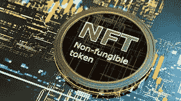

# NFTs 简介

> 原文：<https://medium.com/coinmonks/introduction-to-nfts-e8002df549d8?source=collection_archive---------16----------------------->

## 什么是 NFT？

NFT(不可替代的令牌)是一个唯一的数字标识符，不能被复制、替代或细分。它被记录在区块链中，用于证明真实性和所有权。

NFT

NFT 可以表示真实世界的项目，如艺术品和房地产。将这种真实世界的有形资产标记化，可以提高购买、销售和交易它们的效率，同时降低欺诈的可能性。

# NFTS 的类型

**1。可收集的物品/交易卡**

[收藏品](https://opensea.io/collection/trading-cards)以数千美元的价格出售并不是什么新鲜事，NFT 也是如此——可以作为数字交易卡出售，也可以作为收藏品保存。

NFTs 被视为收藏品的第一个例子是 Cryptokitties 的出现，crypto kitties 是一种独特的数字小猫，在 2017 年受到收藏家的欢迎。它也被认为是 NFT 的第一个用例。

NFT 市场充斥着公司列出的不同类型的交易卡和收藏品——只要它被认为具有收藏价值。

**2。艺术品**
NFT 艺术品是技术和创意的独特结合。
如今流通的大多数非功能性艺术作品都是艺术品——可编程艺术作品占所有非功能性艺术作品的 99%。这是因为艺术家们很快利用了 NFTs 的概念。

目前，包括数码照片、gif 和短视频在内的虚拟艺术品正在网上出售，就好像它们是实物一样。而且，这些是最贵的 NFT，有时卖几百万。|

**3。活动门票**
NFTs 也可以以[活动门票](https://oveit.com/nft-tickets/)的形式使用，方便人们的门票和身份验证。音乐会和音乐节等流行活动的组织者可以利用选定的区块链来铸造有限数量的 NFT 门票。

**4。音乐和媒体把音乐转换成非功能性音乐的实验导致了另一种非功能性音乐的发展。媒体文件和音乐现在可以链接到 NFTs，真正的所有权属于个人。**

**4。音乐和媒体将 T21 音乐转换成非功能性音乐的实验导致了另一种非功能性音乐的发展。媒体文件和音乐现在可以链接到 NFTs，真正的所有权属于个人。**

NFTs 还允许音乐人保留大约 100%的收入，而不必担心唱片公司和流媒体平台的削减——这就是为什么它受到艺术家的欢迎。

**5。游戏**
游戏创作者对 NFT 产生了浓厚的兴趣，并极大地使用它们。在在线游戏平台中，NFT 被用作游戏中的物品。不可替代的代币通过游戏内物品的不可改变的所有权记录来帮助推动游戏内经济的增长。
仅游戏内内容，如人物、皮肤等。作为非功能性游戏出售，而不是整个游戏。NFT 的另一个使用案例是将限量版的 DLC 资产出售给想要享受 NFT 资产独有性的玩家。然而，这并没有阻止该公司出售其常规 DLC。

**6。重大运动时刻**

使用 NFT 的另一种方式是以视频短片的形式捕捉难忘的体育时刻。这不像我们到目前为止谈论的其他 NFT 类型那样有物理等价物，但是历史意义是无价的——尽管它们很昂贵，但也是有意义的。这些 NFT 中的一些可以展示从改变游戏规则的触地得分到突破性的灌篮的体育时刻。

**7。虚拟时尚**

为什么时装应该与 NFT 市场上买卖的任何其他东西有所不同？当你花钱买一件你穿不上的华丽比基尼时，这完全是个人喜好。你可以使用 NFTs 来装饰你的在线头像，而不是购买 NFTs 艺术品。

毫无疑问，这种 NFT 风格是为更有时尚意识和更富有的人准备的。当然，每件商品都是限量的，而且是独一无二的。

**8。真实世界的资产**

虚拟化现实世界的资产

有许多关于 NFT 在未来被用作真实世界令牌的猜测。NFT 领域的进展正朝着实现这一目标迈进，而且这一目标成为现实的可能性很大。

NFTs 提供的所有权的加密证明使得它能够反映真实世界的资产。许多 NFT 项目目前正专注于奢侈品和房地产的符号化。使用 NFT 房契买房或买车时，你会有更多的选择。

**9。迷因**

NFT 迷因

将模因作为非功能性翻译出售是近年来非功能性翻译领域最显著的成就。尽管迷因在互联网用户中很受欢迎，并且是流行文化的一部分，但迷因还是与非功能性思维联系在一起。迷因创造者准备开发一个不断扩大的未来生态系统，这从迷因作为非功能性食物的销售中可以看出。

**10。域名**

NFT 市场使用户注册和出售域名成为可能。你可以在 NFT 市场上购买一个域名，从而绕开向第三方公司支付域名管理费用的麻烦。

有专有权的名称所有权意味着你不需要中间人。

域名 NFTs 提供商的例子是以太坊名称服务(ENS)和通过分散域名服务的不可阻挡的域。

最后，NFT 是一种被证明在加密货币中有用的数字稀缺商品。您可以使用这些小工具来管理和交易您加密货币。

如果你喜欢我的文章，请记得给我一个掌声，并关注更多！

> 交易新手？试试[加密交易机器人](/coinmonks/crypto-trading-bot-c2ffce8acb2a)或者[复制交易](/coinmonks/top-10-crypto-copy-trading-platforms-for-beginners-d0c37c7d698c)