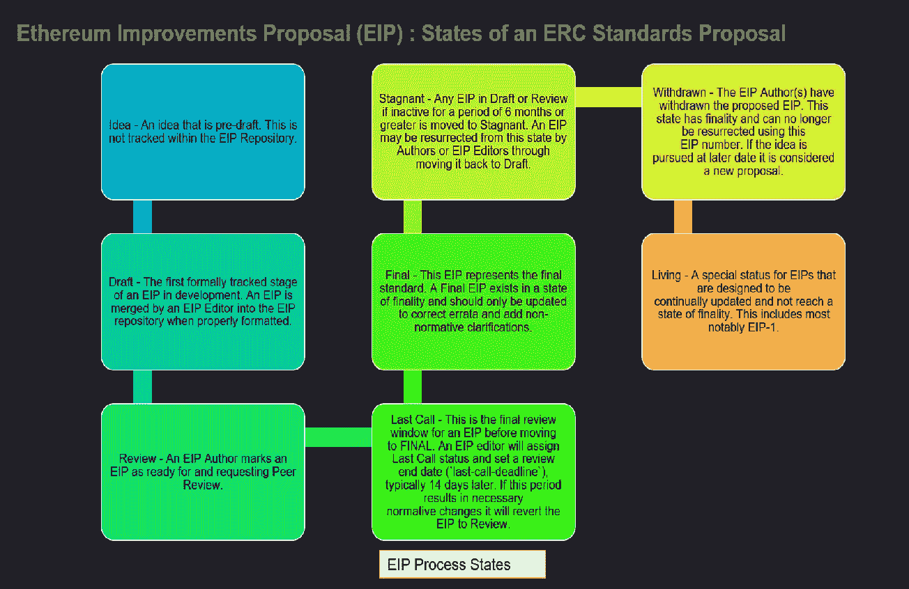
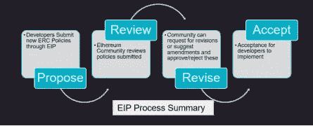

# 以太坊令牌标准介绍:第 1 部分

> 原文：<https://medium.com/coinmonks/introduction-to-token-standards-for-ethereum-part-1-46b4a72e5f12?source=collection_archive---------9----------------------->

Photo by [Traxer](https://unsplash.com/@traxer?utm_source=medium&utm_medium=referral) on [Unsplash](https://unsplash.com?utm_source=medium&utm_medium=referral)

这是令牌标准 4 部分系列的第 1 部分。在这里，我将介绍令牌标准以及拥有它们的必要性。

令牌标准是一组规则，允许在不同的区块链协议上开发加密货币令牌。它们通过定义一组规则、条件和功能来规定加密令牌的工作方式。以太坊利用“以太坊改进流程”(EIP)来发展和合并令牌标准的变化

什么是 ERC 代币标准？

ERC 是以太坊征求意见的首字母缩写。合同开发的应用级标准、令牌标准、名称注册中心、库/包格式等等。通用 ERC 标准为令牌类型定义了一组必需的功能

**为什么需要令牌标准？**

代币几乎可以代表从货币到艺术品到身份的任何东西

一个健壮的标准是处理所有令牌使用方式的必要条件

令牌标准使应用程序和智能合约能够以可预测的方式与令牌进行交互。

这是一种标准化令牌定义和使用最佳实践的方法

**代币的种类有哪些？**

有不同类型的令牌和标准与它们一一对应。有些标准适用于所有令牌类型。

*   可替代代币
*   不可替换的令牌
*   安全令牌
*   身份令牌

**哪些是流行的令牌标准？**

以下是业界广泛使用的一些著名和流行的 ERC 令牌标准

*   ERC20:可替换令牌的令牌标准
*   ERC721:不可替换令牌(NFT)的令牌标准
*   ERC1155:令牌批处理的令牌标准
*   ERC725:基于区块链的数字身份的令牌标准。
*   ERC1400/1404:证券令牌的令牌标准。

**以太坊改进提案(EIP):ERC 标准提案流程**

以太坊的创建者定义了提出标准的过程。ERC 不是由坐在会议室里的一群专家决定的，而是由区块链开发者和用户的一致意见创造的，这符合区块链技术的真正精神。

一份[以太坊提案]要成为 ERC，需要经过以下几个阶段(参考下面的信息图)。

Infographic Describing EIP Stages

简而言之，一个 EIP 人在被接受为 ERC 人之前要经历以下过程

*   提议:开发商通过 EIP 提交新的 ERC 政策
*   审查:以太坊社区审查提交的政策
*   修订:社区可以请求修订或建议修改，并批准/拒绝这些修改
*   接受:对开发人员实现的接受

Summary of EIP Process

**ERC 类型**

以太坊上描述了超过 500 个不同阶段的 ERC。大体上，它们被分为以下不同的类别—

*   ERC (257 个 EIP):应用级标准和惯例，包括契约标准，如令牌标准( [EIP-20](https://eips.ethereum.org/EIPS/eip-20) )、名称注册中心( [EIP-137](https://eips.ethereum.org/EIPS/eip-137) )、URI 方案( [EIP-681](https://eips.ethereum.org/EIPS/eip-681) )、库/包格式( [EIP-190](https://eips.ethereum.org/EIPS/eip-190) )和帐户抽象( [EIP-4337](https://eips.ethereum.org/EIPS/eip-4337) )。
*   核心(190 个 EIP):需要共识分叉的改进，如 EIP-5、EIP-211
*   Meta (18 EIPs):描述一个围绕以太坊的过程，或者提议一个过程的改变(或者一个过程中的事件)。过程 EIP 类似于标准跟踪 EIP，但是适用于以太坊协议本身以外的领域。
*   接口(43 EIPs):围绕客户端 API/RPC 规范和标准的改进，以及某些语言级别的标准，如方法名(EIP-6)和契约 ABIs。
*   信息(6 个 EIP):描述以太坊设计问题，或者向以太坊社区提供一般指南或信息，但不提出新功能。
*   网络(13 EIPs):包括围绕 devp2p (EIP-8)和 Light Ethereum 子协议的改进，以及对 whisper 和 swarm 网络协议规范的改进建议。

[在下一部分中，我们将详细了解一些令牌标准规范。](/coinmonks/introduction-to-token-standards-for-ethereum-part-2-erc20-and-erc721-3846c3ee45ff)

请在下面的评论中分享你的想法。感谢您的阅读！: )

> 交易新手？尝试[加密交易机器人](/coinmonks/crypto-trading-bot-c2ffce8acb2a)或[复制交易](/coinmonks/top-10-crypto-copy-trading-platforms-for-beginners-d0c37c7d698c)