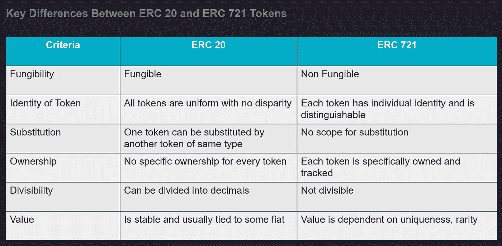

# 以太坊令牌标准介绍:第 2 部分— ERC20 和 ERC721

> 原文：<https://medium.com/coinmonks/introduction-to-token-standards-for-ethereum-part-2-erc20-and-erc721-3846c3ee45ff?source=collection_archive---------26----------------------->

Photo by [Traxer](https://unsplash.com/@traxer?utm_source=medium&utm_medium=referral) on [Unsplash](https://unsplash.com?utm_source=medium&utm_medium=referral)

这是令牌标准 4 部分系列的第 2 部分。在这里，我将介绍可替换和不可替换令牌(NFT)的令牌标准。

关于令牌标准的基础知识，请参考本系列的第一篇文章。

# **可替换代币的代币标准:ERC20**

Photo by [Dan Dennis](https://unsplash.com/@cameramandan83?utm_source=medium&utm_medium=referral) on [Unsplash](https://unsplash.com?utm_source=medium&utm_medium=referral)

ERC 20 引入了可替换令牌的标准。这是区块链领域迄今为止使用最广泛的标准。

**什么是可替换令牌？**

可替换令牌是指每个令牌都与另一个令牌完全相同(在类型和值上)。例如，一个 ERC-20 令牌的行为就像 ETH 一样，这意味着 1 个令牌等于并将永远等于所有其他令牌。

**ERC 20 令牌标准**

ERC 20 引入了可替换令牌的标准

*   一个标准接口允许以太坊上的任何令牌被其他应用程序重用:从钱包到分散的交换。
*   以太网上部署了许多符合 ERC20 的令牌
*   这是一个可替换的令牌标准。
*   使用 ERC 20 标准发行新代币很容易。
*   这是迄今为止最常用的标准。以太坊区块链上存在的许多加密货币是 ERC-20 代币。
*   每个接受以太网的数字钱包也接受符合 ERC 20 协议的令牌。

**ERC 20 令牌标准中的功能&事件**

ERC-20 令牌实现的基本代码功能如下:

*   将代币从一个帐户转移到另一个帐户
*   获取帐户的当前令牌余额
*   获取网络上可用令牌的总供应量
*   批准第三方账户是否可以使用账户中的一定数量的代币

这些代码方法对于用户/令牌实施至关重要，因为它们决定流通中的令牌数量、存储和返回余额、请求和批准转账和取款请求，以及同意自动转账等。

ERC 20 定义了以下事件:

*   令牌传输时的传输事件
*   账户审核时的审核事件

[**规格为 ERC 20**](https://eips.ethereum.org/EIPS/eip-20)

**功能:**

*   平衡 Of
*   总供应量
*   转移
*   转移自
*   赞同
*   津贴
*   名字
*   标志
*   小数

**事件:**

*   转移
*   同意

# 不可替换令牌的令牌标准:ERC721

ERC-721 引入了不可替换令牌的标准。

Photo by [Andrey Metelev](https://unsplash.com/@metelevan?utm_source=medium&utm_medium=referral) on [Unsplash](https://unsplash.com?utm_source=medium&utm_medium=referral)

**什么是不可替换令牌(NFT)？**

NFT 或不可替代令牌是唯一的数字令牌，不能被另一个令牌替代或分割。NFT 可以代表对数字或物理资产的所有权。

**ERC 721 令牌标准**

ERC-721 引入了不可替换令牌的标准。NFTs 需要一个单独的标准，因为—

*   ERC 20 协议不足以跟踪非金融资产，因为每项资产都是不同的(不可替代的)
*   每个资产的所有权必须被单独和原子地跟踪。
*   定义智能合约中 NFTs 的标准 API 的实现
*   提供跟踪和传输 NFT 的基本功能。

[**规格为 ERC 721**](https://eips.ethereum.org/EIPS/eip-721)

功能:

*   平衡 Of
*   所有者 f
*   安全转移自
*   转移自
*   赞同
*   setApprovalForAll
*   获得批准
*   isApprovedForAll

事件:-

*   转移
*   同意
*   批准全部

钱包/经纪人/拍卖应用程序必须实现钱包接口来接受 NFTs。

> ERC721TokenReceiver
> 
> 功能:
> 
> 收到一个 RC 721

# **ERC 20 和 ERC 721 代币的主要区别**

总而言之，ERC 20 和 ERC 721 的区别如下

Difference between ERC 20 and ERC 721

在下一篇文章中，我将介绍对 ERC 20 和 ERC 721 实现所必需的两个标准的扩展，并增强其功能。

> 交易新手？尝试[加密交易机器人](/coinmonks/crypto-trading-bot-c2ffce8acb2a)或[复制交易](/coinmonks/top-10-crypto-copy-trading-platforms-for-beginners-d0c37c7d698c)