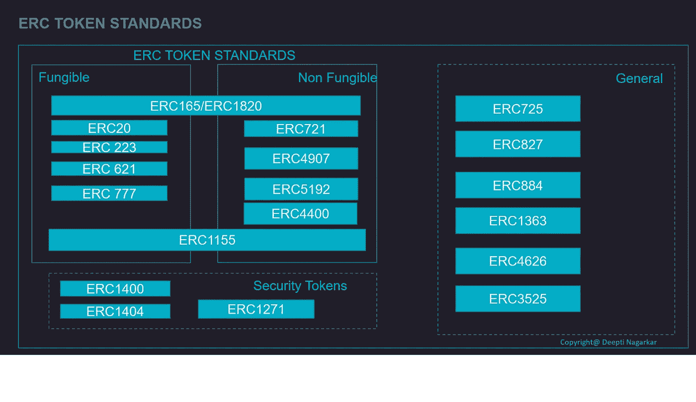

# 以太坊令牌标准介绍:第 4 部分—身份和安全标准

> 原文：<https://medium.com/coinmonks/introduction-to-token-standards-for-ethereum-part-4-identity-and-security-standards-18c9be3e3d50?source=collection_archive---------9----------------------->

Photo by [Vadim Bogulov](https://unsplash.com/@franku84?utm_source=medium&utm_medium=referral) on [Unsplash](https://unsplash.com?utm_source=medium&utm_medium=referral)

这是关于令牌标准的 4 部分系列的最后一篇文章。在这里，我将介绍区块链上身份和安全的令牌标准。

要了解更多关于扩展的令牌标准，请参考我在本系列中的上一篇文章。

**通用键值存储和执行的令牌标准:ERC 725**

Photo by [Michael Dziedzic](https://unsplash.com/@lazycreekimages?utm_source=medium&utm_medium=referral) on [Unsplash](https://unsplash.com?utm_source=medium&utm_medium=referral)

ERC 725 是基于智能合约的账户的标准接口，具有可附加的键值存储。该标准将使机器、对象、组和个人能够用 ERC-725 来定义和管理，允许个人拥有和控制他们的身份。ERC-725 将实现一个可移植和开放的身份标准，允许个人以完全开放、透明、可扩展和分散的方式通过多个应用程序和平台获取和使用他们的身份。

标准化基于智能合约的帐户的最小界面允许任何界面通过这些帐户类型进行操作。遵循此标准的基于智能联系人的帐户具有以下优势:

*   可以持有任何资产(本机令牌，例如 ERC20 like 令牌)
*   可以执行任何智能合同并部署智能合同
*   具有可升级的安全性(通过所有者变更，例如到 gnosis 保险箱)
*   是足够长期工作的基础
*   通过额外的键/值数据标准化是可扩展的。
*   可以充当其他智能合约的所有者/控制者或代理

**ERC 725 的特点**

*   描述可由人类、组、组织、对象和机器使用的基于唯一智能合约的帐户的标准功能。
*   该标准要求 ERC173
*   该标准分为两个子标准:

> ERC725X:可以执行任意智能合约，部署其他智能合约。
> 
> ERC725Y:可以通过通用的键/值存储来保存任意数据。

[**规格为 ERC 725**](https://eips.ethereum.org/EIPS/eip-725)

**ERC725X**

函数→执行:对任何其他智能合约执行调用，传输区块链本地令牌，或部署新的智能合约

**事件** :-

*   合同已创建
*   执行

**ERC725Y**

**功能:-**

*   setData/getData:为单个键设置/获取存储中的字节数据
*   setData(array)/getData(array):设置多个键的数据数组。获取给定键的数据集

**事件:-**

*   数据已更改

**令牌标准股票令牌化:ERC 884**

ERC 884 引入了股票代币的标准，并且专门针对美国的特拉华州。实施 ERC 884 需要一个链外数据库，以满足各种“了解你的客户”(KYC)的要求。这仍然是一个提案草案，并延长了 ERC 20

**ERC-884 定义的功能:**

*   它将把每一个代币指定为在特拉华州成立的公司的股份。
*   令牌持有者的身份验证和强制白名单；
*   公司可以根据监管要求编制股东名单
*   信息监管机构授权的记录
*   根据监管要求记录股份转让
*   只有代币的全部价值，即没有部分价值

[**规格的 ERC 884**](https://github.com/ethereum/EIPs/blob/master/EIPS/eip-884.md)

该令牌标准的实现应该提供以下功能:

*   函数 addVerified(address addr，bytes 32 hash)public；
*   函数 remove verified(addr)public；
*   函数 updateVerified(address addr，bytes 32 hash)public；
*   函数 cancelAndReissue(地址原，地址替换)public

事件:-

*   VerifiedAddressAdded
*   验证地址已删除
*   VerifiedAddressUpdated
*   VerifiedAddressSuperseded

安全令牌标准:ERC 1400

以太坊上的安全令牌标准。它是一套用于发行/赎回安全令牌、所有权管理和转让限制的标准接口。在许多法域中，一方是否能够接收和发送安全令牌取决于该方的身份特征。例如，在一方有资格购买或出售特定证券之前，大多数司法管辖区要求某种程度的 KYC /反洗钱流程。此外，一方可以被归类为投资者资格类别(例如，合格投资者、合格购买者)，并且他们的公民身份也可以告知与其证券相关联的限制。

**ERC 1400 的特点**

*   向代币持有者提供关于其代币余额的不同子集在转让限制、权利和义务方面如何表现的透明度。
*   ERC-1400 定义了文档管理、错误信号、看门人(操作员)访问控制、链外数据注入、发行/赎回语义的规则
*   公开令牌持有者余额的部分可替换子集。
*   该标准将 ERC-1410、ERC-1594、ERC-1643 和 ERC-1655 作为安全令牌标准的基础库，每个标准涵盖了安全令牌功能的不同方面。

ERC-1400 定义了以下规则:

*   资料管理
*   错误信号
*   门卫(操作员)访问控制
*   离线数据注入
*   发行/赎回语义
*   公开令牌持有者余额的部分可替换子集。

事件 ERC-1400 定义:

*   控制器令牌传输时的传输事件
*   控制器令牌兑现时的兑现事件

[**规格的 ERC 1400**](https://github.com/ethereum/eips/issues/1411)

以下部分简要列出了功能和事件。如需进一步阅读，请参考完整规范。

**功能**

资料管理

*   getDocument/setDocument

令牌信息

*   平衡分区
*   分割

转移

*   传输数据
*   transferFromWithData

转移有效性

*   canTransfer/canTransferFrom
*   canTransferByPartition

控制器操作

*   isontrollerTransfer
*   控制者认为

操作员管理

*   授权操作员
*   revoke 运算符

操作员信息

*   iso operator

代币发行/兑换

*   不可发行
*   问题
*   赎回/赎回自/赎回分区

转移有效性

*   canTransfer/canTransferFrom(

事件:-

*   控制器传输/控制器删除
*   文件
*   TransferByPartition/changed partition
*   authorized operator/revoked operator/authorized operatorbypartition/RevokedOperatorByPartition
*   已发行/已赎回发行分区/已赎回分区

**简单受限令牌的令牌标准:ERC 1404**

ERC-1404 引入了简单受限令牌的标准

*   一个简单且可互操作的标准，用于发行具有传输限制的令牌。
*   令牌发行者需要一种方法来限制 ERC-20 令牌的转让，以符合证券法和其他合同义务。
*   ERC-1404 标准建立在 ERC-20 的接口上，增加了两个功能
*   提供一种模式，当令牌传输被恢复时，可以通过这种模式返回人类可读的消息。令牌转让为何被恢复的透明度对于转让限制的成功实施同样重要

[**规格为 ERC 1404**](https://github.com/ethereum/EIPs/issues/1404)

detectTransferRestriction 和 messageForTransferRestriction 的逻辑由发布者决定。

唯一的要求是必须在标记的 transfer 和 transferFrom 方法中计算 detectTransferRestriction。

如果在这些传输方法中，detectTransferRestriction 返回的值不是 0，则应该还原事务。

功能:

*   检测转移限制
*   messageForTransferRestriction

**代用币气费代用币标准:ERC 865**

ERC 865 帮助密码世界的初学者。它使用户能够在一次交易中用代币而不是汽油支付转账。它有一个标准功能，令牌合约可以实现该功能，以允许用户将令牌的转移委托给第三方。第三方支付汽油费用，并收取代币费用。

**规格**

功能:

*   transferPreSignedHashing
*   转让预签名

事件:-

*   转让预签名

**总结**

在这个由 4 部分组成的系列中，我介绍了广泛使用的重要且流行的令牌标准。还有更多处于不同阶段的生态工业园。有几个像 vault 标准，我将在另一篇文章中介绍。为了列出一些重要的标准，并尝试进行分类，我制作了下面的信息图

Token Standards of today

你觉得这个令牌标准系列信息丰富吗？一定要留下评论让我知道你的想法！

感谢阅读！

> 交易新手？试试[加密交易机器人](/coinmonks/crypto-trading-bot-c2ffce8acb2a)或者[复制交易](/coinmonks/top-10-crypto-copy-trading-platforms-for-beginners-d0c37c7d698c)