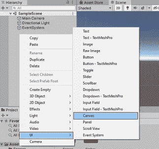
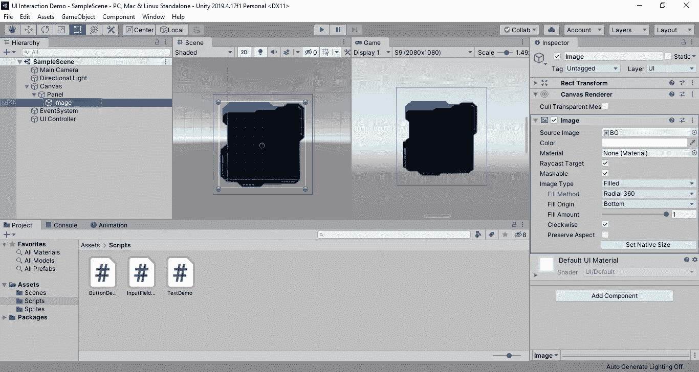

# Unity3D 中 UI 元素介绍

> 原文：<https://medium.com/coinmonks/introduction-to-ui-elements-in-unity3d-b2c8701e378b?source=collection_archive---------15----------------------->


用户界面(UI)是用户与应用程序交互的媒介。定义良好的用户界面能够实现用户和应用程序之间的有效交互。它不仅注重美观，而且最大限度地提高应用程序的可访问性、效率和响应能力。Unity3D 是一个强大的游戏引擎，它带有一个 UI 工具包，可以为你的游戏开发用户界面。这使得 UI 设计变得非常容易，我们使用拖放机制将 UI 元素包含到场景中。在本节中，我们将学习 Unity3D 中的基本 UI 元素。

# 入门指南

## 项目设置

按照步骤在您的机器上创建一个示例 Unity3D 项目。

*   打开 UnityHub，点击新建按钮。
*   选择 Unity 版本(本教程是用 2019.4.17 版本设置的，推荐使用 2019+版本)。


*   选择 3D 模板，提供项目名称和目录路径。
*   单击 Create 按钮创建一个示例项目。


在将 UI 元素添加到场景中之前，让我们将视图模式从 3D 切换到 2D，以便在 2D 视图中轻松排列场景中的 UI 元素。


让我们转到 UI 组件。

*   [画布](#a3cf)
*   [面板](#791b)
*   [正文](#0a03)
*   [输入字段](#5ccf)
*   [按钮](#7a7a)
*   [图像](#9ce3)
*   [滑块](#f094)
*   [切换](#4dc7)
*   [下拉菜单](#02ec)
*   [滚动视图](#5927)

## 1.帆布

画布是场景视图中的矩形区域。它充当一个容器，将所有 UI 元素作为其子游戏对象。如果场景中没有画布，则在添加新的 UI 元素时会自动生成画布。



要添加画布到场景中，右击**层次**并**选择 UI →画布**。


画布游戏对象包含三个组件— `Canvas`、`Canvas Scaler`、`Graphic Raycaster`。画布组件具有改变画布在屏幕上呈现的位置和方式的属性。`Canvas Scaler`用于根据各种屏幕尺寸设置 UI 元素的缩放和排序顺序。

`Render Mode`定义画布在屏幕上呈现的位置。


1.  **屏幕空间——覆盖**
    它将 UI 元素放置在场景屏幕的顶部。它根据屏幕大小将画布中的 UI 元素缩放到所需的大小。
2.  **屏幕空间—摄像头**
    它类似于叠加模式，但用户必须指定渲染 UI 的摄像头。覆盖区域、形状和大小等相机属性的变化将改变用户界面在屏幕上的外观。
3.  **世界空间**
    UI 元素被认为是场景中的游戏对象。在 3D 空间中定位 UI 元素是很有用的。

## 2.面板

Panel 充当一个容器，它定义了一个区域，该区域将被拉伸以适合其父`RectTransform`尺寸。


要添加面板到场景中，选择一个游戏对象，然后右键单击**层级**和**选择 UI →面板**。


您可以从检查器中更改面板颜色或修改图像。使用图像组件的`Source Image, Color`属性来改变面板背景图像和颜色。

## 3.文本

文本用于显示场景中的文本数据。Unity 中有三种类型的文本组件— UI 文本(默认)、3D 文本网格和文本网格专业版。


要给场景添加文本，右击**层次**和**选择 UI →文本**。


文本组件属性:

*   **文本** —定义文本内容。
*   **字体** —定义文本的字体类型。
*   **字体样式** —将文本样式定义为正常(默认)、粗体、斜体或粗斜体。
*   **字体大小** —定义文本的大小。
*   **对齐** —定义文本的左对齐、右对齐或居中对齐。

让我们看看文本组件的 UI 脚本。将`textObject`引用到脚本中，并将所需文本指定为文本属性值，如下所示。

```
textObject.text = “sample text”;
```

*   在`Assets`文件夹下创建一个名为`Scripts`的文件夹。右击`Scripts`文件夹，选择**创建→ C#脚本**，命名为`TextDemo.cs`。
*   向其中添加以下代码。

```
using System.Collections;
using System.Collections.Generic;
using UnityEngine;
using UnityEngine.UI;
public class TextDemo : MonoBehaviour
{
    [SerializeField]
    Text txtMessage;   
    // Start is called before the first frame update
    void Start()
    {
        txtMessage.text = "Hello World";        
    }    
    // Update is called once per frame
    void Update()
    {
    }
}
```


*   要创建一个空的游戏对象，右击**层次**，然后**选择创建空的**，并将其命名为 **UI 控制器**。
*   将脚本拖到 UI 控制器对象中。在“检查器”窗口上拖移或选择脚本中的文本引用。
*   点击**播放**按钮运行应用程序。可以看到控制台中的文本变成了`“Hello World”`。


## 4.输入栏

输入字段是可编辑文本的一种形式，用于收集用户输入的文本。它包含 2 个子游戏对象——占位符和文本。

*   **占位符**为空时显示的文本(“输入文本…”)。
*   **文本**是实际文本。


要将输入字段添加到场景中，右击**层次**并**选择 UI →输入字段**。


输入字段组件属性:

*   **文本** —显示输入字段值。
*   **可交互** —布尔值，用于启用/禁用输入字段。
*   **内容类型** —定义键盘布局的类型。
*   **线型** —定义线型。单行、多行提交、多行换行是可接受的值。
*   **OnValueChanged()** —当输入字段值改变时，事件被调用。

让我们看看输入字段组件的 UI 脚本。将`inputField`引用到脚本中，并将所需文本指定为文本属性值，如下所示。

```
inputField.text = “hello world”;
```

*   在`Assets`文件夹下创建一个名为`Scripts`的文件夹。右击`Scripts`文件夹，选择**创建→ C#脚本**，命名为`InputFieldDemo.cs`。
*   向其中添加以下代码。

```
using UnityEngine;
using UnityEngine.UI;
public class InputFieldDemo : MonoBehaviour
{
    [SerializeField]
    InputField inputField;    
    // Start is called before the first frame update
    void Start()
    {
        inputField.text = "Hello World";        
    }    
    // Update is called once per frame
    void Update()
    {    
    }    
    public void OnValueChanged() {
        Debug.Log("InputField value changed to " + inputField.text);
    }
}
```

*   将脚本附加到 UI 控制器游戏对象中，并为输入字段提供参考。
*   选择输入字段，点击`OnValueChanged`事件触发器中的 **+** 。
*   从下拉菜单中引用 UI 控制器游戏对象和`OnValueChanged()`方法。


点击**播放**按钮，查看输入栏中的 Hello World 文本，并在按下任意键时获得调试消息。


## 5.纽扣

按钮被设计成当被按下时触发一个动作。每个按钮都有一个名为`OnClick`的事件，当用户点击它时就会触发。


要添加按钮到场景中，右击**层级**和**选择 UI →按钮**。


按钮组件属性:

*   **可交互** —布尔值，用于启用/禁用按钮。
*   **转换** —确定控件响应用户操作的方式。
*   **导航** —决定控件顺序的属性。
*   **OnClick()**—当用户点击按钮时调用事件。

让我们创建一个按钮来说“你好世界”。

*   在 Scripts 文件夹中创建一个名为`ButtonDemo.cs`的 C#脚本，并将其分配到 UI 控制器对象中。
*   向其中添加以下代码。

```
using System.Collections;
using System.Collections.Generic;
using UnityEngine;
public class ButtonDemo : MonoBehaviour
{
    // Start is called before the first frame update
    void Start()
    {   
    }    
    // Update is called once per frame
    void Update()
    {    
    }    
    public void DisplayMessage() {
        Debug.Log("Hello World");
    }
}
```

*   在`OnClick`事件中分配自定义方法`DisplayMessage`。将 UI 控制器对象拖动到检查器的`OnClick`事件中，从下拉列表中选择`DisplayMessage`方法。


*   单击播放按钮运行应用程序。当你点击按钮时，你会得到 **Hello World** 消息。


## 6.图像

图像控件用于在用户界面中显示图像。这对于在场景中添加图像，图标，标志，背景是很有用的。它类似于 Raw 图像控件，但为动画图像提供了更多选项。图像控件要求其纹理为 Sprite，而 Raw 图像可以接受任何纹理。


要将图像添加到场景中，右键单击**层级**和**选择 UI →图像**或**选择 UI →原始图像**。



图像组件属性:

*   **源图像** —表示要显示的图像的纹理。
*   **颜色** —应用于图像的颜色。
*   **材质** —用于渲染图像的材质。
*   **图像类型** —显示图像的方式。它接受简单、切片、平铺和填充的值。
*   **保留纵横比** —布尔值，确保图像保留其纵横比。
*   **设置原始尺寸** —将图像尺寸设置为图像的原始尺寸。

在`Source image`属性中提供 2D 精灵来给图像游戏对象添加图像。


在将资源导入项目之前，组织项目文件夹。在 Assets 文件夹下创建一个名为 **Sprites** 的文件夹，并将所有图片放入其中。

按照步骤将这些图像转换成 2D 精灵。

*   单击项目窗口中的图像。
*   将`Texture Type`从`default`改为`Sprite (2D and UI)`
*   点击**应用**按钮。


## 7.滑块

滑块控件允许用户从一系列值中选择一个数值。这有助于我们减少在应用程序中输入数值的工作量。


要添加滑块到场景中，右击**层次**和**选择 UI →滑块**。


滑块组件属性:

*   **可交互** —布尔值，用于启用/禁用滑块。
*   **方向** —定义滑块值的方向。它接受从左到右、从右到左、从下到上和从上到下的值。
*   **最小值**—滑块的最小值。
*   **最大值** —滑块的最大值。
*   **整数** —如果为真，滑块只取整数值。
*   **值** —返回滑块的当前数值。
*   **OnValueChanged()** —当滑块的当前值改变时调用事件。

让我们来试试滑球。

*   在 Scripts 文件夹中创建一个名为`SliderDemo.cs`的 C#脚本，并将其分配到 UI 控制器对象中。
*   向其中添加以下代码。

```
using UnityEngine;
using UnityEngine.UI;
public class SliderDemo : MonoBehaviour
{
    [SerializeField]
    Slider slider;    
    void Start()
    {
        Debug.Log("Initial slider value: " + slider.value);
    }
    void Update()
    {
    }    
    public void OnValueChanged() {
        Debug.Log("Slider value: " + slider.value);
    }
}
```

*   将自定义方法(`OnValueChanged`)分配到`OnValueChanged`事件中。将 UI 控制器对象拖动到检查器的`OnValueChanged`事件中，并从下拉列表中选择`OnValueChanged`方法。
*   将 UI 控制器对象拖动到检查器的`OnValueChanged`事件中，并从下拉菜单中选择`OnValueChanged`功能。


*   单击播放按钮运行应用程序。您可以在控制台中看到滑块上的浮点值发生变化。


## 8.触发器

切换控制是一个复选框，允许用户打开或关闭选项。它有一个`OnValueChanged`事件，当用户改变当前值时它会做出响应。

切换控制有助于，

*   打开或关闭选项(玩/暂停游戏)。
*   提供接受法律免责声明的选项。
*   从一组选项中选择一个(一周中的某一天)。


要添加切换到场景，右击**层次**和**选择 UI →切换**。


切换组件属性:

*   **可交互** —布尔值，启用/禁用切换。
*   **开启** —如果为真，最初将切换设置为开启。
*   **转换** —当 toggle 的值改变时，它的图形反应方式。它接受 None 或 Fade 作为值。
*   **图形** —用于复选标记的图像。
*   **组** —该开关所属的开关组。
*   `toggleButton.value` —将切换的状态返回为真或假。
*   `toggle.isOn` —返回开关的开/关状态。

## 9.下拉式

Dropdown 是一个列表，用于提供选项列表供用户选择。它默认显示当前选择的选项。您可以通过单击下拉菜单并选择您选择的选项来选择不同的选项。


要将下拉菜单添加到场景中，右击**层级**和**选择 UI →下拉菜单**。


下拉组件属性:

*   **可交互** —布尔值，启用/禁用下拉菜单。
*   **标题文本** —充当下拉列表的占位符。
*   **项目文本** —保存项目文本的文本组件。
*   **值** —当前选中选项的索引。
*   **选项** —可能选项的列表。
*   **OnValueChanged()** —当用户单击下拉列表中的一个选项时调用事件。

让我们看看下拉组件的 UI 脚本。

*   在 Scripts 文件夹中创建一个名为`DropdownDemo.cs`的 C#脚本，并将其分配到 UI 控制器对象中。
*   向其中添加以下代码。

```
using UnityEngine;
using UnityEngine.UI;
public class DropdownDemo : MonoBehaviour
{
    [SerializeField]
    Dropdown dropdown;    
    void Start()
    {
        Debug.Log("Starting dropdown value: " + dropdown.options[dropdown.value].text);
    }    
    void Update()
    {
    }    
    public void OnValueChanged() {
        Debug.Log("Dropdown value: " + dropdown.options[dropdown.value].text);
    }
}
```

*   将自定义方法(`OnValueChanged`)分配到`OnValueChanged`事件中。将 UI 控制器对象拖动到检查器的`OnValueChanged`事件中，并从下拉列表中选择`OnValueChanged`方法。
*   将 UI 控制器对象拖动到检查器的`OnValueChanged`事件中，并从下拉菜单中选择`OnValueChanged`功能。
*   单击播放按钮运行应用程序。您可以在控制台窗口中看到每个选项更改中的下拉值。


## 10.滚动视图

ScrollView 在可滚动的框架内显示其内容。它包括子组件，如 viewport、滚动内容和可选的一个或两个滚动条。


要为场景添加滚动视图，右击**层次**并**选择 UI →滚动视图**。


滚动视图组件属性:

*   **Content** —要滚动的 UI 元素的 RectTransform 的引用。
*   **水平** —启用水平滚动。
*   **垂直** —启用垂直滚动。
*   **Viewport**—Viewport RectTransform 的引用，它是内容 rect transform 的父对象。
*   **间距** —滚动条和视口之间的间距。

要创建一个示例身份验证场景来体验用例中的 UI 元素，请参考以下链接—[https://github.com/codemaker2015/unity-ui-interaction-demos](https://github.com/codemaker2015/unity-ui-interaction-demos)。


感谢阅读这篇文章。

感谢 [Gowri M Bhatt](https://www.linkedin.com/in/gowri-m-bhatt-85b31814b/) 审阅内容。

如果你喜欢这篇文章，请点击拍手按钮👏并且分享出来帮别人找！

这篇文章也可以在 Dev 上找到。

这个演示和教程的完整源代码可以在这里找到，

[codemaker 2015/unity-UI-interaction-demos:用不同场景理解 Unity3D UI 元素的演示项目(github.com)](https://github.com/codemaker2015/unity-ui-interaction-demos)

这里有一些有用的链接，

[](https://learn.unity.com/tutorial/ui-components) [## UI 组件- Unity Learn

### 本教程涵盖了 Unity 中可用的用户界面(UI)组件，包括画布、按钮、图像、文本、滑块…

learn.unity.com](https://learn.unity.com/tutorial/ui-components) [](https://www.kodeco.com/6570-introduction-to-unity-ui-part-1) [## Unity UI 简介-第 1 部分

### 2019 年 2 月更新:本教程由本·麦金农更新至 Unity 2018.3。基里尔·穆齐科夫的原创文章。做…

www.kodeco.com](https://www.kodeco.com/6570-introduction-to-unity-ui-part-1) [](https://github.com/codemaker2015/unity-ui-interaction-demos) [## GitHub-code maker 2015/unity-ui-interaction-demos:不同场景的演示项目了解…

### 此时您不能执行该操作。您已使用另一个标签页或窗口登录。您已在另一个选项卡中注销，或者…

github.com](https://github.com/codemaker2015/unity-ui-interaction-demos) 

> 交易新手？试试[密码交易机器人](/coinmonks/crypto-trading-bot-c2ffce8acb2a)或者[复制交易](/coinmonks/top-10-crypto-copy-trading-platforms-for-beginners-d0c37c7d698c)