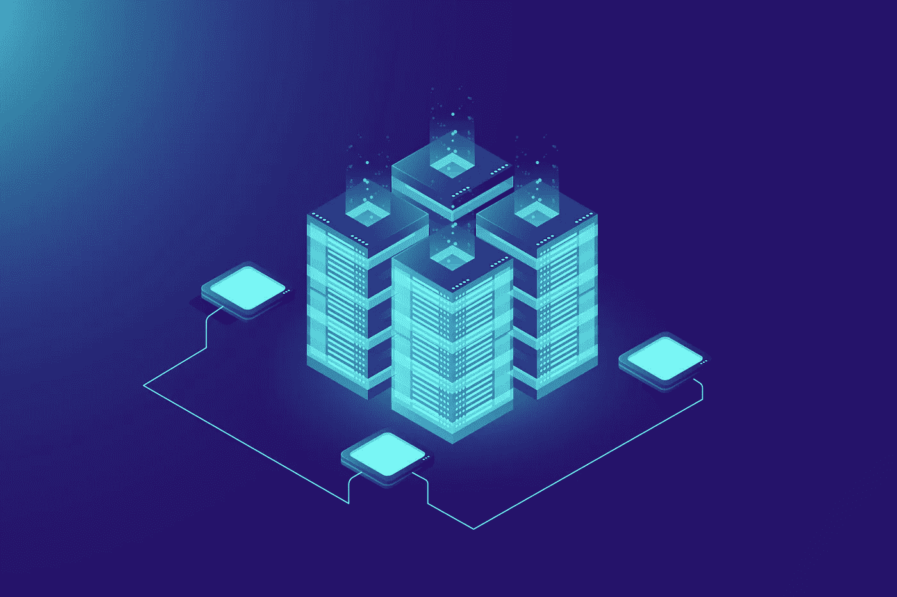
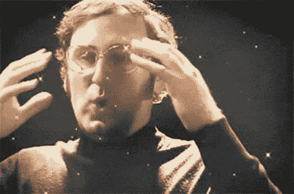

# Web3.0 和区块链简介

> 原文：<https://medium.com/coinmonks/introduction-to-web3-0-and-blockchain-9f30af63fb86?source=collection_archive---------28----------------------->

我们正处于 2023 年的风口浪尖。现在，我们比以往任何时候都听到更多关于 **Web3.0** 、**加密货币**和**元宇宙**的消息。有许多术语被随意使用，经常被误用和误解。

Designed by fullvector / Freepik

大多数人都听说过加密大亨和加密货币可能带来的机遇。加上媒体对 FTX 崩溃的广泛报道，加密可能是当今最热门的话题之一。

但是为什么几乎没有人知道他们正在交易的加密资产或者他们的 OpenSea 集合中的 NFT 的内部工作原理呢？

那么，到底什么是 Web3.0？在技术层面上，它是如何工作的，它提供了什么机会？

Image by Tumisu from Pixabay

所以，我们先来解释一下这个名字的由来:

Web1.0 指的是 90 年代的**静态**网站。这些网站与书籍、报纸和信件一样，只能显示信息，而不能向用户提供任何互动。

Web2.0 是我们熟悉的现代网站。它提供了动态网站和适应性网站，永远改变了我们使用互联网的方式。我们现在使用的大多数网站都是 Web2.0

Web3.0 希望分散互联网，减少对大型科技公司和其他大公司保存大量(通常是私人)数据的依赖。它给互联网带来了一层所有权。

既然我们知道了为什么 Web3.0 会被这样命名，我们也许应该解释一下 Web3.0 诞生的技术突破

**区块链**。这是一个大多数人至少听过一次的词，但区块链的内部工作方式对大多数人来说仍然是一个谜。所以，让我们试着解释一下区块链。

首先，区块链最基本的单元是区块。块存储它们的元数据(例如当前块散列、块生成时间戳等。)、通向前一个块的散列以及有效载荷数据(我们希望存储在链上的数据)。

当然，不同的网络可以将不同的组件添加到它们的块中，但是这三个是存在于任何链上的每个块中的基本部分。唯一的例外是链的第一个块 Genesis 块，它自然不包含指向前一个块的指针

与这些积木一起，我们构建了一个积木链，由每个积木与前一个积木的连接来引导。因此得名，区块链。

现在我们知道了区块链最纯粹的定义，我们可以探索这项技术背后的其他构建模块:

1.  **共享分类账** —共享分类账是一种记录保存的系统。这是一个“只添加”的分布式系统，所以只能添加记录，不能删除。此外，记录在共享分类帐中仅保存一次，而不是由交易双方独立保存。
2.  **权限** —链可以是私有的、公共的或有权限的。这允许从更基本的级别对数据进行更好的保护，允许创建者限制/授权对链的访问。区块链也可以更容易地遵守数据保护法规。
3.  **智能合同** —智能合同是一份协议或一套规则，与普通合同一样。但是，智能合同存储在链上，并作为存储合同的事务的一部分执行。例如，如果我写了一份合同，同意支付 10，000 美元购买一辆汽车，在他们给我汽车之前，我必须自己把钱存到汽车经销商那里。在这里，有三个交易:签署合同，发送资金，并获得汽车。然而，智能合同将只需要一个交易:签署合同。然后，链家会自动把钱和车送过来。
4.  **共识** —链上的所有交易都由各方达成一致。许多不同的链使用许多方法，但是它们超出了本文的范围。

那么，为什么区块链技术允许 Wevb3.0 的启动呢？很简单，有了区块链，海量数据可以去中心化的方式存储。

因此，数据的所有权可以交给用户，而不是服务的所有者。这正是 Web3.0 背后的主要概念。因此，Web3.0 和区块链携手并进。

不过，还有最后一件事我需要提一下。Web3.0 还没有完全独立。事实上，大部分数据仍然以传统的 Web2.0 方式存储和处理。

最著名的例子是 NFTs(不可替换的令牌)。这些通常与艺术品相关联的代币并不包含真正的艺术品。

相反，它们包含一个到存储真实文件的服务器的链接。而且理由很充分。原因是你需要为 ETH 和 Solana 连锁店的每笔交易支付汽油费，这是最受欢迎的连锁店。

让我们试着计算一下，存储我在手机上随便拍的一张照片需要多少存储空间。这张图片重 2.22MB。根据[以太坊黄皮书](https://ethereum.github.io/yellowpaper/paper.pdf)，一千字节的数据将是 640K gas 或 0.032ETH。

扩展到 2.22MB 将意味着 72.7ETH，或 88，421.375 美元！

因此，尽管区块链技术让我们有了一个完整的 Web3.0 的愿景，但现在它仍处于形成过程中。随着技术的进步和新链的建立，我们将看到向基于区块链的 Web3.0 的更大转变。

但这一切只是冰山一角。Web3.0 会慢慢渗透到越来越多的行业。请加入我的系列文章，其中我将涵盖各个领域以及 Web3.0 对它们的影响。

或者，继续这个系列，了解 Web3.0 和区块链的内部工作方式。区块链有哪几层？智能合约是如何运作的？不同的链有什么区别，有什么不同的共识方法？

> 交易新手？在[最佳密码交易所](/coinmonks/crypto-exchange-dd2f9d6f3769)上尝试[密码交易机器人](/coinmonks/crypto-trading-bot-c2ffce8acb2a)或[复制交易](/coinmonks/top-10-crypto-copy-trading-platforms-for-beginners-d0c37c7d698c)