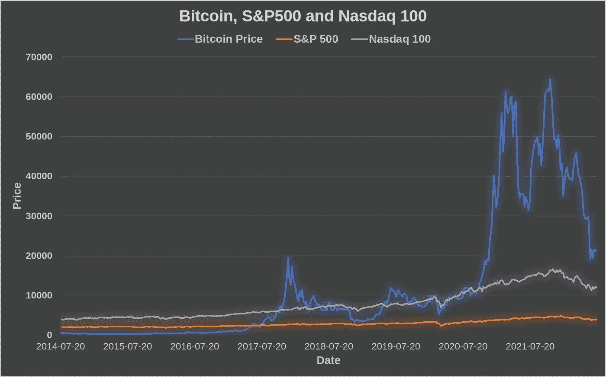
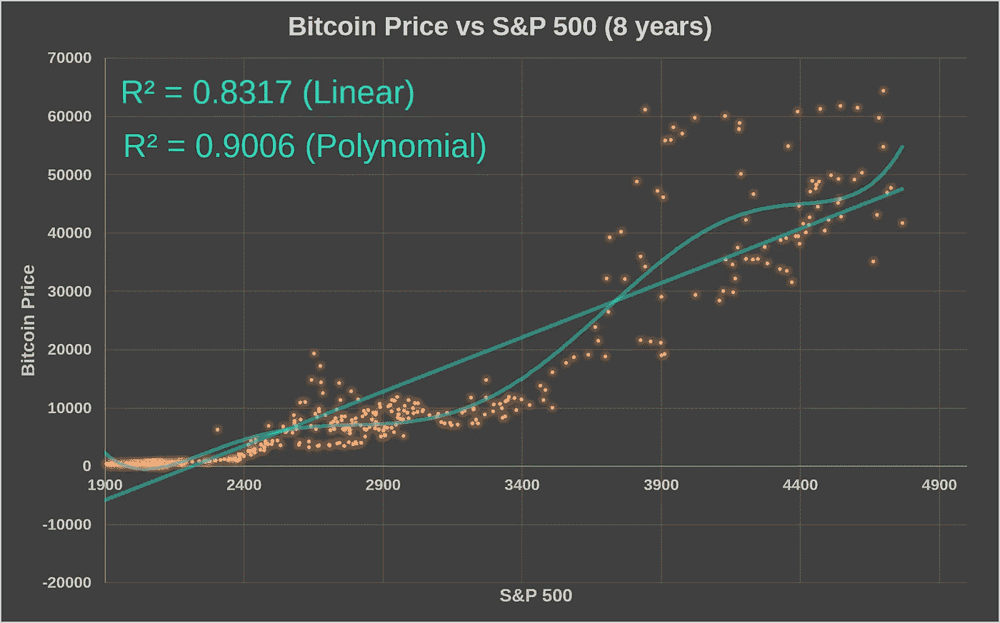
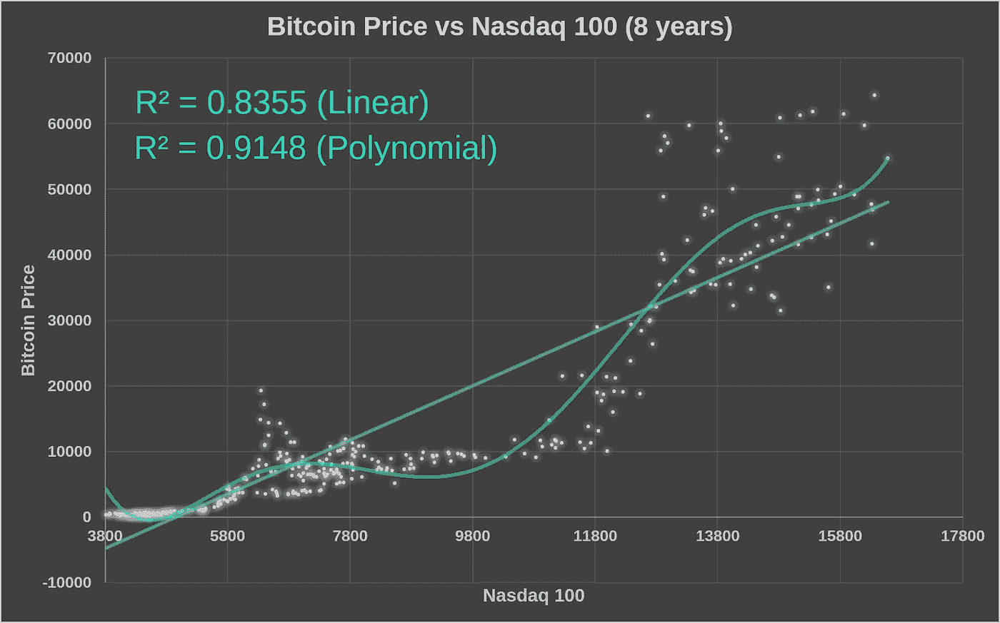

# 标准普尔 500 和纳斯达克 100 指数与比特币价格的相关性研究

> 原文：<https://medium.com/coinmonks/investigating-the-correlation-of-s-p-500-and-nasdaq-100-with-bitcoin-price-3e8047093eed?source=collection_archive---------12----------------------->

**简介**

许多分析师和投资者总是在寻找股市指数的信息，以了解比特币的价格走势。在这种背景下，B 计划创建了一个关联标准普尔 500 指数(标准普尔 500)和比特币价格的模型[1]。但是，由纳斯达克股票交易所上市的最大非金融公司组成的纳斯达克 100 指数与比特币价格的相关性能超过标准普尔 500 吗？

本研究选取了标准普尔 500 和纳斯达克 100 指数来评估这些指数与比特币价格之间的相关性。线性和多项式模型被用来寻找这个问题的答案。

**弱相关**

使用了投资的价格和股票市场指数[2]。

从图 1 中提取的第一个总体想法是，这些指数和比特币价格之间存在微弱的相关性，相反，比特币证明有自己的生命，并以自己的方式发展。

Figure 1\. Bitcoin (BTC), S&P 500, and Nasdaq 100 Chart.

第二，8 年前比特币价格低于这两个指数，但在 2022 年价格更高，这表明了比特币网络的巨大价值以及自成立以来它是如何盈利的。

> 交易新手？试试[密码交易机器人](/coinmonks/crypto-trading-bot-c2ffce8acb2a)或[复制交易](/coinmonks/top-10-crypto-copy-trading-platforms-for-beginners-d0c37c7d698c)

**车型**

从图 2 中可以看出，比特币价格和标准普尔 500 指数之间存在微弱的正相关性，一旦决定系数(R2)最接近 1 时，则表明存在强相关性。线性模型发现多项式模型的 R 平方为 0.8316 和 0.9006。

Figure 2\. Comparison of the Linear Model (blue) and Polynomial Regression (green) for Bitcoin price vs S&P 500 index.

Figure 3\. Comparison of the Linear Model (blue) and Polynomial Regression (green) for Bitcoin price vs Nasdaq 100 index.

图 3 中的重要信息是，纳斯达克 100 指数与比特币价格的相关性强于标准普尔 500 相关性。纳斯达克 100 指数的线性模型达到了 0.8355 的 R2，多项式模型达到了 0.9148。换句话说，如果你想从股市中寻找信息，可能使用纳斯达克 100 指数会更有效。

仅分析去年，决定系数呈现出不可接受的线性，标准普尔 500 的 R = 0.6483(线性)和 R = 0.6991(多项式)，纳斯达克 100 的 R = 0.7094(线性)，R = 0.7308(多项式)，凸显了比特币遵循的独特路径，受到全球经济的影响，但也是独一无二的。

**结论**

这里提出的简单建议是一个极好的机会，向交易者和投资者展示一种从股票市场寻找信息的新方法。此外，这些模型显示，在理解比特币价格走势方面，纳斯达克 100 指数可能比标准普尔 500 更有用。

如果您喜欢这些内容，请考虑以下建议:

BTC:BC 1 qljlmuwq 9 gyvn 7 uhvwwypsj 4x 8 hcetuzhw 9 quh 0

BNB:bnb 159am 7 huy 53mg 7 sygnklrtxkahkdk 2 qxzmnk 0 GW

BUSD:bnb 159am 7 huy 53mg 7 sygnklrtxkahkdk 2 qxzmnk 0 GW

**致谢**

作者感谢中本聪、哈尔·芬尼、尼克·萨博、赵昌鹏、萨布丽娜·莫赖斯和安德烈·福斯。

**参考文献**

1. [(2) PlanB no Twitter:“过去 10 年，P500 和比特币一直是相互关联、共同整合的。标普暗示 BTC 价格:2.5 万美元..有趣的时代就在前方！https://t.co/mi8gLmKcmf"/推特](https://twitter.com/100trillionusd/status/1285494118941167617)

2.[https://www.investing.com/](https://www.investing.com/)

> 加入 Coinmonks [电报频道](https://t.me/coincodecap)和 [Youtube 频道](https://www.youtube.com/c/coinmonks/videos)了解加密交易和投资

# 另外，阅读

*   [火币加密交易信号](https://coincodecap.com/huobi-crypto-trading-signals) | [HitBTC 审核](/coinmonks/hitbtc-review-c5143c5d53c2)
*   [TraderWagon 回顾](https://coincodecap.com/traderwagon-review) | [北海巨妖 vs 双子 vs 比特亚德](https://coincodecap.com/kraken-vs-gemini-vs-bityard)
*   如何在 FTX 交易所交易期货
*   [OKEx vs KuCoin](https://coincodecap.com/okex-kucoin) | [摄氏替代品](https://coincodecap.com/celsius-alternatives) | [如何购买 VeChain](https://coincodecap.com/buy-vechain)
*   [ProfitFarmers 回顾](https://coincodecap.com/profitfarmers-review) | [如何使用 Cornix Trading Bot](https://coincodecap.com/cornix-trading-bot)
*   [如何匿名购买比特币](https://coincodecap.com/buy-bitcoin-anonymously) | [比特币现金钱包](https://coincodecap.com/bitcoin-cash-wallets)