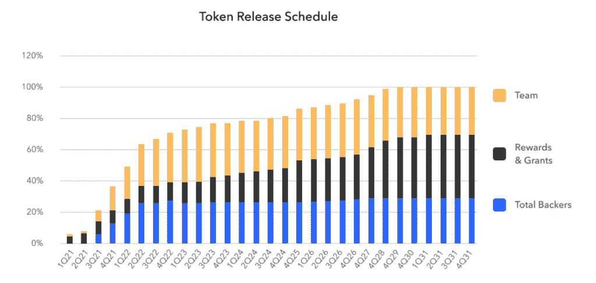

# 投资离心机

> 原文：<https://medium.com/coinmonks/investing-in-centrifuge-19c496345940?source=collection_archive---------27----------------------->

Source: CentrifugeDocs

离心机为区块链带来了真实世界的资产。它提供了一个去中心化的借贷协议，允许用户将其真实世界的资产(如抵押贷款和版税)令牌化，并从这些资产中释放巨大的流动性。离心机为小企业提供快速、廉价的资本，为投资者提供稳定的收益。

# 产品

Tinlake 是离心机面向消费者的核心产品，是一个开放的、基于智能合约的资产池市场，汇集了资产发起人和投资者，以释放现实世界资产的流动性。

下图显示了离心机的工作原理及其商业模式。简而言之，资产发起人(如中小企业、艺术家)提供文件(如发票、艺术品)，这些文件将由第三方验证，然后这些文件将以 NFT 格式锁定，作为 Tinlake 池中的抵押品，为发起人的资产提供资金。

*Source: Centrifuge*

资产发起者的好处是，与投资银行等许多传统途径相比，他们可以更快、更便宜地获得资金。更重要的是，许多传统上由于规模有限或资产类型不受支持而无法获得融资的中小企业可以通过离心机为其项目融资。

对于投资者来说，离心机为他们提供了两种贷款融资选择，每种都通过一种类型的令牌。高级令牌 DROP 被称为“收益令牌”，通过 TIN 令牌防止违约，并获得稳定(但通常较低)的回报。次级债券锡的回报率预计会更高，但波动性更大，因为它们首先吸收了任何潜在的违约。

# 市场

在定性评估之前，让我们做一些数学计算。

*   **TAM** (潜在市场总量):根据[forcast](https://forkast.news/digital-asset-report/tokenized-asset-market-sizing-and-analysis/)的一份报告，包括房地产和大宗商品在内的主要现实世界资产的总价值约为 30 万亿美元。如果我们对 crypto 使用保守的 400%抵押率，那么 TAM 就是 30/4 = 7.5 万亿美元。
*   **SAM** (可服务的可寻址市场):限制服务可寻址性的一个主要因素是加密货币的总市值。根据 [CoinMarketCap](https://coinmarketcap.com/charts/) 的数据，全球加密市场的总市值在约 1 万亿至约 3 万亿美元之间波动。为简单起见，我取中间值 2T。
*   SOM**(可获得的可维修市场):在这个领域有一些竞争者，尽管我认为离心机是其中的佼佼者。一个适度的假设是，离心机可以得到 5%的 SAM。换算成 1000 亿索姆。这是一个巨大的市场。**

**定性地说，有一些现有的证据表明，离心机是在正确的轨道上找到自己的位置，并实现产品/市场的配合。例如，它与一家音乐分析公司进行了成功的试点，以释放数字媒体的流动性，这是一个上述 TAM 没有考虑的利基市场。**

# **组**

**出于尽职调查的目的，我通常会检查创始人是否应该具备涵盖产品构建、增长和运营的互补技能。创始人过去的经验最好地证明了这一点:**

*   **CEO: Lucas Vogelsang，有软件开发经验。**
*   **首席财务官&首席运营官:马丁·昆塞尔(Martin Quensel)，他是被 SAP 收购的金融供应链初创公司 Taulia 的联合创始人兼总经理。**

**值得注意的是，Taulia 和离心机(核心业务)处于同一垂直领域；这利用了创始人的领域专长。**

**我想见见战略家、业务发展顾问和法律顾问(特别是因为 DeFi 可能面临的法规)。我确实发现所有这些角色在他们扩大的团队中都有人担任。**

# **令牌组学**

**离心机令牌(CFG)是离心机的主要令牌(在波尔卡多特 L1 上)。表征组学的细节如下:**

*   **总代币供应量:4.25 亿**
*   **流通供应量(截至 2022 年 8 月，如适用，下同):3.02 亿**
*   **市值:1.15 亿英镑**
*   **完全稀释后的市值:1.54 亿英镑**

**CFG 具有如下所示的分发和发布时间表:**

****

***Source: Centrifuge***

****

***Source: Centrifuge***

**请注意，虽然分配的最大部分给了核心团队成员，但这部分有 48 个月的锁定期和 12 个月的悬崖；这是合理的。**

**同样值得注意的是，CFG 是一个治理令牌，但它也可以用于支付交易费用和入股——也就是说，它有一些用例。**

# **牵引力**

**下图显示了展示离心机吸引力的两个指标(收入、唯一地址)。**

****

***Source: Token Terminal***

**唯一地址图(令牌持有者数量)与令牌发布时间表一致，这意味着令牌很受欢迎，而不是集中在少数持有者中。此外，即使在一些加密货币暴跌期间，收入的普遍增长也意味着离心机通过其收取交易费的服务获得了牵引力。**

# **竞争**

**由于离心机的服务范围相对较广，您观察到的竞争对手会因您关注的细分市场而异:**

*   **如果你专注于 **DeFi lending** ，那么这里有一大堆选择。然而，我认为几乎所有这些替代品都只接受密码作为抵押品，而不是离心机的真实世界资产**
*   **如果焦点是真实世界资产的**标记化**，那么这个垂直领域中值得注意的玩家是 Polymath Network。但是 Polymath 大多停留在令牌化(变成安全令牌)上，我也对它的进展和令牌价格历史有些担忧。**
*   **如果重点是**通过真实资产融资**，我认为这是最合适的类别，那么竞争对手是:**
*   **poly trade——目前主要支持发票作为抵押品，比离心机窄很多。它的市值和交易量也小得多。**
*   **持久性——这可能是目前离心机唯一真正的竞争对手。然而，仔细观察一下，Persistence 显然有一种不同的开发产品的战略方法。目前，持久性更侧重于构建基础设施和吸引开发人员在其基础设施上构建，并实现类似于离心机的愿景。**

**简而言之，上面的竞争分析揭示了只有一个真正的竞争对手值得跟进。这一部分远没有听起来那么拥挤。**

# **过去的资金和投资者**

**根据 PitchBook 的数据，截至 2022 年 8 月，离心机已经筹集了 1180 万美元。最新一轮融资是 2021 年 2 月的一轮 430 万美元的风险投资。其机构投资者包括 Galaxy Digital Holdings、AU21 Capital 和 FinTech Collective。正如许多加密项目一样，它吸引了一些天使投资者，包括菲利普·默林和罗伯特·莱什纳。**

**与最近的许多加密项目相比，离心机资金充足。它还向基金会分配了 10%以上的令牌(参见令牌组学部分的令牌分布图)，这是对不确定性的缓冲。**

# **风险**

**在讨论这个项目的风险之前，我将快速回顾一下他们的商业模式。离心机的商业模式有两个主要组成部分:资产发起者(借款人)抵押真实世界的资产并获得资金，投资者(贷款人)提供流动性并在贷款到期时获得利息。正如我在竞争部分提到的，离心机不同于典型的 DeFi 贷款协议，因为借款人抵押真实世界的资产。离心机的主要风险与这种差异有关:**

*   **借款人采用风险:借款人是传统资产的所有者或知识产权的创造者(而不是典型 DeFi 贷款中的密码持有者)。他们通常对 DeFi 了解较少，离心机需要付出更多努力来教育市场。(我不会担心贷款人的采用，因为离心机的贷款方面与 Aave 等典型的 DeFi 贷款协议没有太大区别。)**
*   **监管风险:这种风险在借款方也更为相关。随着离心机连接 DeFi 和 TradFi，后者更加成熟和受监管，离心机将吸引监管审查。**
*   **抵押品风险:这里很棘手，因为我认为抵押品风险在某种意义上比典型的 DeFi 贷款协议要小，但在另一种意义上却更大。从积极的一面来看，由于借款人抵押的是波动性小得多的真实资产，抵押风险降低了。然而，缺点是如何始终如一地确保真实世界的抵押品是真实的；从这个角度来看，风险更大。**
*   **当然，像大多数 DeFi 项目一样，存在安全风险。**

# **结论**

**离心机是一家领先的公司，它将现实世界的资产与 DeFi 连接起来，释放现实世界资产的流动性，并使用它们为现实世界的业务融资。市场规模巨大，离心机在该领域没有太多真正的竞争对手。其团队在金融供应链的垂直领域拥有丰富的经验，并在业务发展部和法律咨询部聘用了关键人员来解决客户采用风险和监管风险。我看好这个机会，推荐投资 CFG(或包装 CFG)。**

# **关于作者**

**海顿·罗是明尼苏达大学卡尔森管理学院的 MBA 候选人。他拥有天使投资、创业运营、工程项目管理和战略咨询方面的专业经验。Haydon 是一个技术爱好者，lifehacker，现在正在积极探索 Web3。**

****参考****

**离心机网站，离心机文档，离心机官方 CFG 令牌执行摘要，PitchBook，Crunchbase。**

****免责声明****

***本文件中的分析仅供参考。虽然我努力保持信息的最新性和正确性，但对于本文档或本文档中包含的信息、产品、公司或相关图形的完整性、准确性、可靠性、适用性或可用性，我不做任何形式的明示或暗示的陈述或保证。因此，您对这些信息的任何依赖都是完全由您自己承担风险的。***

***原载于 2022 年 8 月 30 日*[*https://www.haydonluo.com*](https://www.haydonluo.com/blog/2022/08/30/investing-in-centrifuge/)*。***

> **交易新手？尝试[加密交易机器人](/coinmonks/crypto-trading-bot-c2ffce8acb2a)或[复制交易](/coinmonks/top-10-crypto-copy-trading-platforms-for-beginners-d0c37c7d698c)**