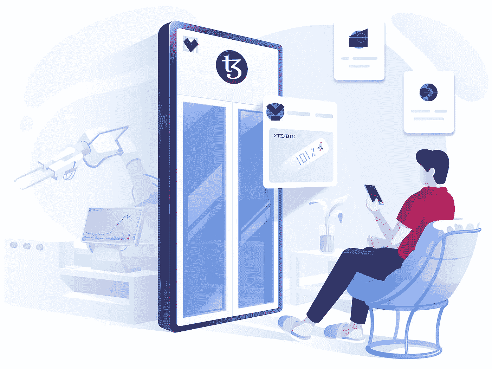

# 投资虚拟世界 v 在虚拟世界购买代币

> 原文：<https://medium.com/coinmonks/investing-in-virtual-land-vs-buying-tokens-in-the-virtual-world-958b73b88634?source=collection_archive---------21----------------------->

## 既然可以在协议本身中购买令牌，为什么还要投资虚拟土地呢？

Photo by [Jonathan Borba](https://unsplash.com/@jonathanborba?utm_source=unsplash&utm_medium=referral&utm_content=creditCopyText) on [Unsplash](https://unsplash.com/s/photos/crypto?utm_source=unsplash&utm_medium=referral&utm_content=creditCopyText)

> 关于你的作者:CryptoQuestion 是一个为加密货币投资者提供免费资源的独立平台。通过按需问答服务…