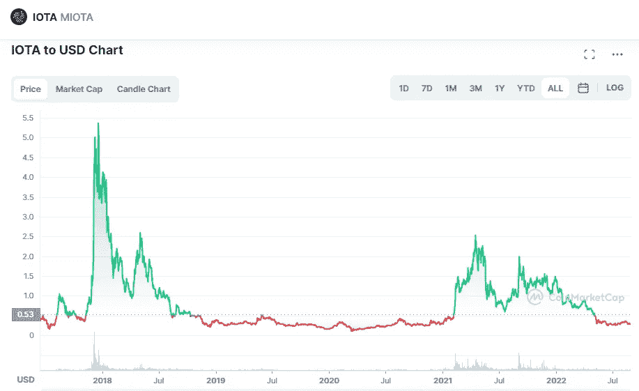

# IOTA(米欧塔)2022–2025 年价格预测

> 原文：<https://medium.com/coinmonks/iota-miota-price-prediction-2022-2025-ed52541b220d?source=collection_archive---------12----------------------->

Source photo [IOTA price today, MIOTA to USD live, marketcap and chart | CoinMarketCap](https://coinmarketcap.com/currencies/iota/)

什么是 IOTA？

IOTA 是一个公共的分布式分类帐，设计用于独立于任何一个区块链运行。另一方面，它使用了有向无环图(DAG)技术。作为一种网络拓扑，Tangle 被 IOTA 用来认证金融交易。

IOTA 项目最初于 2016 年启动，自启动以来已经走过了漫长的道路。为了便于…