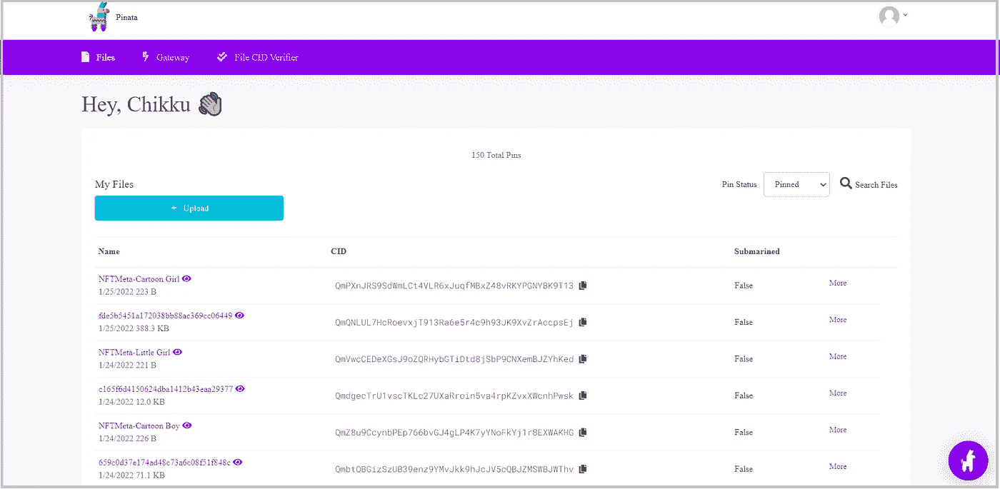

# IPFS Vs Arweave Permaweb

> 原文：<https://medium.com/coinmonks/ipfs-vs-arweave-permaweb-a482dc717150?source=collection_archive---------7----------------------->

## NFT 系列

## 流行的分布式文件存储平台研究

当我们在区块链铸造一个 NFT 时，它会生成一个带有 URI 的唯一令牌，这基本上是一个指向某个存储上的文件的超链接。该文件包含该 NFT 的独特属性和到实际图像文件的链接。这被称为元数据。显然，只有数字签名存储在区块链上，而 NFT 图像及其信息存储在单独的存储平台上。

等等！NFT 不存储在区块链上！但是为什么呢？— *像图像/视频这样的数字资产通常需要制作很大的尺寸。把它们像以太坊一样存放在区块链上也有点贵。这就是为什么只有暗示所有权的数字签名存储在区块链上，而实际的 NFT 图像和元数据保持在链外。*

将文件存储在任何集中式存储平台上都太冒险了。因为如果服务器宕机，我们不能保证文件可以被检索到，这最终会使 NFT 无法使用。

这是一幅分散存储平台的画面，其中数据使用对等协议分布在多个节点上，因此没有人能够取下文件。 **IPFS 和 Arweave Permaweb** 就是这样的非功能性桌面存储平台。

## IPFS(星际文件系统)

IPFS 使用对等协议以分散的方式托管文件。当我们上传一个文件到 IPFS，它被存储在一个节点上。它对文件进行加密编码，并提供唯一的内容标识符(CID ),以便其他节点也可以识别。当有人查询文件时，另一个节点会使用 CID 找到它，并将其提供给我们。稍后，该节点还可以存储该文件以供将来使用。但是如果每个节点都尝试存储文件，存储空间就会减少。所以垃圾收集器开始删除没有被固定的文件。可以使用名为 **Pinata 的锁定服务来锁定文件。** IPFS 可用于这类需要以分散和内容可寻址的方式快速检索的数据。

## 皮纳塔

皮纳塔是使用 IPFS 最简单的方法。它是 IPFS 网络的牵制平台。锁定文件可以确保文件不会被垃圾收集器移除。

尽管 Pinata 一开始提供了一个免费账户，但在有限的使用之后，我们应该转向付费账户。一旦我们停止付费，文件被删除的几率会更高。

*使用 Pinata 创建您的免费帐户，如下所示:*

## 第一步:转到 [Pinata](https://www.pinata.cloud/)

[Pinata](https://www.pinata.cloud/)

## 第二步:点击登录

Pinata sign in or sign up

*现在您可以将您的文件上传到 Pinata！*

## Filecoin

Filecoin 也是一个建立在 IPFS 之上的分散层。它允许我们更经济高效地存储长期数据。它允许每个人被激励成为网络的一部分。Filecoin 在一定时期内以固定价格存储数据。如果时间到了，那么我们不能保证文件不会被删除。

## Arweave Permaweb

永久分散的 web，托管多个社区驱动的应用程序和平台。Arweave 是一个区块链项目，确保可持续链上数据存储。这个网络是永久网的基础。用户可以通过 Arweave 网关访问 Permaweb 上的应用程序。它将数据永久存储在链上，不会被篡改。数据分布在几个节点或挖掘器上。我们只需支付一次存储费用，就可以在区块链上无限期地存储数据。

*在 Arweave 上创建您的帐户，如下所示:*

## 第一步:进入 [ArWeave 网站](https://faucet.arweave.net/)

[ArWeave Website](https://faucet.arweave.net/)

## 第二步:下载钱包

Download wallet

## 第三步:发微博告知钱包地址

Tweet wallet address

*现在你有了一个密钥文件和一个钱包地址。*

## 第四步:转到 [ardrive](https://ardrive.io/)

*点击登录*

ardrive

## 第五步:点击选择钱包

*上传您在步骤 2 中获得的密钥文件。*

Select Wallet

## 第六步:用用户名和密码注册

ardrive sign up

## 第七步:充实你的钱包

我们的钱包中应该有 ArWeave 令牌(AR)才能使用 ArDrive。ArDrive 只需要一次性费用，数据将永久存储，无需任何订阅。通过此处指定的[选项获取您的 AR。](https://ardrive.atlassian.net/wiki/spaces/help/pages/86540310/Fund+Your+Wallet)

现在你可以开始上传你的文件了。

## 谢谢:)

> 交易新手？尝试[加密交易机器人](/coinmonks/crypto-trading-bot-c2ffce8acb2a)或[复制交易](/coinmonks/top-10-crypto-copy-trading-platforms-for-beginners-d0c37c7d698c)