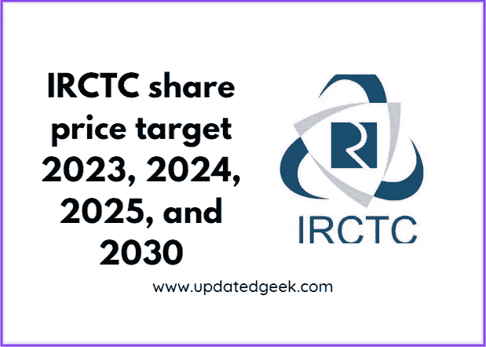
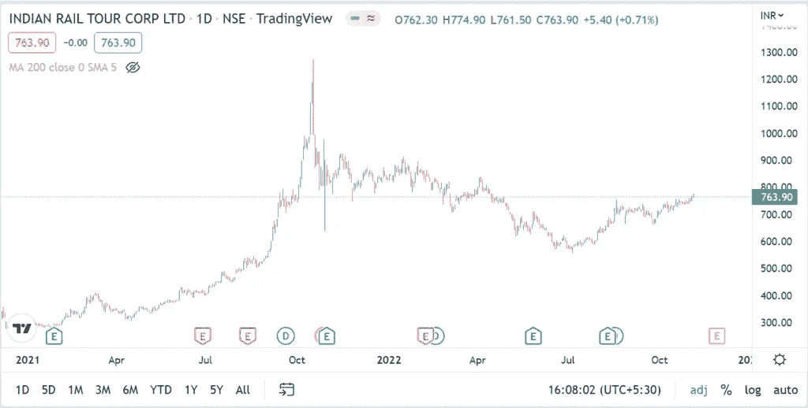
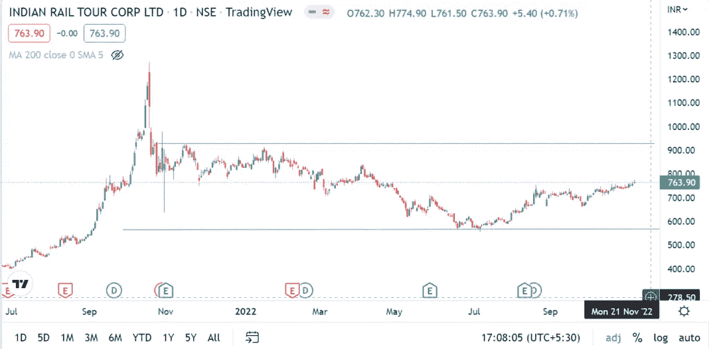

# IRCTC 2023 年、2024 年、2025 年和 2030 年的股价目标

> 原文：<https://medium.com/coinmonks/irctc-share-price-target-2023-2024-2025-and-2030-611f04fc1e99?source=collection_archive---------1----------------------->

# IRCTC 公司详细信息

IRCTC share price target 2023, 2024, 2025, and 2030

IRCTC 代表印度铁路餐饮和旅游公司。该组织是印度政府铁道部印度铁路公司的全资子公司。它为印度铁路提供多种服务，如票务、旅游和餐饮。该组织成立于 1999 年 9 月，是一个公共部门企业。2008 年，该组织被归类为 Miniratna 公共公司，提供一定程度的财政权力。

**IRCTC 股份**2019 年在全国证券交易所上市。此后，印度政府将其股份降至 87%，其余股份公开交易。此外，达政府通过剥离另外 20%的股份将股份减少到 67%。该公司在 2020 财年报告的收入为 235.353 亿卢比，净收入为 52.857 亿卢比。

**亦读**

[HDFC 股价目标](https://updatedgeek.com/hdfc-ltd-share-price-target/)

[分支金融股价目标](https://updatedgeek.com/muthoot-finance-share-price-target/)

[Bajaj 金融股价目标](https://updatedgeek.com/bajaj-finance-share-price-and-target/)

> 交易新手？在[最佳加密交易](/coinmonks/crypto-exchange-dd2f9d6f3769)上尝试[加密交易机器人](/coinmonks/crypto-trading-bot-c2ffce8acb2a)或[复制交易](/coinmonks/top-10-crypto-copy-trading-platforms-for-beginners-d0c37c7d698c)

# 技术分析

当前 **IRCTC 股价**为 763.90 卢比。该股在 2021 年 10 月触及 1273 卢比的最高值。最大值是根据 2021 年 11 月股票 1:5 的拆分估算的。

IRCTC share price chart

过去一年，IRCTC 的股价一直在两条水平线之间盘整。目前，价格正好位于水平线的中心。激进的买家可以在当前价格进入交易。也可以等价格突破上方水平线。这将是 IRCTC 股价突破盘整区域并有望上涨的点。

IRCTC share price zone

保守的买家可以等待价格在 650 到 700 卢比之间。预计 IRCTC 的股价在未来几年将会上涨。

该公司宣布 2022 年 8 月的股息为 1.50 卢比，2022 年 2 月为 2 卢比，2022 年 9 月为 5 卢比，2.50 卢比，2020 年 2 月为 10 卢比。

[点击此处](https://link.upstox.com/DQT7YCUH7irWFzFM6)在印度最好的经纪人处开立 demat 账户

[向印度最好的经纪人开立加密钱包账户](https://wazirx.com/invite/jkwe73z9)

# IRCTC 股价目标

**IRCTC 的股价目标【2023 年在 1800 到 1850 卢比之间，2024 年在 2000 到 2250 卢比之间，2025 年在 2500 到 2680 卢比之间，2030 年在 6000 到 6600 卢比之间。**

许多因素在估算 IRCTC 股价目标时起着关键作用。首先是疫情之后的经济复苏。随着新冠肺炎病例的减少，酒店业有望再次增长。

IRCTC 可能会在目前不提供服务的许多火车站提供多样化的服务。预计该公司的收入将增长 3 至 4 倍。

政府还可能宣布许多铁路基础设施发展项目。因为该公司在行业中处于垄断地位，因为它归政府所有，没有其他私人参与者。然而，印度铁路的私有化已经在进行中，预计印度铁路的状况将会改善。

**也读作**

[Bajaj Finserv 股价目标](https://updatedgeek.com/bajaj-finserv-share-price-and-target/)

[PFC 股价目标](https://updatedgeek.com/power-finance-corporation-share-price-target/)

[Manappuram 财务股价目标](https://updatedgeek.com/manappuram-finance-limited-share-price-target/)

[苹果公司股价目标](https://updatedgeek.com/apple-inc-share-price-target/)

# 结论

IRCTC 股票是一种增长型股票，随着越来越多的人开始使用铁路服务，预计该公司将获得收入。如果你将资金长期投资，投资 IRCTC 股票可以获得巨大回报。

**免责声明**:如果你想投资股市，在做出购买决定之前，你应该咨询你的理财顾问。你应该评估风险，研究公司细节。

# 常见问题

**1。IRCTC 最适合长期投资吗？**

是的，IRCTC 可以在长期投资中获得不错的回报

**2。IRCTC 的目标是什么？**

2023 年的目标是 1，800 至 1，850 卢比，2024 年是 2，000 至 2，250 卢比，2025 年是 2，500 至 2，680 卢比，2030 年是 6，000 至 6，600 卢比。

**3。现在买 IRCTC 好吗？**

是的，在价格图表显示的现有区域购买 IRCTC 很好

**相关搜索**

[(价格图表)2022 年 11 月你应该购买的 3 种最佳加密货币](https://updatedgeek.com/best-cryptocurrency-to-buy-november/)

[为什么 2022 年你不应该现在就在印度购买电动汽车？](https://updatedgeek.com/why-not-buy-electric-vehicle-in-india/)

[为什么信用卡或借记卡有有效期？](https://updatedgeek.com/why-credit-or-debit-cards-have-expiry-date/)

[在亚马逊和 Flipkart 上省钱](https://updatedgeek.com/save-money-amazon-and-flipkart/)

[什么是 Upstox，为什么要在 2022 年开户？](https://updatedgeek.com/what-upstox-and-why-open-account-2022/)