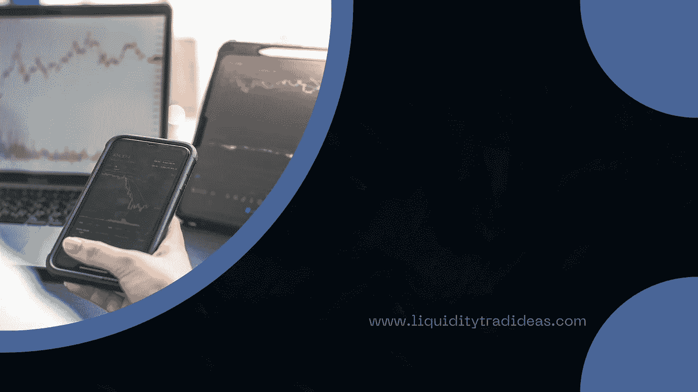
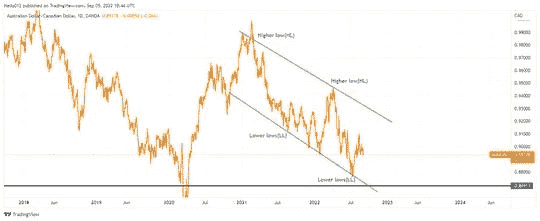
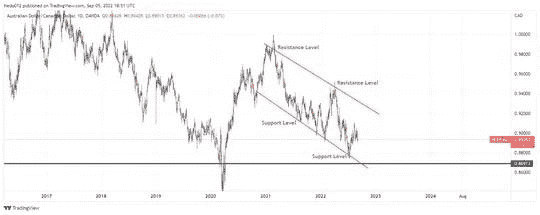

# 下降通道是看涨还是看跌？

> 原文：<https://medium.com/coinmonks/is-a-descending-channel-bullish-or-bearish-3b46286ece9b?source=collection_archive---------48----------------------->

Image by [Liquiditytradeideas](https://liquiditytradeideas.com/)

下降通道是看涨还是看跌？你是金融领域的新手，对下降通道是看涨还是看跌感到困惑，或者你正在寻找一个简单而有利可图的策略，可以应用于金融市场并获得丰厚的利润？

如果是这样的话，那么你就可以享受一下了。在金融界，你需要理解几个关键概念。其中一个概念是，从金融资产交易中赚钱有几种方式，下降通道是大多数盈利交易者使用的最简单的策略之一。

在这篇文章中，我们将更详细地讨论下降通道，包括下降通道的含义，对交易者和投资者的意义，如何识别它，如何绘制下降通道，以及如何交易才能盈利。

# 介绍

下降通道是一种熊市趋势，其特征是一系列较低的高点和较低的低点。当一种资产的价格创造了一个较低的高点，然后是一个较低的低点，并且这个过程重复多次时，这种模式就形成了。下降通道有时也被称为下降趋势或熊市趋势。

# 什么是下降通道？

下降通道是交易者和投资者在金融市场赚钱的最简单的交易策略之一。这是一种识别资产价格走向的方法。

识别下降通道时要记住的最重要的事情是，它们往往在价格较低的区域形成，并且它们通常与市场波动相关。

当使用你的技术分析工具如线和指标寻找下降通道时，重要的是要考虑价格是如何移动的，以及该通道形成的可能性有多大。此外，注意价格中可能出现的任何模式也是有帮助的。

 [## 外汇交易是好是坏？-流动性交易理念

### 外汇交易是好是坏？当然，像任何活动一样，外汇交易几乎没有什么风险…

liquiditytradeideas.com](https://liquiditytradeideas.com/is-forex-trading-good-or-bad/) 

# 下降通道的含义是什么？

下降通道是一种[技术分析](https://liquiditytradeideas.com/is-technical-analysis-useless/)模式，它只是一条连接价格下降趋势低点的熊市趋势线。技术交易者用这种模式来表示股票处于下跌趋势，可能会继续下跌。

在分析市场时，你应该知道下降通道的几个关键含义。首先，这种模式表明空头控制了股票、货币对或资产，下跌趋势可能会继续。

第二，趋势线可以作为利用价格波动的卖空者的目标，因为当股票向下移动到趋势线的支撑时，他们可以从股票中获利。

最后，作为交易者，你应该意识到趋势线以下的突破可能是进一步下跌的信号，他们应该相应地调整交易。

HL/LL Chart by [Chikwem Chinedu Ogugua](https://liquiditytradeideas.com/participant/admin/) on [Liquiditytradeideas](https://liquiditytradeideas.com/)

# 下降通道对交易者和投资者意味着什么？

下降通道是技术交易者在分析金融资产时最常用的图表模式之一。这被一些交易者认为是一种交易策略。

当一项资产的价格行为创造了一个较低的高点和一个较低的低点，并且包含在两条平行的向下倾斜的趋势线内时，就会形成这种形态。

下降通道模式对交易者和投资者来说很重要，因为它可以用来做熊市或牛市反转。例如，如果价格行为突破了下降通道的上趋势线，这可能是牛市反转的迹象。

相反，如果价格突破了下降通道的低趋势线，这可能是熊市延续的迹象，如果你坚持交易，可能会获得巨大的利润。

# 你如何识别市场中的下降通道？

有几种不同的方法来识别下降通道，但最常用的方法是识别市场在一定时期内的最高价和最低价。一旦你找到了这两点，你就可以画一条线把它们连接起来。

下降通道是一种熊市图表模式，当价格下跌时出现，并由更低的低点和更低的高点支撑。下降通道通常在下降趋势中形成，可以用来识别潜在的支撑位和阻力位。

要识别下降通道，首先你需要注意价格波动的高点和低点。一旦你完成了这些，进入你的工具箱，拿出支点高低点指标，在图表中标出重要的高点和低点。

该线将作为通道的上边界，然后您可以将其向下延伸以形成下边界。下降通道模式也可以用来设定价格目标。

 [## 交易和投资哪个更赚钱？

### 交易和投资哪个更赚钱？交易和投资是一个长期争论的问题。那里…

liquiditytradeideas.com](https://liquiditytradeideas.com/which-is-more-profitable-trading-or-investing/) 

# 交易者和投资者如何绘制下降通道？

下降通道是一种技术分析工具，交易者和投资者用来预测资产未来的价格变动。这种类型的通道是通过画一条线连接最近两个证券价格的低点，然后将这条线向右延伸而形成的。

结果是一个向下倾斜的通道，可以用来识别潜在的买入或卖出机会。下降通道通常被视为熊市信号，因为它们表明价格可能会继续下跌。

然而，这些通道也可以用来识别可能的反转点，因为价格通常会从通道的下线反弹回来。如果你对使用下降通道交易或投资证券感兴趣，这些是你应该知道的几件事。

# 那么，下降通道是看涨还是看跌呢？

下降通道是一种技术分析模式，它只是一条连接价格下降趋势低点的熊市趋势线。这种模式被技术交易者和投资者用来表示股票处于下跌趋势，并可能继续走低。

是的，这可能是真的，但是[技术分析对于交易来说足够了吗？](https://liquiditytradeideas.com/is-technical-analysis-enough-for-trading/)在金融市场中，在对交易资产做出最终结论之前，您应该进行一些类型的分析。

下降通道表明资产是看跌的，可能会继续，相反，如果阻力位被突破，也将被视为看涨信号。这是真的，因为金融市场主要由宏观经济驱动，而不仅仅是工具。

Support/Resistance by [Chikwem Chinedu Ogugua](https://liquiditytradeideas.com/participant/admin/) on [Liquiditytradeideas](https://liquiditytradeideas.com/)

# 下降通道怎么交易？

有几种方法可以交易下降通道，可以用裸图交易。这个概念通常由有经验的交易者实践，他们不把技术指标纳入他们的交易策略。

它也可以在一个指标的帮助下进行交易，这个指标可以帮助交易者注意到何时卖出资产并获得可观的利润。这种方法主要被不熟悉价格行为的[新手交易者](https://liquiditytradeideas.com/which-trading-is-best-for-beginners/)使用。

**卖空:**

然而，无论你是只根据价格行为交易还是结合交易指标交易，最常见的方法是等待价格测试并反弹至卖空的阻力位，并伴随着成交量的增加，这被认为是一个看跌信号。

**突破买入:**

在突破过程中，最好的方法是等待价格突破该形态向上的阻力，并再次测试该阻力，然后进入多头仓位。上涨突破应该伴随着成交量的增加，这被认为是一个看涨信号。

根据您打算交易的偏好，可能是卖空或多头，关注与资产相关的宏观经济很重要，并始终等待使用价格行动或技术指标的确认，以最小化损失和最大化机会。

 [## 对于交易来说技术分析就够了吗？-流动性交易理念

### 对于交易来说技术分析就够了吗？刚接触交易或对金融市场的概念感到困惑…

liquiditytradeideas.com](https://liquiditytradeideas.com/is-technical-analysis-enough-for-trading/) 

# 交易渠道指标

而下降通道模式是在价格下跌时形成的，它创造了更低的低点和更低的高点。如果价格跌破较低的低点，这个形态就被认为是完整的。通过使用[技术指标](https://liquiditytradeideas.com/top-10-powerful-trading-indicators/)结合其他数据，你可以做出更明智的交易决策，提高成功几率。

交易下降通道中使用的一些指标包括:

振荡指标是一种技术分析指标，允许交易者和投资者通过测量两个连续的高值和低值之间的差异来预测价格的短期运动。相对强度指数是最广泛使用的振荡指标之一。

支撑位和阻力位指标可用于识别市场何时经历支撑位。这种指标的一个例子是移动平均收敛发散(MACD)指标。

# 结论

下降通道通常在市场下跌时形成，交易者和投资者用它来帮助识别潜在的支撑位和阻力位。这些区域可以帮助你确定可能的进场点，进行交易，实现利润最大化。

下降通道可以是看涨的，也可以是看跌的，这取决于环境。记住，技术分析没有对错之分。在交易或投资时，观察其他市场数据很重要，如基本面分析和市场情绪。

你有任何问题或想分享你对这个话题的想法，如果你不确定哪个解释是正确的，请在我们的[论坛](https://liquiditytradeideas.com/community)与他人分享你的图表，并获得大量的好意见。

*原载于 2022 年 9 月 5 日 https://liquiditytradeideas.com***。**

# *来自 LiquidityTradeIdeas 的消息*

*感谢您成为我们社区的一员！在你离开之前:*

*   *👏为故事鼓掌，跟着作者走👉*
*   *📰查看更多内容请点击*
*   *****📈**加入我们关于外汇、加密和股票的 [**论坛**](https://liquiditytradeideas.com/community/)***
*   *****📚发现 [**最佳交易&投资电子书**](https://liquiditytradeideas.com/trading-e-books/)*****

> *****交易新手？尝试[加密交易机器人](/coinmonks/crypto-trading-bot-c2ffce8acb2a)或[复制交易](/coinmonks/top-10-crypto-copy-trading-platforms-for-beginners-d0c37c7d698c)*****