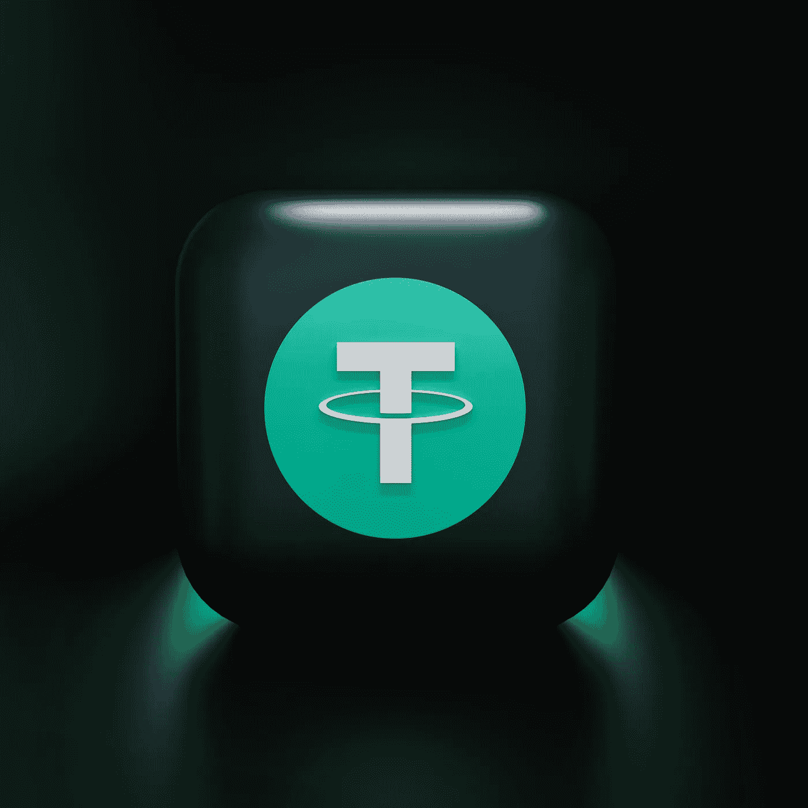

# 在熊市中购买 USDT 是一个好的决定吗？

> 原文：<https://medium.com/coinmonks/is-a-good-decision-to-buy-usdt-in-bear-market-49802a60aa4a?source=collection_archive---------29----------------------->

Source photo Unsplash.com

泰索(也称为 USDT)是一种基于美元价值的稳定货币。因此，理论上，一 USDT 可以兑换一美元。稳定的货币 USDT 经历了相当一部分的货币脱钩，但总体上保持稳定。

重要的是要注意到，如果你想知道为什么一个稳定的硬币拴在…