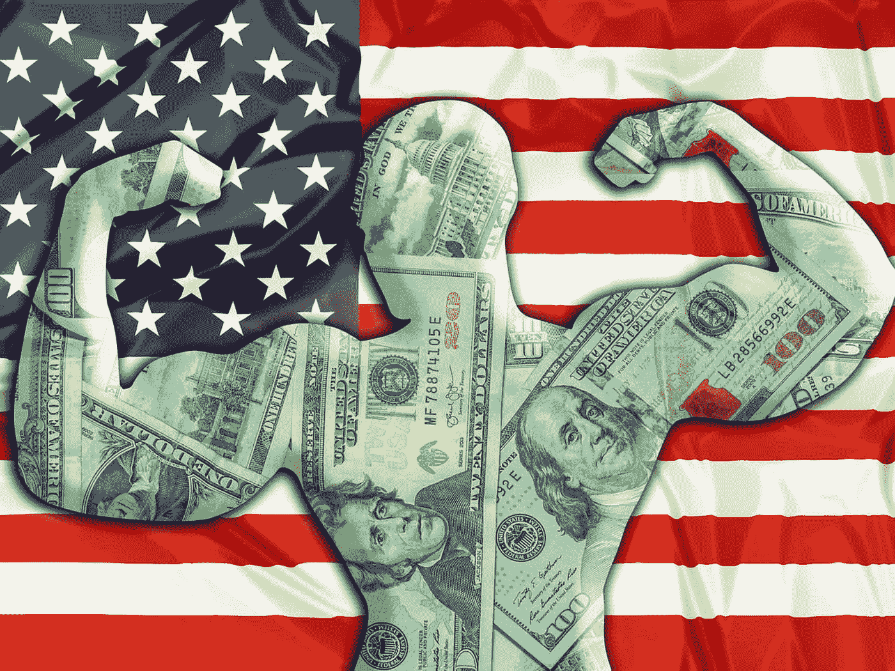

# 强势美元对经济和股市有好处吗？

> 原文：<https://medium.com/coinmonks/is-a-strong-dollar-good-for-the-economy-stock-market-e8ab93619312?source=collection_archive---------48----------------------->

美元比几十年来更强劲，这伤害了许多人，也有利于其他人。过去一年，一美元兑一篮子全球货币升值约 20%，现在甚至比一欧元还值钱。作为世界上最重要的货币，强势美元对全世界产生了显著的影响。通过这篇博客，你将了解强势美元对经济和股市是好是坏，对你是好是坏。

*The U.S. dollar is currently at its strongest.*

# 什么是强势美元？

那么，**强势美元意味着什么**和**美元到底有多强？**确切地说，[美元](https://en.wikipedia.org/wiki/Dollar)是澳元、加元、港币、新台币、新西兰元、新加坡元等 20 多种货币的名称。然而，在这篇博客中，我们将谈论几十年来最坚挺的美元，它使世界各地的其他货币贬值，并扰乱了全球经济的前景。美元现在非常强劲，基本上与欧元持平——1 美元可以兑换 1.01 欧元。

 [## 衰退解释:原因和影响

### 到 2022 年 8 月底，像“衰退”或“通胀”这样的词越来越多地出现在重大新闻中…

medium.com](/@libraryoftrader/recession-explained-causes-and-impact-3a953c1042) 

# 为什么今天美元这么强势？

推动美元对其他主要货币升值的主要原因是美国的货币政策。为了遏制通货膨胀，美联储一直在大幅提高美国利率，这将吸引资本流入美国，推高美元价格。

美元升值的另一个原因是美国经济表现好于其他国家。尽管通货膨胀率很高，但美国的就业市场一直保持着显著的稳定。与此同时，欧洲正处于战争之中，很可能已经陷入衰退。

*Importers benefit while exports get hurt when the dollar gets stronger.*

# 强势美元是好是坏？

如上所述，强势美元对许多人有利，对其他人不利。例如，如果你从美国出国旅行，你的美元会升值，让你在海外有更大的购买力。如果制造商的货币相对于美元贬值，进口产品也会变得更便宜。在美国开展业务的跨国公司也受益于强势美元，因为它们以美元赚取收入。

然而，随着美元走强，前往美国的游客、出口商、在海外开展业务的美国公司以及需要美元储备的外国政府将受到影响。

 [## 如何度过难熬的密码寒冬？

### 加密市场就像过山车。它用许多巨大的胜利吸引和愉悦人们，尽管他们可能会遭受…

medium.com](/@libraryoftrader/how-to-get-through-the-tough-cryptos-winter-4b047aba4196) 

# 强势美元对经济有好处吗？

点击这里阅读全文:[https://libraryoftrader . net/is-a-strong-dollar-good-for-the-economy](https://libraryoftrader.net/is-a-strong-dollar-good-for-the-economy)

您可能会对以下文章感兴趣。

*   [经济衰退解释:2022 年的原因和影响](/@libraryoftrader/recession-explained-causes-and-impact-3a953c1042)
*   [通货膨胀的原因& 10 种通货膨胀的常见影响](/@libraryoftrader/the-causes-of-inflation-10-common-effects-of-inflation-81507c7fbb4e)
*   [股市:有一个你不应该进入的情感陷阱|交易者图书馆| 2022 年 8 月|媒体](/@libraryoftrader/the-stock-market-there-is-an-emotional-trap-you-shouldnt-go-in-c5dac3838dfa)

> *交易新手？试试* [*加密交易机器人*](/coinmonks/crypto-trading-bot-c2ffce8acb2a) *或* [*复制交易*](/coinmonks/top-10-crypto-copy-trading-platforms-for-beginners-d0c37c7d698c) *上* [*最好的加密交易*](/coinmonks/crypto-exchange-dd2f9d6f3769)

> 加入 Coinmonks [电报频道](https://t.me/coincodecap)和 [Youtube 频道](https://www.youtube.com/c/coinmonks/videos)获取每日[加密新闻](http://coincodecap.com/)

# 另外，阅读

*   [免费加密信号](/coinmonks/free-crypto-signals-48b25e61a8da) | [加密交易机器人](/coinmonks/crypto-trading-bot-c2ffce8acb2a)
*   [杠杆代币的终极指南](/coinmonks/leveraged-token-3f5257808b22)
*   [16 款最佳折叠电动自行车](/coinmonks/top-17-folding-electric-bikes-5e296f0918cb)
*   [28 款最佳电动自行车点评](/coinmonks/the-28-best-electric-bikes-review-and-buying-guide-in-2023-7bb3146cb403)
*   前三名[币安期货交易机器人](/coinmonks/top-3-binance-futures-trading-bots-e6031f84b3f9)