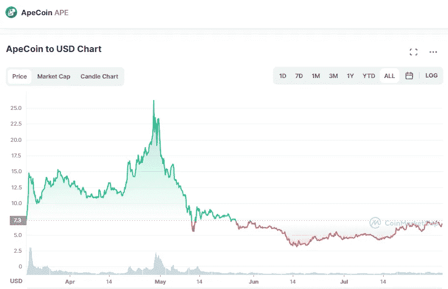

# ApeCoin (APE)是好的投资吗？

> 原文：<https://medium.com/coinmonks/is-apecoin-ape-a-good-investment-5ce661249e4f?source=collection_archive---------30----------------------->

Source photo [ApeCoin price today, APE to USD live, marketcap and chart | CoinMarketCap](https://coinmarketcap.com/currencies/apecoin-ape/)

ApeCoin 创建于 2022 年 3 月，是一种相对年轻的加密货币。尽管市场下跌，但它也是少数几枚升值的硬币之一。很大程度上由于庞大的粉丝群和加密影响者和名人的超额认购，这种货币获得了很多关注和欢迎。因为它与 BAYC 和 MAYC 国家森林公园相似，这两个最著名的 NFT 项目…