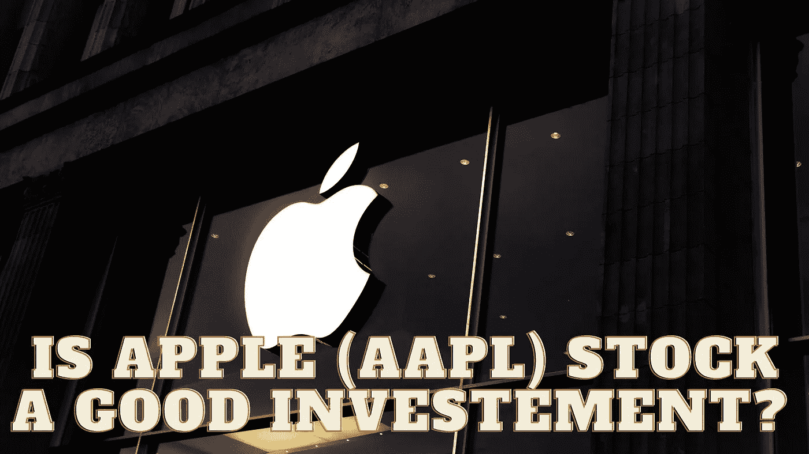

# 苹果(AAPL)股票是好的投资吗？

> 原文：<https://medium.com/coinmonks/is-apple-aapl-stock-a-good-investement-356929c5d886?source=collection_archive---------45----------------------->

Source photo Unsplash.com

在过去的 12 个月里，尽管市场大幅波动，苹果(纳斯达克代码:AAPL)的股票一直相对平稳。这是以当前价格衡量股票价值的一个非常可靠的指标。根据市场的感觉，我相信如果股价下跌，这只股票会出现在许多投资者的“必备品”清单上。