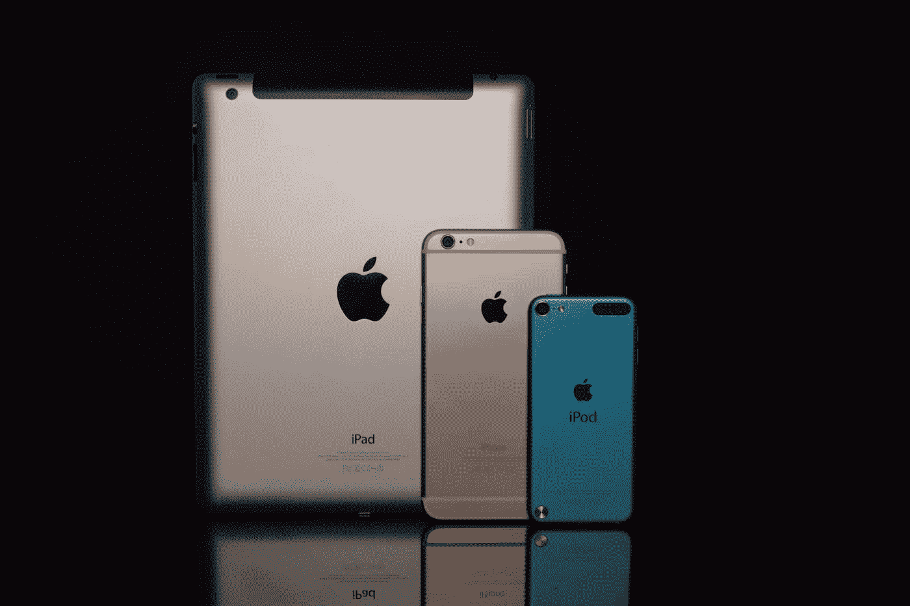

# 苹果股票是好的投资吗？

> 原文：<https://medium.com/coinmonks/is-apple-stock-a-good-investment-70e2dc9ed88d?source=collection_archive---------30----------------------->

Source photo [Space Gray Ipad, Gold Iphone 6, and Blue Ipod Touch · Free Stock Photo (pexels.com)](https://www.pexels.com/photo/space-gray-ipad-gold-iphone-6-and-blue-ipod-touch-236086/)

苹果公司是一家在纽约证券交易所上市的跨国公司，专门从事电子设备、计算机程序和基于互联网的服务的生产、分销和零售。该公司的旗舰硬件和软件产品包括 iPhone、iPad 和 Mac 电脑，以及 iOS、macOS 和 watchOS 操作系统。