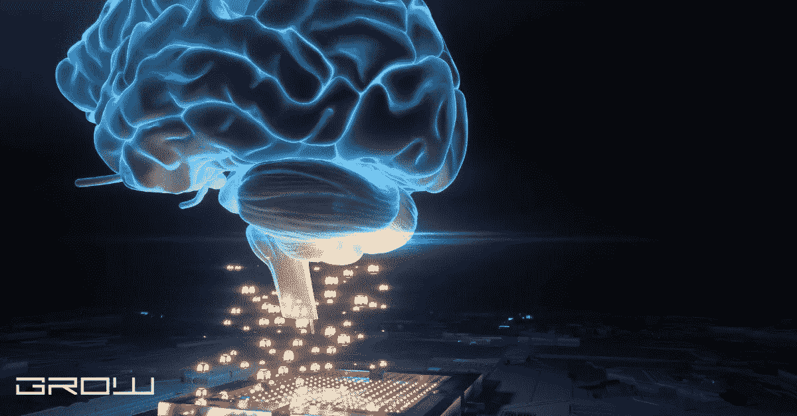

# 人工智能是机器学习的一种，还是机器学习是人工智能的一种？

> 原文：<https://medium.com/coinmonks/is-artificial-inteligence-a-type-of-machine-learning-or-mechine-learning-a-type-of-artificial-92530ecb5187?source=collection_archive---------13----------------------->

artificial inteligence

人工智能或“AI”是软件应用程序、机器人和计算机程序表现出的智能行为，它们执行面向目标的任务。人工智能可以用来预测人类行为，改善行为反应和自动化行动。AI 是否应该被贴上“唯一感兴趣的专家”的标签；目前还不清楚人工智能是一种机器学习还是一种人工智能。这是因为两者有相似之处；机械化意味着人被置于机器之上，而自主化意味着人进化成了机器本身。“人工智能”一词是由达特茅斯学院的约翰·麦卡锡首先提出的。他将 AI 定义为对“智能机器”的研究。“机械化”一词是亨利·柏格森在他 1911 年的著作《进化》中创造的，他在书中认为机械化是人和机器的结合。柏格森将机械化视为一种新的生活形式。机械化的概念与查尔斯·巴贝奇在分析机方面的工作有关，特别是他 1843 年关于计算时间的论文。如果巴贝奇的引擎被制造出来，它会有许多类似人工智能的品质。这是因为它能够根据过去的事件、经历或考验来适应和改变未来的行动或过程，就像人类一样。巴贝奇的机器也能像人类一样，从错误中学习并自我修复。这可以解释为什么有些人认为巴贝奇的工作是现代人工智能研究的基础。
“自动化”一词的首次使用是由诺伯特·维纳于 1948 年在他的著作《控制论:动物和机器中的控制与交流》中提出的。维纳将自动化描述为“由前因因果决定的行为科学”。他将控制论的目标定义为开发一种“知道做什么，为什么做，以及应该如何做才能达到目的”的机器。因此，他支持“逻辑控制”自动机的概念。维纳的书还包括一篇关于“人工智能”的文章，尽管他的定义与当前的定义有很大不同。
约翰·冯·诺依曼是最早在他的报告中使用“人工智能”一词的人之一，这是他于 1945 年提交的关于 EDVAC 的报告初稿。他将“人工智能”的概念描述为与“自然智能”相对的人类或类似计算机的智能。冯·诺依曼关心的是推广机器思维，而不是试图让计算机像人类一样思考。他的工作被认为是现代人工智能研究的基础。

高度的准确性(精确度)和对世界的“常识”理解是任何人工智能程序都应该存在的元素。一种常见的做法是开发一种算法来解决一些问题，然后在各种问题上进行实验测试:… —在领域中…这对于测试和调试来说通常是足够的，尽管在原始问题和它的一般解决方案之间可能存在差异，即它作为应用程序的预期运行。

要被认为足够“智能”，软件必须能够自我学习，并表现出对环境及其内容的好奇心、动机系统和自我意识。这要求软件有一系列基本的情感，包括从简单到复杂的兴趣、兴奋、惊讶和惊奇。它还必须具有挫折承受力和从错误中学习的能力。为了在软件中开发这些品质，必须使用各种试错法对它们进行测试，这可能需要相当长的时间。
此外，学习过程可以是迭代的和渐进的，而不是离散的和一次性的。
自我意识通常根据软件代理识别其组件的能力来测试，包括 CPU、大容量存储设备和与之通信的网络接口。
这种“经典”测试被称为“镜子测试”,即人类在被测动物的皮肤上做一个标记，然后观察动物在照镜子时是否能认出这个标记。这项测试也被用来评估机器人的自我意识。

用更实际的话来说，许多现代人工智能应用程序使用模仿大脑神经结构的深度学习。神经元网络是在大规模并行处理器阵列上模拟的，用于同时处理几个输入。神经网络使用以复杂和非线性方式互连的分层节点。
在这些网络中，每一层都提供一些从一层到另一层的过滤或映射(即下一层的内部表示)。这些层由节点组成，这些节点可以执行简单的操作，如求和、乘法和阈值处理，或者更复杂的操作，如 sigmoidal 过滤和汇集操作，然后输入到下一层。

由于神经网络的基本目的是将输入模式(向量)与内存中存储的模式进行比较，因此所有节点都具有相同的一般结构，这是一种称为神经元的基本求和操作。该操作采用一个输入向量和另一个加权向量，并将它们逐个元素相加。求和产生的加权和然后通过触发动作电位的阈值函数。当这种情况发生时，神经元将这个输出向量发送到下一层进行额外的处理，并将它向下发送回先前的层，在将它传递到后续层之前，先前的层可以进一步处理它。

可以“训练”或“优化”神经网络中使用的权重，以便网络学习更有效地执行任务。例如，谷歌的 DeepMind AI 已经通过调整其内部权重来训练玩街机游戏，如 Breakout、Pong 和 Space Invaders，以便它可以以越来越高的精度预测某个对象的移动。通过将每个输入向量与其相关的权重向量进行比较来计算神经网络的输出，以找到产生最大输出值的向量。重复进行这一过程，直到处理了固定数量的向量。例如，多重递归神经网络可以被编程为在对固定数量的输入重复该过程之后输出每个输入向量的最大值。

由于神经网络中的权重被调整的方式，训练和测试它们的过程可以被比作从经验中学习。对于神经网络训练，可能有必要调整学习速率和/或阈值，以便增加或减少有效样本大小。为了优化人工智能程序的性能，通常需要微调这些参数，但这样做可能需要几周甚至几个月的时间。

深度学习的目标是发现如何创建一个模拟人类神经元结构的模型。该过程首先识别神经网络中不同类型的层，并定义如何基于每层的输出来调整权重向量。然后，科学家必须学会如何手工构建这些模型，以便可以在软件程序中实现它们(参见 DeepLearning)。然而，许多研究人员认为神经网络本身过于复杂，对于实际应用来说效率低下。例如，2014 年谷歌的 AI AlphaGo 击败世界冠军 Lee Sedol 时，他们就不正确；DeepMind 预计它将赢得 50 场比赛中的 47 场。即便如此，DeepMind 此后使用不同的策略与 AlphaGo 又赢了六场比赛。

神经网络模型和生物大脑功能之间没有完美的匹配，因为网络必须执行许多不同的任务，而不仅仅是简单的模式识别。但可以说，目前深度学习研究的趋势是通过增加其并行性来提高该模型的效率，而不牺牲其准确性。深度学习还没有产生科幻小说故事所描绘的普遍智能；例如，在《Ex 玛奇纳》中，一个人类级别的 AI 是通过将几个更简单的算法合并为一个而创建的。

神经科学家和人工智能研究人员都致力于了解意识的神经生物学基础以及大脑如何执行某些功能。希望是，通过研究人类和动物的大脑活动，可以提取潜在的神经代码，然后使用人工智能进行模拟。

> 交易新手？试试[加密交易机器人](/coinmonks/crypto-trading-bot-c2ffce8acb2a)或者[复制交易](/coinmonks/top-10-crypto-copy-trading-platforms-for-beginners-d0c37c7d698c)

2012 年，IBM 的人工智能程序 Watson 能够击败 Jeopardy！通过分析 2 亿页的内容和比人类对手更准确地权衡可能性，击败了布拉德·鲁特和肯·詹宁斯。这是由一个名为 DeepQA 的系统实现的，该系统使用了机器学习算法和非结构化数据的结合。
类似的系统正被用于根据患者的医疗记录实时回答患者的问题，或者从大量非结构化数据(如文本文档和 PDF 文件)中搜索答案。

已知的第一个大脑启发计算的研究是约翰·冯·诺依曼在 1962 年发表的一篇关于蜂窝网络的论文，他在 1958 年将计算机的概念表述为“神经化的电子计算机”。冯·诺依曼假设，复制人脑最快、最可靠、最便宜的方法是在一个非常复杂的网络中连接大量简单的计算组件。细胞神经网络也称为网格网络或多层感知器(MLP)，是一组相互连接的人工神经元组成的连续细胞结构。每个神经元都是一个模拟处理器，接收多个输入，将每个输入相乘，然后相加产生输出。

第一次直接模拟人类神经网络的已知尝试是在 1969 年由 Frieder Nake 进行的，他开发了“神经元绘画”方法。从 1974 年到 1976 年，Jürgen Schmidhuber 写了一篇关于自组织神经网络模型的博士论文，并于 1986 年出版了一本关于“自我参照学习”的书。

1991 年 Sepp Hochreiter 发表了第一个用于时间序列预测的递归神经网络实现。1994 年，Geoffrey Hinton 和 Thomas Sejnowski 发表了一个学习分类数字的神经网络。他们还展示了如何用一套训练集来训练该系统，这套训练集只由四个类别之一的“芯片”组成。1995 年，Schmidhuber 发表了他的论文，论述了一种基于称为 Bolt 的神经网络的联想记忆，它使用一种中间代码来表示概念，而不是单词。1996 年，Gennaro 和 Lomberg 发表了递归神经网络的第一个实际实现。接下来的一年，也就是 1997 年，Hochreiter 和 Riedmiller 完成了当时可以存储在计算机中的最大的学习系统——但只能作为使用蒙特卡罗方法的模拟。

在 1998 年，Stuart Russell 和 Peter Norvig 发表了他们的论文“前馈神经网络中的近似学习”,该论文使用具有非线性激活函数的神经网络来解决分类的最近邻问题。几年后的 2002 年，Yann LeCun 写了《递归神经网络的分布式训练》。2005 年，有人展示了无监督的深度信念网络如何从数据流中学习长期依赖性。然而，所使用的方法是基于线性操作原理。2007 年，Geoffrey Hinton 展示了如何使用具有大量(但很少)层的反向传播来训练深度信念网络，而不必使用理论上的 Bolt 代码。2008 年，Hochreiter 和 Van Lambalgen 发表了第一个使用递归神经网络的强化学习实验。

2009 年，有人展示了如何使用反向传播训练深度信念网络来识别手写数字。2010 年，Schmidhuber 写了他的论文“使用神经网络的自适应控制系统的理论基础”。2011 年，谷歌的 Christopher Olah 和他的同事展示了他们可以构建深度神经网络，在不使用符号识别器的情况下进行手写识别。2012 年，Schmidhuber 发表了他的论文“神经网络的自适应控制”，其中使用了自组织映射作为例子。

一年后的 2013 年，迈克尔·尼尔森发表了《学习自适应控制和深度强化学习的深度架构》。2014 年展示了无监督的深度信念网络如何使用其外部输入作为先验知识来学习文本中的长期依赖性。
2016 年，一种名为 LSTM(长短期记忆)的算法被引入。它使用与递归神经网络相同的概念，但具有从记忆中回忆信息的能力。

深度学习可用于解决固有的复杂、困难或需要过滤大型数据集的问题。深度学习已经应用到的问题的一些例子:
可能的计算机架构的数量是无限的，上面的列表只是一个小样本。许多架构不属于这些类别中的任何一个。主要的区别在于，深度学习专注于神经网络或类似的结构，而不是关注底层的操作原理或基本算法。

深度学习已经应用于广泛的领域，包括图像和语音识别和翻译、计算机视觉和对象检测等。有人认为，深度学习可以对人工智能领域产生巨大影响，因为它依赖于连续计算，而不是手工制作的规则。

在图像和语音识别系统中，深度神经网络用于识别图像中的复杂模式(例如，人脸)。最常见的深度学习架构是卷积神经网络(CNN)，它由许多小特征检测器组成，后跟一个公共共享层。例如，LeNet-5 网络开发于 1998 年，用于识别手写数字。

在计算机视觉和物体检测中，深度学习系统可以用来检测具有大量数据的物体。2015 年，微软的研究人员应用了一种这样的方法，他们称之为“深度剩余学习”，以提高 Xception 算法在图像中检测人脸的性能。据报道，结果“总体上比以前提取特征的方法要好”。

谷歌、脸书、微软和其他开发机构等公司已经使用深度学习技术来帮助计算机更好地理解(并因此更好地与)现实世界互动。

深度学习可以用来模拟人类的认知功能。例如，深度学习技术已经应用于人工插管，计算机学习如何决定何时重要的毛细血管被堵塞；以及在计算机辅助外科手术中，关于手术期间何时介入的决定是自动做出的。
帕尔马大学的心理学家 Giorgio Grisetti 展示了如何训练 deep mind(Alphabet Inc .的子公司，于 2014 年被谷歌收购)开发的算法来执行围棋游戏。

在医学上，深度学习技术已被用于诊断癌症，比人类更准确和精确，特别是在检测早期癌症方面。最近，深度学习被用于诊断多发性硬化症，这是一种神经学家难以识别的衰弱性疾病。深度学习系统还可以用于检测人类神经学家难以检测的帕金森病。2016 年，谷歌开发了一个名为 DeepMind Health 的项目，该项目使用深度学习技术检测中风、哮喘和癫痫。

深度学习还可以用于改善药物发现，这是一个因缺乏测试潜在新药候选物的能力而受到阻碍的医学领域。深度学习技术可以用于识别有前途的新药候选物，然后可以在临床试验中进行测试。

农业领域也受益于深度学习技术。世界粮食供应的很大一部分依赖于农民的作物和动物，它们被称为粮食生产链中的“第一环”。包括卷积神经网络在内的深度学习技术可以帮助预测作物产量和牲畜行为，以比人类专家更准确地评估系统的健康状况。这可以导致更有效的作物管理措施和减少损失。

深度学习也被应用到了金融领域。一家名为 Sentient Technologies 的初创公司正在使用深度学习算法在金融市场交易股票。2016 年，一家名为 Bridgewater Associates 的大型投资基金开始使用基于深度学习算法的预测系统，据该公司称，该系统“在过去一年中击败了 S&P(500)30%以上”。

深度学习领域面临的最重要的问题之一是泛化:训练数据的性能与看不见的数据的性能有多接近？许多计算机程序在得到训练中没有看到的新例子时会失败。测量泛化的一种方法是通过错误率。深度学习研究的重点是改进计算泛化错误的方法，并发现了一些改进。

深度学习系统通常在大量未标记(或“看不见”)的数据上进行训练。当系统在看不见的数据上进行测试时，它的表现往往比预期的更差:模型在测试数据上的表现和在训练数据上的表现之间存在巨大的差异。这种差异的一个主要原因是，当深度学习系统获得训练期间没有看到的新例子时，它们学习概括的能力很差。2006 年，当研究人员使用卷积神经网络对手写数字(例如，0-9)进行分类时，首次发现了这个问题。作者表明，这些模型在训练数据上表现良好，但未能推广。

深度学习方法一直被批评缺乏可解释性和可重复性，难以理解为什么某些系统在看不见的数据上给出某种性能(或者在不同的事情上训练时“学习”一件事情)。例如，目前还不清楚深度学习模型如何识别图像中的猫，或者它们是否能够可靠地学习如何做到这一点。许多研究人员认为，缺乏理解是广泛采用深度学习的最大障碍。2015 年和 2016 年发表的论文提出，改进的生成模型架构和强化学习方法将有助于解决这个问题。

除了缺乏理解，大多数深度学习系统都需要大量的训练数据才能表现良好。因此，该领域必须小心处理标记数据非常缺乏的领域中的问题，例如计算机视觉。影响深度学习性能的另一个问题是训练参数(即超参数)的不稳定性。它们不稳定的主要原因是，当有太多自由参数时(例如，深度信念网络中有多少层)，没有办法告诉它们对变化有多敏感。解决这个问题的方法是使用不同的正则化策略来处理潜在变量。学校和开源社区已经为想要了解深度学习的人建立起来。已经创建了在线课程，如斯坦福大学通过 Udacity 开设的机器学习课程和吴恩达大学在 Coursera 上开设的深度学习专业。谷歌发布了 TensorFlow，这是一个使用数据流图进行数值计算的开源软件库。可用于深度学习研究和生产系统。Julia 编程语言内置了对通过 PyCall 使用 GPU 的支持，使得用 Julia 语言编写高效的 GPU 程序成为可能。Python 的机器学习库 sci-kit-learn 包括几个支持数据分析的函数，特别强调将常用的统计技术应用于数据集。

深度学习和深度神经网络在医学成像和视频分析以及计算机视觉、自然语言处理和生物信息学等领域仍然是新的。开发了一种称为连续抽象曲线(CAC)的工具，以帮助可视化深度神经网络如何执行。CAC 以某种方式可视化抽象，使得理解神经元之间变化的关系成为可能，从而允许人们可视化模型随着时间的推移已经学习了哪些特征。

深度学习可以用于医学图像分析，如 PET 扫描和 MRI，使用视觉处理方法。该领域正在进行研究，以通过 3D 卷积、3D max pooling、3D U-Net、深度残差网络和初始模块等方法来提高深度学习系统对医学图像分析的准确性。

深度学习也被应用于生物信息学中的问题。例如，哈佛大学的一个小组使用深度学习算法发现了新的 RNA 二级结构，称为 DUF1220 结构域。另一个应用是通过分析小分子和蛋白质的相互作用来发现药物。

深度学习已经扩展到机器学习研究的其他领域，如强化学习和贝叶斯非参数。通过使用依赖于梯度下降的蒙特卡罗方法，深度神经网络可用于逼近给定数据的后验分布。但是深度神经网络需要大量的数据来训练，在数据有限的情况下很难学习。深度学习还被应用于机器人控制和游戏程序的强化学习算法，这些程序在“围棋”、“DOTA”和“星际争霸”中与人类玩家竞争。此外，深度学习还被用于《太空入侵者》和《吃豆人》等雅达利游戏的强化学习。

深度学习也被应用于贝叶斯非参数的研究，在图像识别、机器翻译和计算生物学领域取得了显著的成功。深度神经网络已经被证明对于使用各种技术在大型数据集上执行统计推断是有用的。深度学习已被用于寻找文本和音频信号中的模式。

2016 年，谷歌研究人员发表了关于如何使用神经网络对 1989 年后制作的图像进行分类的工作，方法是将上下文作为额外的特征层纳入神经网络训练。该方法在 ImageNet 分类精度基准上优于以前的最新结果。

深度神经网络已被用于发现基因组数据中的特征，并预测基因功能和生物的其他表型特征。在一个特定的应用中，深度神经网络与来自多个生物体的大量基因组序列记录一起使用，以预测尚未被表征的基因。在另一项研究中，卷积深度神经网络分类器能够从淋巴细胞样本的图像分析中识别染色体畸变，并区分健康个体和早期肺癌患者。这种方法还能够识别其他几种罕见的遗传性癌症综合征，如囊性纤维化和范可尼贫血。这一过程背后的一般遗传学原理是通过搜索基因组的所有可能变体来识别数据中的模式。

深度学习已经应用于语音识别和语言建模的不同领域。在一个案例中，研究了深度卷积神经网络模型在两种语言之间的区分能力。更具体地，证明了三种不同的模型能够对连续语音识别实验和依赖于说话者的说话者协议分类实验准确地分类英语和西班牙语。

深度神经网络的另一个应用是在计算金融和算法交易中，深度学习已被用于开发一个自动检测内幕交易者行为的系统。

2016 年 11 月，非营利人工智能研究公司 OpenAI 获得了来自包括脸书、微软和阿里巴巴在内的各种来源的 10 亿美元投资，这是有史以来最大的一轮人工智能融资。该基金声明的目的是研究和开发友好的人工智能，以解决任何潜在的危险和与人工通用智能相关的问题(AGI)。作为这项努力的一部分，脸书透露，它正在使用深度学习技术开发一种可以进行自然对话的虚拟助手。脸书还表示，它一直在研究如何将深度学习与计算机视觉人工智能相结合，以自动识别人的面孔，但它尚未宣布是否已经公开任何工作。2017 年 2 月，CIFAR AI 竞赛宣布了其 100 万美元“ai.cifar.net”挑战赛的获胜者，这是一场多阶段的比赛，涉及来自 90 个不同国家的 130 个团队，挑战他们使用 CIFAR-10 数据集和 ImageNet 分类基准开发新的深度学习 AI 软件进行图像分类。

深度学习也被用于语音识别系统。2017 年，谷歌和一个大学研究人员团队声称，世界上第一个口语识别系统能够理解英语。

2018 年，DeepMind 能够创建经过训练的模型，这些模型可以自动构造假新闻标题，使机器能够制作宣传材料。这是通过给计算机编程来挑选出特定的单词、句子结构和词序来定义真假新闻标题。这种能力是一个具有挑战性的学科，因为在创建良性或恶意内容的过程中涉及许多不同的人为因素。2018 年 3 月，新加坡南洋理工大学的研究人员发表了一篇论文，声称他们已经成功地在国家地理纪录片系列“天生富有”的视频数据上训练了一种深度学习算法。在论文中，他们详细介绍了他们如何能够生成假奢侈品的新图像，这些图像足够有说服力，足以欺骗他们的同行，让他们认为这些图像是真实的。

许多这些应用都是在一个更大的深度学习架构的背景下开发的，该架构被称为人工神经网络，基于神经科学和脑科学的最新理论进展。一些研究人员甚至将某些卷积神经网络称为“神经化身”，以此强调深度学习方法旨在像人类、哺乳动物和灵长类动物一样模拟动物大脑的架构。在这种情况下，深度学习特别有用，因为它可以将静态的课堂知识转化为更动态、更强大的神经网络，进而可以用于开发新的大脑模型。

康奈尔大学计算机科学系副教授 Deepak Ravindranath 对深度学习这一术语提出了批评。他认为“深度”一词被误用了，因为它经常被用于任何类型的使用深层的神经网络。他还认为“学习”一词也被误用了。他指出，这是一个误称，因为根据他们的经验，当前的神经网络并不使用增量学习过程来解决问题。相反，他们依赖于优化算法和统计学和几何学的既定原则。他认为，[深度学习]只使用来自神经网络深层的机制，通过将它们应用于不同的问题，我们可能会看到性能的改善或没有改善，但这些层的组织方式或它们的功能方式并不是深度学习中最重要的。

以下术语用于一般深度(即任何种类)神经网络:

以下术语仅用于某些深层架构:

不连续(非线性)神经网络，也称为连续反向传播(CBPR)，是前馈神经网络的一个特例，它允许神经元具有更复杂的功能。特别是，CBPR 允许神经元根据输入和输出来计算值。在许多不同的领域，例如信号处理和机器人学，已经使用微分方程提出了不连续网络。这种系统可以被视为具有附加非线性或玻尔兹曼机器的线性变分自动编码器。

一些其他种类的神经网络也被称为“深度”，尽管它们通常不被称为“深度学习”。因此，有一些东西被称为“分层神经网络”，“增强神经元网络”，等等。

神经网络类型和深度学习类别之间的映射并不总是显而易见的。特别是，您可以在任何类别的前馈神经网络上定义深度递归网络。然而，这里我们关注线性或者最好是线性递归网络，因为它们比基于非线性递归的网络更容易被人理解，并且对动力学更通用。

以下是文献中提到的深度学习的一些基本属性:

深度学习和相关领域之间的许多关系还没有得到很好的理解。然而，有一门新学科叫做“深度学习”(或“深度机器学习”)，它研究如何构建智能系统的基本问题。这门学科的一个目标是确定可用于一般智能的统一原则。在某些情况下，术语“深度学习”可以与一个被称为“机器学习”或“数据挖掘”的相关领域互换使用。其他类似的领域包括使用神经网络和深度信念网络的知识发现。这样的描述性术语有助于在不同但相关的领域交流研究团体。

深度学习的一个主要应用领域是处理视觉和其他多模态数据。一个常见的应用是自动图像字幕算法的开发和评估。最近的工作还表明，神经网络可以用来产生一个文本，这是自然的声音和吸引力。一个更直观的例子是脸书的 DeepText，这是一个用于自动文本内容分析的递归神经网络，也可以进行情感分析。

使用卷积神经网络进行医学图像分析在医学诊断、治疗计划和临床试验分析方面也有许多潜在的应用。由斯坦福大学和谷歌领导的医学成像专家一直在努力将这项技术应用于医疗目的。

一个领域是应用于视频理解的“在线学习”。这涉及实时分析视频流，应用深度学习方法进行监控和分类。

DeepMind 已经在他们新的 Atari 2600 游戏机上使用了深度卷积神经网络(DCNN)(见下文)。Atari 2600 游戏控制台有彩色图形、立体声和内置操纵杆。雅达利原本计划发布与 Intellivision 的主机规格相同的游戏主机(16 K RAM，无硬盘)，但最终只提供了 12 K 的 RAM。为了解决这一限制并提供相同的体验，谷歌创建了一个深度卷积神经网络来模仿 Atari 2600 游戏机。

基于深度学习的技术正被用于在人类环境中训练机器人，使它们能够执行复杂的任务，如找到火警并将其关闭或在繁忙的街道上导航。2018 年，剑桥大学宣布，人类首次成功训练一些机器人通过积极强化奖励正确的行为来“感受”(在屏幕上显示快乐的表情符号)，这比传统方法有效得多。

谷歌开发了集成到谷歌搜索引擎中的程序，名为“RankBrain”，利用深度学习。RankBrain 分析传入的搜索查询，并预测给定查询显示哪些结果(在 10%的非结构化搜索中)。RankBrain 使用深度神经网络来预测哪些结果最有可能相关。

微软在其 Skype Translator 应用程序中利用了深度神经网络，该应用程序使用人工智能在不同语言之间实时翻译语音。这种技术最终可以帮助法律专业人士与说不同语言的人交流。它还可以帮助聋人或重听人通过使用实时字幕(也称为“同声翻译”)的手语理解其他人。

全球语言服务提供商(如谷歌和微软)使用深度网络进行内容审核，使用这些程序来识别攻击性或敏感内容。通过使用深度学习，这些公司可以减少他们必须做的工作量。当遇到骚扰或欺凌时，内容审核算法也可以用于更好地理解和应对人类行为。

人们选择不买某样东西可能有几个原因。价格可能太高，物品可能在那个特定的时间在他们的城市很难找到，可能还有其他一些因素使他们难以购买。为了确定这些原因是什么，以及基于这些原因提供推荐，必须使用推荐算法。可以使用的推荐算法的类型取决于被推荐的项目的类型。

可以生成多种类型的推荐。通过使用如下所示的深度学习系统，可以提供基于文本的推荐服务。

在任何企业中，it 部门的表现都是其成功的关键因素，任何改变都会直接影响到绩效。因此，任何需要进行这种改变的企业和其他组织都需要一种不受人类偏见影响的算法方法。这就是引入深度学习算法的地方。

除了用于图像识别之外，它们还被用于医学成像和金融预测。在机器人领域已经发现了其他用途，一些研究人员成功地使用人工神经网络来控制机器人。

“LSTM”或“长短期记忆”网络是一种特定类型的递归神经网络(RNN)，由于其能够长时间记住以前的事件，并能够学习事件之间的长期相关性，因此非常适合执行这项任务。LSTM 网络还可以模拟时间顺序很重要的事件序列，不像以前的 rnn，如长短期记忆网络(lstm)。

2016 年，牛津大学和 Salesforce.com 大学的研究人员使用递归神经网络改进了一个大型数据库中对未来股票价格的预测(8，000 多只股票的 2.22 亿笔交易)。
研究团队使用了一个递归神经网络模型，该模型与 LSTMs 一样，可以长时间记住事件，并学习它们之间的长期依赖性。正是这些属性使得构建复杂的模型成为可能，该模型考虑了不可预见的事件，如监管变化或市场中的意外赢家，预测这些事件将如何影响未来的价格走势。
这是通过将数据集输入 CNN 来完成的，CNN 创建了一个包含向量和标量预测的时间序列，即同时包含顺序值和连续值。标量预测随后被输入到 LSTMs 中，以生成价格。

深度学习算法的使用已被证明可提高视频检测的准确性，其中算法的深度决定了必须从图像中提取多少特征。深度学习算法的输入层为 20 ~ 50 个神经元，能够更好地区分物体，区分颜色及其在图像上的位置。

2017 年，一种类似的方法被用于视频识别系统，用于在视频中识别汽车，其中包含汽车的图像可以从 3500×1300 像素调整到 300×100 像素。为此使用了深度学习系统，包括使用长短期记忆(LSTM)神经网络来学习环境和周围车辆的特征，包括交通标志和车道标线。

对于更大的特征图，模型学会忽略一些不相关的信息以产生更好的结果。在模拟中，他们能够达到 80.8%的准确率在视频中识别汽车，100%的准确率区分不同型号的汽车。

有许多例子，人们很难理解为什么算法在对信息进行分类或预测时会做出某些决定。这导致了“黑箱”算法的引入，这种算法通常被归类为“机器学习”，更确切地说是“人工智能”。

“人工智能”通常与神经网络联系在一起，特别是以其监督学习的形式，最早出现于 20 世纪 60 年代，并被应用于专家系统的开发。然而，人工神经网络的使用比这早得多(见下文)。

生物神经元从其他神经元接收输入并匹配它们的输出。一个非常相似的过程发生在人工神经网络中——它们从其他节点接收输入值，并将其与一组预定义的函数进行匹配——通常是通过一个称为反向传播的过程。然后，产生的输出被用作下一层的输入，依此类推，直到最后一层。

在每个阶段，将该输出与期望的结果进行比较，并且产生误差信号，该误差信号用于修改每个连接的强度或权重，允许后续层访问来自先前层的信息。这个反馈回路使用所谓的长短期记忆(LSTM ),它可以从以前的输入中学习，并产生更符合预期的结果。LSTMs 还可以更长时间地保留信息，这在预测未来事件或行为时很有用。

在大多数情况下，神经网络由人类输入数据。这可以是监督训练的形式，其中使用已知结果如何的例子来训练神经网络，或者是强化学习，其中人类奖励某些行为，神经网络将相应地调整其行动。也可以通过在没有人类输入的情况下将数据输入网络，并使用无监督学习来生成规则，来生成模型。这种方法有时被用来揭示第一眼看上去不明显的潜在模式(如上所示)。

人类大脑执行许多复杂的任务，如下棋、开车上班和识别面孔，这些任务是通过一个类似的过程学习的，当它以期望的方式做出反应时，通过奖励它的行为来教它识别模式。正因为如此，神经元经常被用作人工神经网络的构建模块，其行为和连接基于现实世界的例子。

人工神经网络的规模是效率和能力之间的权衡。大脑被认为包含大约“1000 亿”个神经元，每个神经元与成千上万个其他神经元形成突触，这意味着记忆可以存储在大脑中一个非常特定的位置。神经网络无法做到这一点，因此它需要将其活动分散到许多不同的节点和连接上。

神经网络还必须使用试探法来确定如何有效地管理信息。在人脑中，神经活动是通过一个称为“修剪”的过程来管理的，在这个过程中，不使用的连接被删除。人工神经网络也必须使用类似的过程来防止它们随着规模的增长而变得低效——因为它们被设计来完成特定的任务，所以它们应该能够忽略完成任务不需要的信息。

神经网络的大小还取决于它接收的输入或输出的类型。当信息以“1”和“0”的形式呈现时，较小的网络可以有效地管理信息，尤其是当训练数据包括许多不同类型的信息时。当用于更复杂的决策时，例如飞机驾驶员或自动驾驶汽车，需要更深的网络来管理大量的潜在结果。

神经网络的大小取决于输入和输出值。输入值(称为“激活”)可以映射到神经网络中的某些连接，并以某种方式进行修改，例如，值 0 可以映射到无修改，1 可以乘以+1，10 乘以–10，等等。输出值(称为“发射率”)然后在几次迭代(“时期”)内从这些连接中确定。有许多不同类型的神经网络，每一种都有其优点和缺点。

深度学习使用将任务映射到计算问题的计算模型来解决复杂问题。这些计算模型可以像线性回归一样简单，但它们通常要复杂得多，由数十个甚至数千个相互连接的节点组成；它们可能涉及多层隐藏层，其中输入根据取决于输入值的若干规则混合；这些链可能涉及许多神经元。

在某些情况下，可以添加隐藏层，使网络看起来像一个更复杂但更简单的模型。这被称为“深度”，因为这些网络通常由“更深”级别的节点构成。

如同在神经网络中一样，神经网络架构取决于机器学习算法要执行的任务。在大多数情况下，有一个输入层获取信息并使其对其他节点可用；还将有一个显示或存储处理结果的输出层，以及一组中间层(允许处理在时间上前后移动)。神经网络的这些部分也可以被视为数据流动的阶段。这些阶段通常分为“隐藏层”和输出层，隐藏层可以对数据进行计算，输出层将最终结果传递给连接的设备。

神经网络架构的结构是高度可变的，但是有许多不同的流行配置和连接策略。每种配置都有其优点和缺点；有些很快但不准确，有些可以管理大量数据，但速度很慢。

有许多不同的架构，但最常见和最著名的是“前馈”网络，如图 1 所示(上图)。这可以被视为“全连接”网络的一个例子，其中一层中的每个神经元在每个节点处连接到另一层中的每个神经元。

对于前馈网络，输入层由几个数字填充，每个数字代表一个神经元的活动。例如，如果有 10 个输入节点，并且每个节点的活动都设置为+10，那么将有 100+10=110 个输出节点(图 1 中未显示)，它们的输出将通过将它们的输入相加来计算。然后，输出层将这些值组合起来，并根据需要将它们重新路由到网络的其他部分。应当注意的是，该图除了说明 C1 是 C2+C3 之和之外，不包含任何等式，因为这只是给出一种可能配置的基本示例。节点的实际选择和每个节点的选择性(层间或节点间)取决于数据和正在分析的具体问题。有许多不同形式的架构可供选择，每一种都是为特定任务定制的。

当它们用于现实世界的应用时，神经网络通常使用机器学习算法来实现。机器学习算法指的是可以通过分析信息来学习如何执行任务，然后相应地调整其行为的计算系统——例如，如果它们检测到特定的模式，那么它们可以根据对输入的了解来调整其输出值以提高其性能。

用于神经网络的最常见的机器学习算法是“监督学习”和“非监督学习”。在监督学习中，使用输入-输出数据集训练神经网络，其中输入数据表示算法用于做出决策的信息集，输出数据表示正确的决策。神经网络可以识别这个数据集中的模式，允许它调整其节点，以便在新的情况下做出类似的决定。

另一种类型的机器学习算法——称为无监督学习——不需要任何形式的训练。这是一种监督学习，假设神经网络使用未明确定义的特征来响应其输入数据。目标仅仅是识别网络输出中的模式，以便它们可以被更好地理解并用于其他系统。

用于机器学习算法的一般分类是基于它们的计算复杂度；“动态”算法适用于图像识别等需要实时响应且计算要求较低的任务，而“静态”算法最适合于金融分析等需要大量计算但结果相对较慢的问题。
下面是一些常见类型的机器学习算法的例子:

有许多不同的方法来实现神经网络并将其集成到解决方案的创建中。一种方法是将神经网络的输出输入到一个更复杂的程序中，根据这些数据进行预测。

其他常见的配置包括组合几个神经网络的输出，如图 2 所示，并使用一种算法的输出来预测另一种算法的输出。这可以通过将一个神经网络的输出输入到另一个神经网络来实现，或者通过创建一个计算模型来基于来自多个方向的输入在每个节点产生预测值来实现。当结合起来时，这些可以产生复杂的模式，这些模式可以被研究以洞察更高阶的模式，否则无法被检测到；这可以实现在没有多个输入源的情况下无法做出的高质量决策。

术语“神经网络”用于指代各种不同类型的计算系统。“神经网络”一词最早出现在 20 世纪 50 年代，特指受生物神经网络启发的系统。神经网络最普遍的用途是用于模式识别；还有其他用途，如语音识别，但本文将主要关注这些类型的应用程序。

定义神经网络的主要特征之一是它从数据中学习的能力。这是通过调整神经网络的节点来实现的，当它们暴露于不同的输入时，会改变它们的输出值。神经网络学习得越好，它就越有可能完成不同类型的任务。然而，神经网络也有可能“过度拟合”它们的数据；如果他们对数据产生的方式了解太多，而对管理数据使用的规则了解不够，他们就会在面对新数据时做出错误的预测。

神经网络的另一个重要特征是它们一次处理多个输入的能力。这可用于确定系统在受到多种影响时的行为，并预测系统在不同情况下的行为。

神经网络也有一些限制，这可能使它们难以完成某些任务。它们不能与外部资源保持持续的通信，因此在网络刚建立时未知的任何数据都必须在网络接通后进行训练和输入。大多数神经网络在它们的性能令人满意之前也需要大量的时间来训练。

众所周知，神经网络也很难评估。因为它们是如此复杂的系统，所以很难确定它们是否已经了解了它们所接触到的信息，并且它们可能会对所提供的数据形成过于简单或过于复杂的理解。

一种最常见的神经网络用于模式识别。这些系统旨在分析输入模式并识别其相应的输出，该输出可以与期望的输出进行比较，以确定它有多远以及是否应该进行调整。调整量通常根据产生期望输出的精确程度而变化，因此如果预测是正确的，那么它将接收到非常小的调整，反之亦然。

用于模式识别的最常见的神经网络形式之一是那些设计用于图像的神经网络。这些旨在识别图像中的模式，如线条、边缘、形状、纹理、角度和颜色。识别很可能受到多种视觉属性的影响，因此系统可以确定它看到的是它训练的特征，还是完全不同的东西。然后，将相应的输出与一组算法进行比较，该组算法旨在产生与训练模型的输出接近的输出。

为了使这种类型的神经网络发挥最佳功能，必须有一组广泛的训练数据来识别图像中的共同和独特特征。神经网络可以学习这些特征，并将它们与图像之间可能存在很大差异的某些特征相关联；只有这样，他们才能在面对新数据时准确地执行任务。

虽然图像识别是由神经网络实现的最常见的模式识别形式，但是还有几种不同的类型。许多方法旨在识别文本中的模式，例如语音。这种类型的识别通常是通过将文本分解成单个单词、句子和段落来完成的。此特定类别的相应输出取决于文本的预期用途；在语音识别系统中，它必须与一组预先确定的单词或短语相匹配才能被认为是成功的。另一方面，语音合成可能更关心创建尽可能听起来自然的输出，而没有任何与之相关的预先确定的措辞。

神经网络也能够识别与任何单词无关的声音；它们可以识别音符、滴答声或音调的存在。在这些情况下，输入数据通常表示为数字(音高和振幅)的矩阵，而不是字符串。实践中的一个例子是 Microsoft LifeCam Cinema 模型，它从用户的面部识别面部表情，并根据该输入输出他或她的情绪状态。