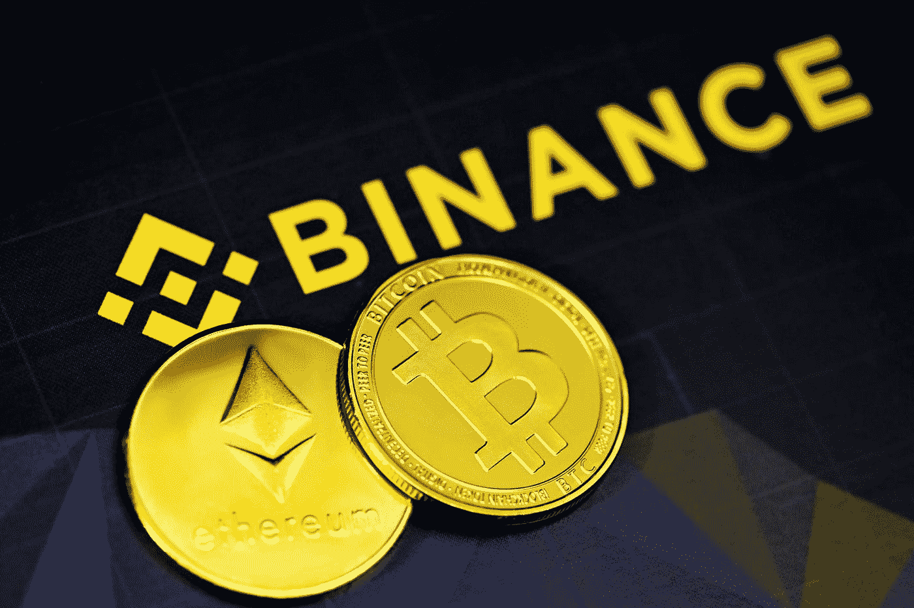

# 币安反弹来了吗？

> 原文：<https://medium.com/coinmonks/is-binance-backlash-incoming-df7d4f2339ea?source=collection_archive---------1----------------------->

Photo by [Kanchanara](https://unsplash.com/@kanchanara?utm_source=medium&utm_medium=referral) on [Unsplash](https://unsplash.com?utm_source=medium&utm_medium=referral)

在过去的 48 小时里，关于币安加密交易所的坏消息越来越多。这一切都是 FUD，对 FTX 崩盘的报复，还是别的什么？让我们来看看目前为止我们所知道的。

## 美国司法部可能指控币安高管洗钱

据报道，自 2018 年以来，币安处理了数十亿美元的非法支付。根据来自…的报道