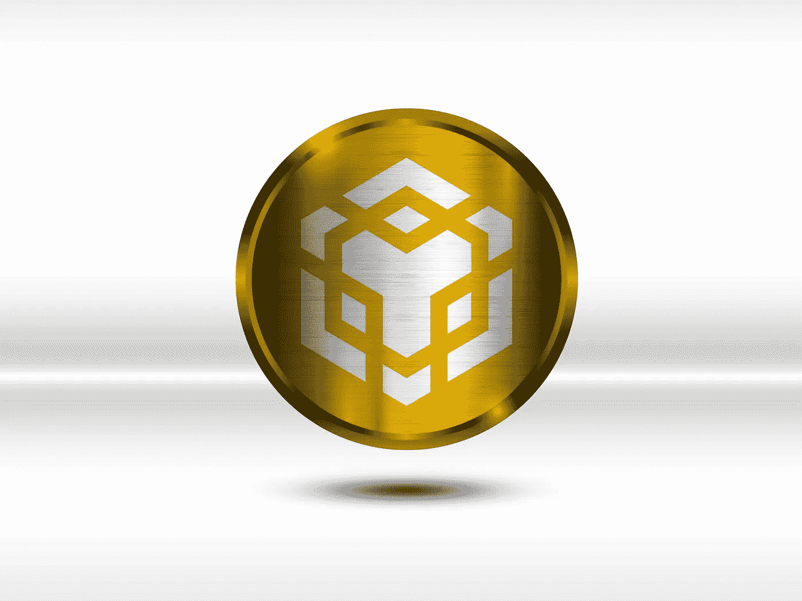

# 币安(BNB)是 2023 年的好投资吗？

> 原文：<https://medium.com/coinmonks/is-binance-bnb-a-good-investement-in-2023-633b1ae182b1?source=collection_archive---------50----------------------->

Source photo [Binance Blockchain Monedă — Imagine gratuită pe Pixabay](https://pixabay.com/ro/illustrations/binance-blockchain-moned%c4%83-7431005/)

在全球加密货币市场币安，大约有 600 种不同的数字货币可供交易。BNB 是该平台的原生硬币，旨在支持平台的增长，并为交易者提供一个流动的市场。你可以用币安 VISA 借记卡用代币购物，也可以用代币支付费用。