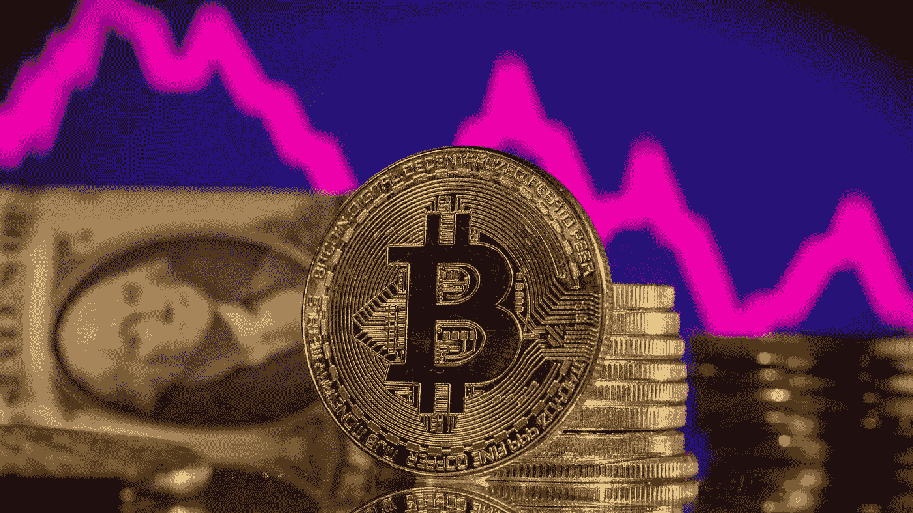
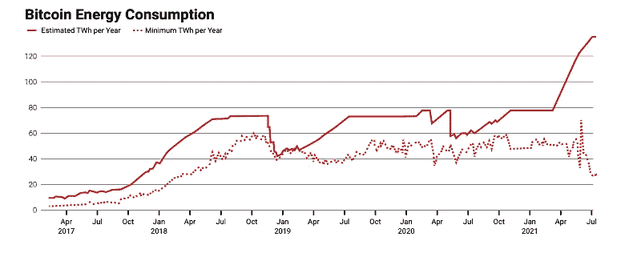
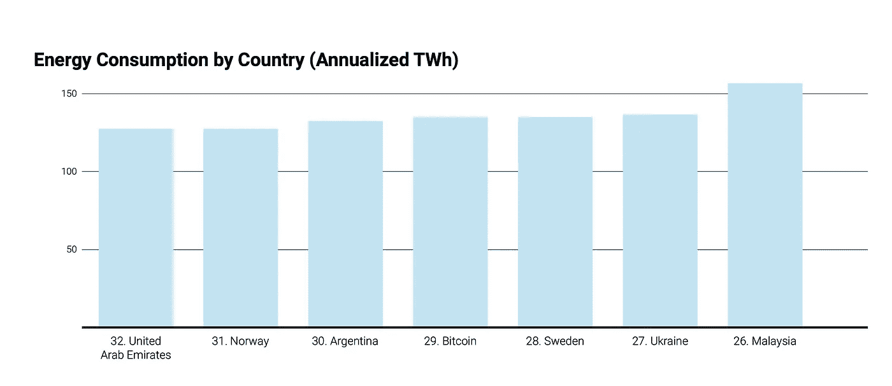
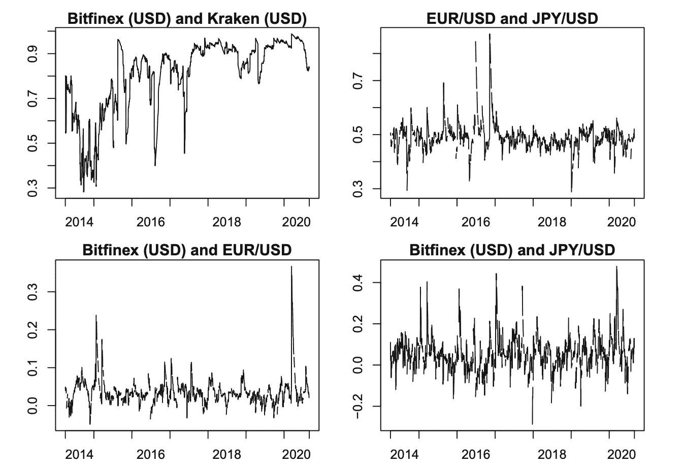

# 比特币是福是祸？

> 原文：<https://medium.com/coinmonks/is-bitcoin-a-blessing-or-a-curse-3e569ecf68d7?source=collection_archive---------13----------------------->

**简介**

诺贝尔经济学奖获得者保罗·克鲁格曼最近表达了他对加密货币的担忧，他宣称加密货币市场“存在令人不安的次贷危机的回声”[1]。克鲁格曼是在警告公众加密货币的危险和风险，还是他只是向后看，拒绝适应 21 世纪的方式？乍一看，比特币取代法定货币，似乎是无现金经济的未来。然而，比特币是一个诅咒，应该不惜一切代价避免，因为它的能源消耗非常大，不可持续，不具备作为全球货币所需的属性。

2008 年，为了应对经济衰退，一个名为中本聪的组织创立了比特币，其目的是在不使用金融机构作为中介的情况下，为交易提供更大的透明度。比特币背后的关键创新是它的区块链技术，这是一种像账本一样的软件，记录使用比特币进行的每一笔交易[3]。比特币分类账和金融机构分类账的区别在于，比特币分类账可以被任何人分发和访问。比特币的另一个方面是其挖掘过程[4]，允许比特币网络验证和保护区块链和新交易。虽然这些功能通常被视为积极因素，但区块链和采矿技术实际上是比特币能耗达到天文数字的原因[5]。

**比特币的高能耗**

根据剑桥大学运行的剑桥比特币电力消耗指数，比特币在 2021 年 6 月消耗了几乎 115 太瓦时(TWh)的能源[6]。例如，一笔比特币交易被记录为消耗多达 80，000 笔信用卡交易的能量，而消耗的能量比阿根廷和挪威等国家还多[7]。由于当前的能源危机，美国数百万家庭买不起汽油，比特币消耗的能源数量简直不合逻辑。

由于当前的供应链系统严重依赖于旅行、运输食品和商品以及许多其他必需品的能源，一种货币消耗如此多的能源是不合理的。

> 交易新手？尝试[加密交易机器人](/coinmonks/crypto-trading-bot-c2ffce8acb2a)或[复制交易](/coinmonks/top-10-crypto-copy-trading-platforms-for-beginners-d0c37c7d698c)

此外，对于一个走向更可持续时代的全球经济来说，比特币的开采过程是适得其反的，因为大多数比特币开采是在依赖煤炭和其他化石燃料能源的亚洲国家进行的[9]，这会产生大量的排放和温室气体。由于供应有限，可供开采的比特币数量变得越来越少，计算机开采比特币所需的能量将会增加，这将导致更多的煤炭和其他能源消耗。由于更加注重减少对化石燃料和煤炭能源的依赖，比特币采矿对环境具有毁灭性的影响，因为大型采矿会消耗煤炭并产生温室气体。

图 1 [10]

图二[11]

**缺少被视为货币的属性**

此外，比特币缺乏被视为一种货币形式的基本属性，因为它不具备被视为货币的三个主要方面。根据许多经济学家的观点[12]，货币有三种不同的属性:它可以作为交换媒介，有记账单位和价值储存手段。比特币几乎不符合唯一的第一个属性，因为比特币的全球使用量仍然很小，特别是在发展中国家，那里的许多人甚至没有互联网接入[13]，更不用说使用比特币了。作为一种记账单位和价值储存手段，比特币迫使卖家报出小数点后四五位的价格，同时表现出高波动性和大量网络攻击和黑客行为。从本质上讲，比特币根本不具备作为货币的必要属性，应该在全球经济中避免使用。

**交易媒介**

难以获得新的比特币是比特币成为普遍使用的交易媒介的一个障碍。用户必须从互联网交易所或交易商那里购买比特币，然后想办法安全地存储它们，除非他们是成功的比特币矿工(这一职业现在由超级计算机主导，需要巨额资本支出)。买方必须进行银行转账或将现有银行账户连接到交易所，以便进行这些购买，因为它们通常不能使用信用卡或 PayPal 进行[14]。由于发展中国家在卫生、教育和互联网接入等领域仍有欠缺，比特币因缺乏交易媒介而无法作为全球货币使用。

此外，要想使用商家的服务，就必须拥有比特币，这是不可能的。在大多数零售市场中，顾客在手头没有现金的情况下使用零售商或第三方信用卡发行商提供的消费信贷进行购物是很常见的。由于缺乏比特币计价的信用卡，以及比特币计价的消费贷款似乎很少见，这些选择对于比特币来说是不可用的。为了让比特币发挥作用，它依赖于法定货币，这突显出它无法充当货币。

**记账单位**

消费者在对比各种零售商品的成本时，必须将一种货币视为国家货币，以此作为记账单位[15]。出现的一个问题是比特币的波动性，这将导致商家不断更新价格，这将为商家创造更多的菜单成本[16]。使用比特币作为货币的一个最容易被忽视但也是最严重的问题是，它将迫使价格报价达到四位小数，这将导致巨大的复杂性，特别是在效率是主要优先事项的消费者驱动型经济中。由于一杯咖啡的价格为 0.00023 BTC，很难在世界上找到任何其他货币的消费价格以这些单位报价，这证明了比特币作为记账单位的低效率[17]。

**储值酒店**

一种货币的价值储存背后的主要方面本质上是保护它不被盗窃[18]，这通常是把它放入银行账户。然而，对于比特币，它必须存储在数字钱包中，这很容易被黑客和诈骗[19]。即使比特币用户能够确保账户安全，他们也面临着管理比特币波动性带来的风险的问题。

由于其去中心化的性质，比特币的价格被允许自由波动，这导致当双方参与交易时，比特币的价格极其不稳定。在一种货币中，波动性代表不稳定，这是一个不可取的方面[20]。此外，如果人们想对冲比特币价格下跌的风险，比特币的波动性应该与其他外币相似，以免受到宏观经济事件的影响。然而，图 3“描绘了两种外汇汇率之间的相关性，平均为 0.49，在 0.29 和 0.87 之间波动，而比特币的波动率平均更高(0.81)，波动更大(在 0.28 和 0.99 之间)”(Baur & Dimpfl，2020)。如图 3 所示，平均而言，比特币和其他货币之间的波动相关性非常低，这表明比特币作为风险管理工具是无效的。与其他全球货币不同，很难对冲任何影响比特币价格的风险[21]。对于像美元和英镑这样受政治和经济生活领域事件严重影响的全球货币来说，比特币的价格似乎完全没有变化，这些事件强调了它无法存储和价值，作为回报，也无法充当全球货币。甚至最近比特币价格的变动[22]也凸显了比特币的不稳定性和无法成为一种全球货币。

图三[23]

**金本位的教训**

在普通大众看来，比特币的优势之一是其通缩机制。在 21，000，000 BTC 的有限数量下，随着比特币开采数量的增加，比特币的通货膨胀率以恒定的速度下降[24]。虽然这一方面确实使比特币颇具吸引力，但从历史角度来看，如果比特币被用作全球货币，这实际上是一个负面因素。如果比特币变得非常受欢迎并取代法定货币，它将对经济产生通缩效应，因为货币供应不会随着经济增长而扩张。这种情况将迫使大多数工人接受年薪削减，这可能引发反对货币的政治抗议，类似于 19 世纪末民粹主义运动期间在美国看到的情况[25]。比特币的行为使其成为高风险商品和不可持续货币之间的一条细线。比特币已经证明，它不具备被视为货币的属性，因为它几乎不能充当交换媒介，也没有记账单位或价值储存手段。此外，其高能耗不利于对可再生和可持续能源寄予厚望的未来。简单说，比特币是个诅咒，不应该融入全球经济。

然而，如果有一天比特币以某种方式成为一种全球货币，那么我们可以从金本位制中吸取一些教训和想法，因为比特币和黄金都提供了一种国际基础货币[26]。金本位表现相当好的一个原因是“每当经济活动下降时，英格兰银行就增加其对外贷款，抑制而不是加剧国际商业周期，并充当国际最后贷款人”(Kindleberger，1973)。然而，由于金本位国家选民构成的变化，金本位没有持续很长时间[27]，因此国内利益变得更加重要，国际收支平衡问题变得不那么重要[28]。最终，金本位制阻碍了政治家解决失业和通货膨胀等问题的能力，特别是在大萧条时期[29]。

在比特币标准下，这种事件也可能成为现实，因为比特币标准下的大规模周期性衰退或金融危机可能会导致政治压力，并要求中央银行解除比特币的束缚[30]，这些束缚禁止它们扩张以刺激经济或向陷入困境的金融机构提供帮助[31]。央行或政府最终将不得不屈服于这种压力，切断其货币与比特币的联系，就像央行和政府在大萧条期间所做的那样。与金本位制类似，如果比特币标准成为现实，央行或政府最终将不得不回归法定货币。这突显出，如果比特币被采纳为全球货币，它最终将走向衰落。

在过去几年中，大量的实证研究对比特币应该被视为全球货币的下一次转变的假设提出了挑战。从物物交换系统到黄金再到信用卡，许多人认为比特币应该是货币进化的下一个目标。然而，货币具有与众不同的属性，这些属性比特币都不具备。此外，随着能源价格的上涨，比特币交易消耗的能源量完全失控。虽然社会总是希望改进当前的想法和方法，但比特币带来的危险远大于优势，不应作为一种货币融入全球经济。

**脚注**

[1]:布朗，R. (2022 年 1 月 28 日)。*诺贝尔奖获得者保罗·克鲁格曼说，加密与次贷危机有着“令人不安”的相似之处。美国消费者新闻与商业频道。检索于 2022 年 6 月 2 日*

[2]: *还记得为什么比特币被创造出来吗……—加密新闻*。Coin.fyi .(未标明)。检索于 2022 年 6 月 2 日

[3]:海耶斯，A. (2022 年 6 月 24 日)。*区块链讲解*。Investopedia。检索于 2022 年 6 月 4 日

[4]: *比特币(BTC)价格、图表、新闻:比特币基地:比特币价格、BTC 价格、比特币比特币基地*。比特币基地。(未注明)。检索于 2022 年 6 月 19 日

[5]:马尔库斯，J. (2021)。加密货币——是诅咒还是祝福？*扬·马尔库斯组织*。

[6]:马尔库斯，J. (2021)。加密货币——是诅咒还是祝福？*扬·马尔库斯组织*。

[7]:马尔库斯，J. (2021)。加密货币——是诅咒还是祝福？*扬·马尔库斯组织*。

[8]:有线新闻网。(2021 年 7 月 13 日)。观点:油价上涨对低收入家庭的伤害最大。政府需要帮助。CNN。检索于 2022 年 6 月 16 日

[9]:马尔库斯，J. (2021)。加密货币——是诅咒还是祝福？*扬·马尔库斯组织*。

[10]:马尔库斯，J. (2021)。加密货币——是诅咒还是祝福？*扬·马尔库斯组织*。

[11]:马尔库斯，J. (2021)。加密货币——是诅咒还是祝福？*扬·马尔库斯组织*。

[12]: *比特币是真正的货币吗？国家级经济评价……—NBER*。(2013 年 12 月)。检索于 2022 年 6 月 12 日

[13]:世界银行集团。(2018 年 11 月 21 日)。*为包容而连接:为所有人提供宽带接入*。世界银行。检索于 2022 年 6 月 27 日

[14]:*N-事务。【Blockchain.com】T21。(未注明)。检索于 2022 年 6 月 5 日*

[15]: *比特币是真正的货币吗？国家级经济评价……—NBER*。(2013 年 12 月)。检索于 2022 年 6 月 12 日

[16]:w . Kenton(2021 年 10 月 28 日)。*菜单费用定义*。Investopedia。检索于 2022 年 6 月 3 日

[17]: *比特币是真正的货币吗？国家级经济评价……—NBER*。(2013 年 12 月)。检索于 2022 年 6 月 12 日

[18]: *比特币是真正的货币吗？国家级经济评价……—NBER*。(2013 年 12 月)。检索于 2022 年 6 月 12 日

[19]:杜米特雷斯库，希腊共和国，2015 年 9 月 13 日。*环球经济观察*。检索于 2022 年 6 月 9 日

[20]: Strebko，j .，& Romanovs，A. (2018)。*虚拟货币比特币的利与弊——research gate*。研究之门。检索于 2022 年 6 月 7 日

[21]: *比特币是真正的货币吗？国家级经济评价……—NBER*。(2013 年 12 月)。检索于 2022 年 6 月 12 日

[22]:库里，B. (2022 年 6 月 13 日)。*为什么比特币今天下跌？《福布斯》。2022 年 6 月 27 日检索，来自[https://www . Forbes . com/advisor/investing/cryptocurrency/why-is-bit coins-price-falling/](https://www.forbes.com/advisor/investing/cryptocurrency/why-is-bitcoins-price-falling/)*

[23]:杜米特雷斯库，希腊共和国，2015 年 9 月 13 日。*全球经济观察报*。检索于 2022 年 6 月 9 日

[24]: IAC 出版公司。(未注明)。*民粹主义政党的主要目标是什么？*引用。检索于 2022 年 6 月 3 日

[25]:阿玛迪奥，K. (2022 年 3 月 17 日)。*金本位*。余额。检索于 2022 年 6 月 11 日

[26]:怀特，L. H. (2018 年 1 月 11 日)。*比特币系统与金本位有何相似和不同*。Cato.org。检索于 2022 年 6 月 10 日

[27]:韦伯，W. E. (2016)。*比特币标准:金本位的教训*。加拿大银行。

[28]:韦伯，W. E. (2016)。比特币标准:金本位的教训。加拿大银行。

[29]:类似于 1931 年英国脱离金本位时被打破的黄金枷锁

[30]:韦伯，W. E. (2016)。*比特币标准:金本位的教训*。加拿大银行。

[31]:韦伯，W. E. (2016)。*比特币标准:金本位的教训*。加拿大银行。

**参考书目**

阿马代奥，K. (2022 年 3 月 17 日)。*金本位*。余额。检索于 2022 年 6 月 11 日，来自[https://www . The balance . com/what-The-history-of-The-gold-standard-3306136 #:~:text = The % 20 gold % 20 standard % 20 is % 20a % 20 monetary % 20 system % 20 where，with % 20 gold % 20 as % 20a % 20 standard % 2C % 20 but % 20it % 20 failed](https://www.thebalance.com/what-is-the-history-of-the-gold-standard-3306136#:~:text=The%20gold%20standard%20is%20a%20monetary%20system%20where,with%20gold%20as%20a%20standard%2C%20but%20it%20failed)

Baur，d .，& Dimpfl，T. (2020 年 11 月 12 日)。*家乡——PMC——NCBI*。国家生物技术信息中心。于 2022 年 6 月 25 日从 https://www.ncbi.nlm.nih.gov/pmc/检索

*比特币(BTC)价格、图表、新闻:比特币基地:比特币价格、BTC 价格、比特币比特币基地*。比特币基地。(未注明)。于 2022 年 6 月 19 日从 https://www.coinbase.com/price/bitcoin 检索到

布朗河(2022 年 1 月 28 日)。诺贝尔奖获得者保罗·克鲁格曼说，加密与次贷危机有着“令人不安”的相似之处。美国消费者新闻与商业频道。2022 年 6 月 2 日检索，来自[https://www . CNBC . com/2022/01/28/Paul-Krugman-says-crypto-has-disturbing-parallels-with-subprime . html](https://www.cnbc.com/2022/01/28/paul-krugman-says-crypto-has-disturbing-parallels-with-subprime.html)

有线新闻网。(2021 年 7 月 13 日)。观点:油价上涨对低收入家庭的伤害最大。政府需要帮助。CNN。2022 年 6 月 16 日检索，来自[https://www . CNN . com/2021/07/13/perspectives/gas-prices-low-income-families/index . html](https://www.cnn.com/2021/07/13/perspectives/gas-prices-low-income-families/index.html)

库里，B. (2022，6 月 13 日)。*为什么比特币今天会下跌？*福布斯。2022 年 6 月 27 日检索，来自[https://www . Forbes . com/advisor/investing/cryptocurrency/why-is-bit coins-price-falling/](https://www.forbes.com/advisor/investing/cryptocurrency/why-is-bitcoins-price-falling/)

DUMITRESCU，G. C. O. R. N. E. L. (2015 年 9 月 13 日)。*全球经济观察报*。2022 年 6 月 9 日检索，来自[http://www . globe co . ro/WP-content/uploads/Vol/GEO _ Vol _ 5 _ No _ 2 . pdf](http://www.globeco.ro/wp-content/uploads/vol/GEO_Vol_5_No_2.pdf)

海耶斯，A. (2022 年 6 月 24 日)。*区块链讲解*。Investopedia。2022 年 6 月 4 日检索，来自[https://www.investopedia.com/terms/b/blockchain.asp](https://www.investopedia.com/terms/b/blockchain.asp)

IAC 出版公司。(未注明)。*人民党的主要目标是什么？*参考。2022 年 6 月 3 日检索，来自[https://www . reference . com/world-view/were-main-goals-popularity-party-7224 aa 153 f 111000](https://www.reference.com/world-view/were-main-goals-populist-party-7224aa153f111000)

*比特币是真正的货币吗？国家级经济评价……—NBER*。(2013 年 12 月)。2022 年 6 月 12 日检索，来自[https://www . NBER . org/system/files/working _ papers/w 19747/w 19747 . pdf](https://www.nber.org/system/files/working_papers/w19747/w19747.pdf)

西肯顿(2021 年 10 月 28 日)。*菜单费用定义*。Investopedia。检索于 2022 年 6 月 3 日，来自[https://www . investopedia . com/terms/m/menu-costs . ASP #:~:text = Key % 20 takeaways % 201% 20 menu % 20 costs % 20 are % 20 the % 20 costs，can % 20 contribute % 20 to % 20a % 20 recession。% 20 更多% 20 个项目...%20](https://www.investopedia.com/terms/m/menu-costs.asp#:~:text=Key%20Takeaways%201%20Menu%20costs%20are%20the%20costs,can%20contribute%20to%20a%20recession.%20More%20items...%20)

马尔库斯，J. (2021)。加密货币——是诅咒还是祝福？*扬·马尔库斯组织*。

*N 交易。Blockchain.com。(未注明)。于 2022 年 6 月 25 日从[https://blockchain.info/charts/n-transactions.](https://blockchain.info/charts/n-transactions.)检索*

*记住为什么创造比特币……—加密新闻*。Coin.fyi .(未标明)。2022 年 6 月 2 日检索，来自[https://coin . FYI/news/bitcoin/remember-why-bit coin-was-created-vhl tv6](https://coin.fyi/news/bitcoin/remember-why-bitcoin-was-created-vhltv6)

Strebko，j .，& Romanovs，A. (2018)。*虚拟货币比特币的利弊——research gate*。ResearchGate。检索于 2022 年 6 月 27 日，来自[https://www . research gate . net/publication/348393420 _ BENEFITS _ AND _ defaults _ OF _ VIRTUAL _ CURRENCY _ BITCOIN](https://www.researchgate.net/publication/348393420_BENEFITS_AND_DRAWBACKS_OF_VIRTUAL_CURRENCY_BITCOIN)

Weber，W. E. (2016)。*比特币标准:金本位制的教训*。加拿大银行。

White，L. H. (2018 年 1 月 11 日)。*比特币系统与黄金标准有何不同*。Cato.org。检索于 2022 年 6 月 10 日，来自[https://www . Cato . org/blog/how-bit 币-system-不象-gold-standard](https://www.cato.org/blog/how-bitcoin-system-unlike-gold-standard)

世界银行集团。(2018 年 11 月 21 日)。*连接包容:全民宽带接入*。世界银行。检索日期:2022 年 6 月 27 日，自[https://www . world bank . org/en/topic/digital development/brief/connect-for-inclution-broadband-access-for-overall](https://www.worldbank.org/en/topic/digitaldevelopment/brief/connecting-for-inclusion-broadband-access-for-all)