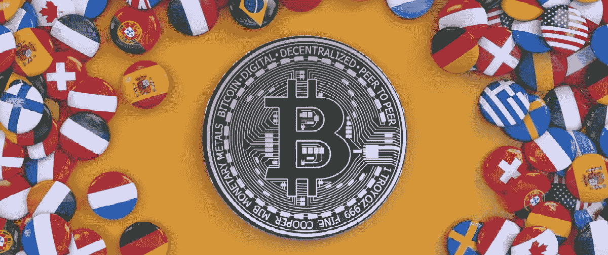

# 比特币的采用就发生在我们眼前吗？

> 原文：<https://medium.com/coinmonks/is-bitcoin-adoption-happening-right-before-our-eyes-de5a0c78d1f7?source=collection_archive---------31----------------------->

我将以一句引语开始本周的文章，每当你发现自己在质疑 crypto 和整个 Web3 领域时，我希望你记住这句话:

***大多数人都高估了一年能取得的成就，低估了十年能取得的成就。***

当人们缩小到 crypto 中的最后一年，看到一个 ATH 为 69，000 美元的令牌现在正在努力突破 20，000 美元的阻力时，他们会感到害怕。这是周期性的，大多数人忘记分析的是股票价格波动背后发生的事情。

让我们回顾一下今年到目前为止已经发生的事情，这些事情可能预示着由 Web3 引起的宏观变化。

自从区块链技术实施以来，已经过去了将近 15 年。2008 年，中本聪发布了比特币白皮书，介绍了比特币及其底层技术。一年后，第一笔比特币交易——“创世纪区块”(Genesis block)——完成。这些在当时是很小的一步，但对这个行业在接下来的几年中所包含的内容是至关重要的。

2013 年，Vitalik Buterin 发布了以太坊的白皮书，也介绍了智能合约的概念。几年后，一些目前的主要交易所成立，如币安、比特币基地和 Gate.io)，密码行业迈出了成熟的第一步，吸引了更多的用户和投资者。一千美元的市场变成了万亿美元的产业。区块链是当今最具颠覆性的技术之一。它有可能重塑人们购物、工作、定居和银行的方式。比特币在全球范围内的采用就在我们眼前，它成为主流并与传统金融完全融合只是时间问题。

**BTC 作为官方国家货币**

据当地政府称，世界上最贫穷的国家之一中非共和国(CAR)采用比特币和非洲金融共同体法郎作为其官方货币。这是第二个采取该措施的国家。2021 年 9 月 7 日，萨尔瓦多成为首个采用比特币作为与美元并列的法定兑换货币的国家。

在这些国家采用比特币代表着为它们打开新机遇的决定性一步。动机和好处包括:

*   采用比特币作为官方货币可以促进国际转账的接收。
*   比特币可以成为没有银行账户的人在金融系统中使用数字支付和其他交易的工具，而不仅仅依赖现金。
*   比特币可以吸引国际资本，将其被接受与这些国家的财产税减免和更顺畅的监管结合起来。

**比特币和加密领域正在改善美国以外的人们的生活**

Axie Infinity 是一款从玩到赚的游戏，它帮助了菲律宾等贫困国家成千上万的人与贫困作斗争。通过玩这种与加密相关的游戏(以及其他游戏)，这些国家的个人能够在玩的同时获得加密，并将收益转换为比特币作为财富储存手段，因为他们的货币逐年被低估。

这是比特币和密码部门如何改善人们生活的一个用例。例如，如果人们在艰难的经济时期挣扎，他们可能会通过玩游戏获得额外的收入。

**比特币对抗政府限制**

政府几乎可以随心所欲地施加限制。因此，更加明显的是，他们可以随时控制公民的资产。事实证明，比特币是对抗资产集中化的一种方式:

*   **自治加拿大卡车司机**:“自由车队”的抗议者从支持者那里收到了超过 100 万美元的 BTC 捐款，而当地政府寻求冻结这些捐款。
*   **俄罗斯寡头**:俄罗斯精英们正在将他们的财富转换成比特币，以逃避经济制裁。

我们正在目睹比特币在几个案例和场景中的采用，这表明这代表了一条通往更加全球化和分散化的经济的道路。BTC 能走多远以及它在不同情况下能有多大用处的最初迹象已经出现，出现更多清晰的迹象只是时间问题。

我们可能很快就会看到无银行账户的人群更广泛地参与加密、即时和低税的国际交易，在 BTC 接受支付，以及许多其他用例。就像之前说的，大多数人高估了一年能达到的成就，低估了十年能达到的成就。

[*乔罗伯特*](https://joerobert.com/) *现任罗伯特风险投资公司首席执行官，拥有超过 20 年的资产管理经验。自创办以来，乔已经为投资者和合伙人创造了可预见的两位数回报。Joe 已经投资了股权和代币的种子轮，以及比特币、以太坊和其他顶级加密货币的投资组合。*

*如果您是合格投资者，并想了解更多关于我们产品的信息，请联系我们。*

> 交易新手？试试[加密交易机器人](/coinmonks/crypto-trading-bot-c2ffce8acb2a)或者[复制交易](/coinmonks/top-10-crypto-copy-trading-platforms-for-beginners-d0c37c7d698c)