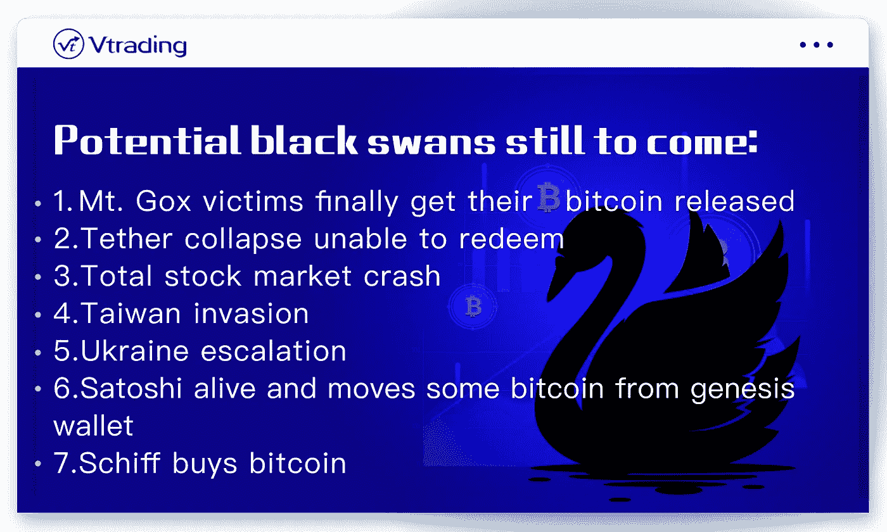
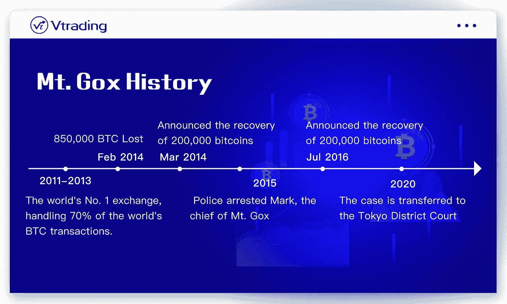
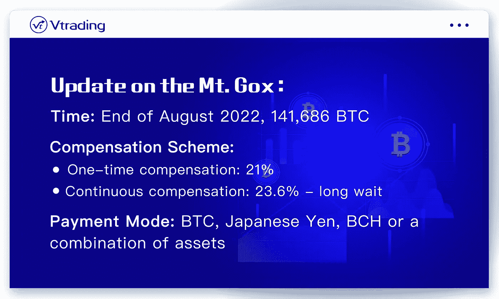

# 比特币黑天鹅来了吗？什么是 Mt. Gox，它如何影响加密市场？

> 原文：<https://medium.com/coinmonks/is-bitcoin-black-swan-coming-what-is-mt-gox-and-how-does-it-affect-the-crypto-market-a15dc431dae9?source=collection_archive---------20----------------------->

过去一周，美股连涨 5 天，实现 5 连阳。比特币也成功收复 20000 关口，一度升至 20002 上方。这看起来对市场非常有利。

但今天我们将向你展示加密市场即将面临的黑天鹅，并将重点放在排名第一的 Mt. Gox 上，Mt. Gox 之所以被称为比特币持有者头顶上最大的刀，这把刀可能真的会在今年 8 月底落下。这件事已经过去 8 年了。在过去的 8 年里，许多比特币持有者非常害怕 Mt. Gox 一旦实施，里面的 15 万个比特币会在市场上被粉碎。

Black swans still to come in crypto market

本文将重点介绍 Mt. Gox 的始末，以及 Mt. Gox 之后会对市场产生什么影响。

Mt. Gox 是加密货币发展到目前为止投资者损失最惨重的一次。所以这件事影响太大了，即使到现在已经 8 年了，还是没有解决。Mt. Gox 上周取得了新的进展。

Mt. Gox History

Mt. Gox 交易所是一个古老的日本交易所，在当时它是世界第一的交易所，处理全球 70%的比特币交易。

2014 年 2 月，很多人发现 Mt. Gox 交易所出现了提现延迟的情况。随后，Mt. Gox 交易所关闭官网，发布公告关闭交易，并申请破产。更离谱的是，他们宣布丢失了 85 万个比特币，其中 75 万个属于客户。按照当时官方的解释，是被黑客攻击了。但很快在 3 月，Mt. Gox 交易所表示，他们在一个旧钱包中发现了 20 万个比特币。

事件发生后，许多 Mt. Gox 用户开始了艰难的维权之路。有的去 Mt. Gox 交易所投诉，有的去东京法院起诉事发时交易所负责人马克。

2015 年，调查此事的东京警方表示，他们发现最多有 1%的比特币被盗，其余的是系统未经授权运行的结果。而且警方怀疑交易所负责人马克也是案发当年该系统的操纵者。马克后来承认自己是该系统的操作者。于是警察逮捕了马克，指控他贪污挪用外汇资金。

> 交易新手？试试[加密交易机器人](/coinmonks/crypto-trading-bot-c2ffce8acb2a)或者[复制交易](/coinmonks/top-10-crypto-copy-trading-platforms-for-beginners-d0c37c7d698c)

但由于一直没有有利证据证明马克是劫匪，2016 年 7 月他被保释。出狱后，马克表示将以盗窃发生时比特币的价格对受害者进行补偿。但由于 2014 年和 2016 年的比特币价格已经相差很大，受害人没有接受赔偿。因此，他们继续在当地法院捍卫自己的权利。

最终，法院裁定 Mt. Gox 交易所的破产申请无效，必须向受害者返还价值 10 亿美元的比特币。然而，该裁决长期以来并未得到有效执行。

该案直到 2020 年 11 月才被移送至东京地方法院。

Update on the Mt. Gox

根据东京地方法院 2021 年 11 月 16 日的判决，法院批准并确认了最终的返还方案。还款计划确定在今年 8 月底进行，但具体日期未公布。然后他们的信托基金有 141686 个比特币。受害者可以选择接受一次性赔偿他们当时拥有的比特币的 21%。如果他们选择连续赔偿，可以获得当时损失的 23.6%，但是要等很久。你可以选择用比特币、日元、比特币现金，或者这三种资产的组合来支付。

# **mt . Gox 事件赔偿一旦实施，对市场会有什么影响？**

8 月底，这些受害者在领取赔偿时将有两种选择:

**选项 1:** 接受加密货币或比特币现金。如果选择这个选项，事发时比特币的价格仅为 426 美元，而目前比特币的价格约为 2 万美元。再加上现在宏观经济的恶化，现在的密码市场也处于熊市，很多人对现金的需求在上升。在这种情况下，许多受害者会选择出售自己的比特币，换取法定货币。

**选择二:**接受菲亚特赔偿。同样的结果。当受托人要向这些受害者支付法币时，他们只能出售比特币，他们只能去市场出售比特币来换取法币。

因此，无论他们选择哪种支付方式，整个市场都会面临很大的抛售压力。

据新闻报道，Crypto.com 首席执行官向所有投资者发出严重警告，提醒大家密切关注 8 月底 Mt. Gox 事件中的赔偿支付。据他介绍，目前市场对这一事件还没有太大反应，但这一事件可以排在所有黑天鹅事件之首。所以可以看出，这件事比 USDT 雷雨更严重。

我们可以按照现在的比特币价格，假设 2 万的价格，算出 141686 个比特币总共超过 28 亿美元。如此巨大的抛售压力，肯定会对比特币的价格产生非常大的影响。

www.vtrading.com

Vtrading 是一个为每个交易者提供交易策略的加密交易平台。Vtrading 旨在让您的交易更加智能。一键访问 Vtrading.com[的多个交易所和多个交易对。各种加密交易机器人是永久免费的。是时候让 Vtrading 帮助您在加密市场赚取更多利润了。](http://www.vtrading.com)