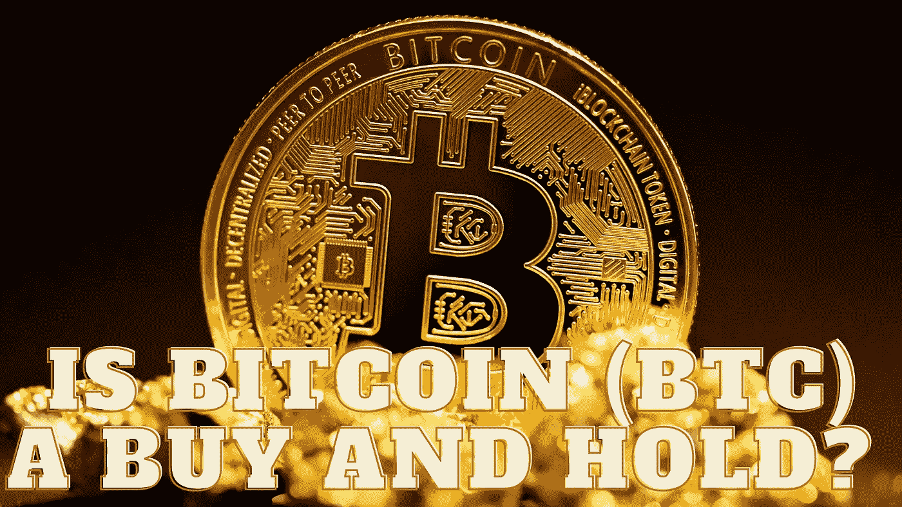

# 比特币(BTC)是买入并持有吗？

> 原文：<https://medium.com/coinmonks/is-bitcoin-btc-a-buy-and-hold-a2de308665ea?source=collection_archive---------41----------------------->

Source photo Unsplash.com

自诞生以来，比特币已经为数百种其他数字资产的创造扫清了道路。到目前为止，BTC 的价格波动很大，货币跌至历史低点，然后在下一轮牛市中飙升。然而，crypto 以 372，132，544，792 美元的市场估值继续成为市场领导者。