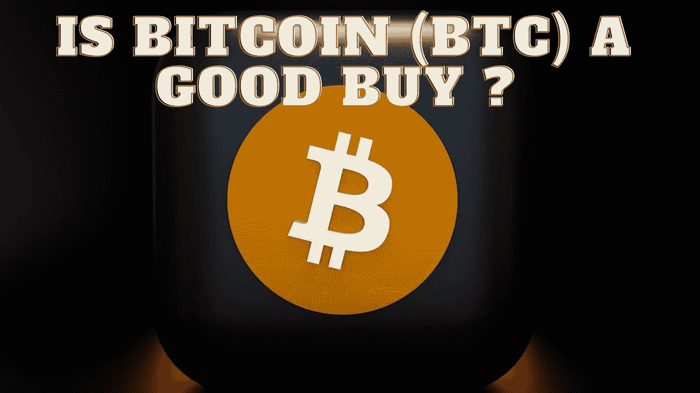

# 比特币(BTC)划算吗？

> 原文：<https://medium.com/coinmonks/is-bitcoin-btc-a-good-buy-cdb64f63740c?source=collection_archive---------20----------------------->

Source photo Unsplash.com

2009 年 1 月，就在大萧条结束后，一群化名为中本聪的人向全世界介绍了比特币。其中一个主要目标是建立一种分散的、抵制审查的货币。由于政府借贷、印钞和量化宽松都将在 2009 年开始，很容易理解为什么人们会想要使用比特币。