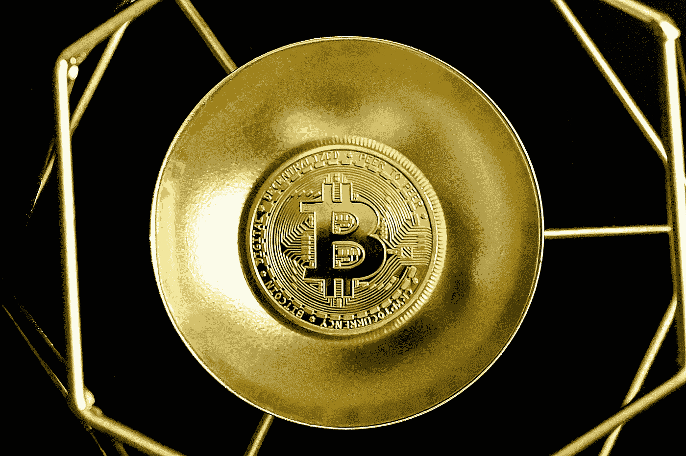

# 比特币(BTC)是最好的 HodL 加密货币吗？

> 原文：<https://medium.com/coinmonks/is-bitcoin-btc-the-best-hodl-cryptocurrency-76f64ef07aef?source=collection_archive---------42----------------------->

Source photo Unsplash.com

比特币由来已久，是世界上最受欢迎的加密货币之一。自 2013 年价格上涨以来，略有下降，但逐渐增长。

作为形成我们现代加密生态系统的最初数字资产，硬币多年来已经发展了一大批地下追随者。这些投资者将 BTC 视为数字货币系统的指路明灯…