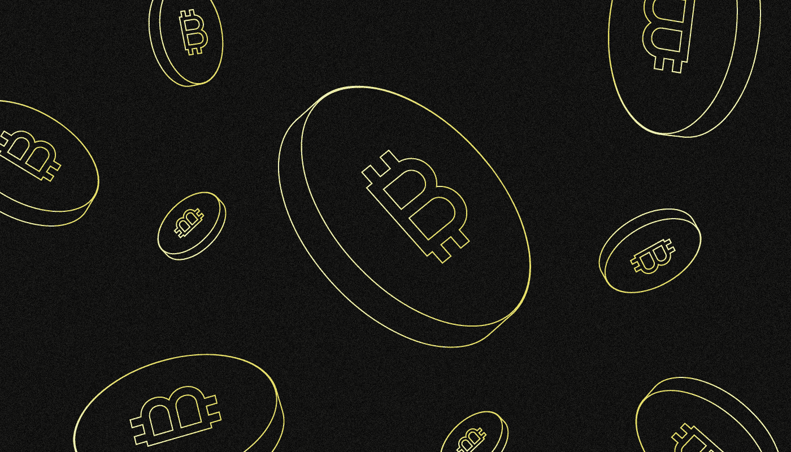
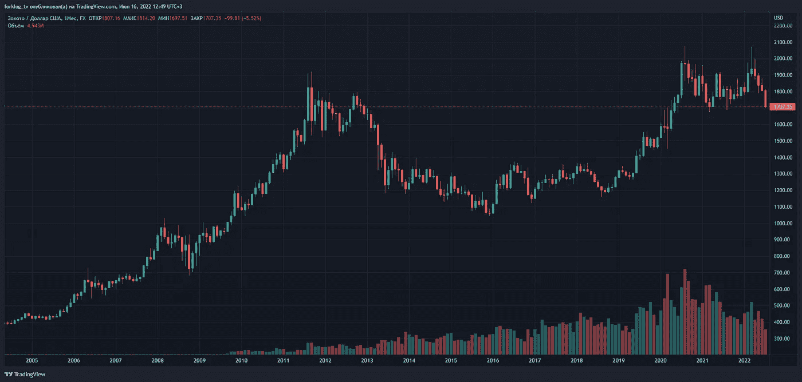
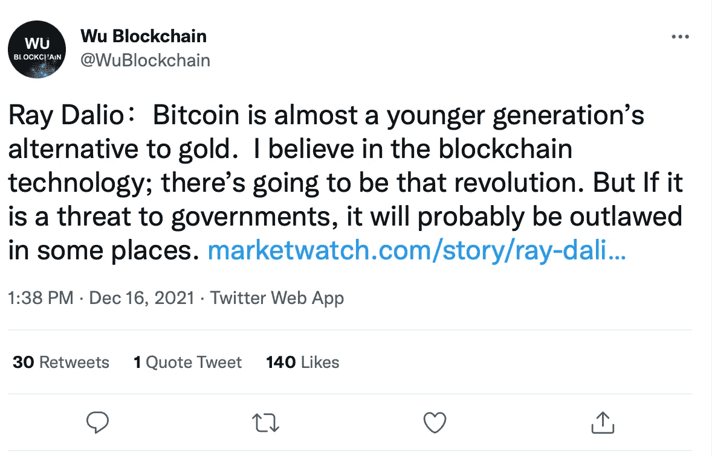

# 比特币是“数字黄金”吗？

> 原文：<https://medium.com/coinmonks/is-bitcoin-digital-gold-2929e312859a?source=collection_archive---------28----------------------->

***比特币经常被称为“数字黄金”，因为它能够像实物黄金一样保值。这是真的吗？让我们来了解一下！***

对于比特币是防御性资产还是投机性资产，目前还没有达成共识。只有少数投资者和组织将资本投资于第一种加密货币，以抵御通货膨胀。

对比特币和各种资产类别相关性的研究表明，它在不同的市场情况下表现不同。

# 比特币和黄金有什么共同点？

[中本聪](/@SunflowerCorpAdmin/who-is-satoshi-nakamoto-8b20cfc55fbe)设想比特币是一个完全成熟的支付系统，没有法定货币的任何缺点。第一个是通货膨胀，它被定义为以购买力表示的实际价值的逐渐损失。

为了应对这一点，比特币的架构中嵌入了以下属性:

*   发行数量限制在 2100 万 BTC。矿工将在 2140 年秋天开采出最后一枚硬币。
*   新硬币的产量正在减少。由于被称为减半的程序化事件，开采比特币的奖励大约每四年减半。

黄金也有类似的特性。它的储量有限，因为它是一种天然金属。而且，尽管这种资源的数量在增加，但却跟不上需求的增长，新的矿藏也变得越来越稀缺。

最后，与比特币一样，人类已经自愿承认黄金是一种具有货币价值的宝贵资产。

# 黄金一直是安全资产吗？

比特币和黄金的使用方式是一个关键的相似之处。多年来，黄金既作为保值手段，也作为支付手段。它们的价值是由里面的东西决定的。

所谓的“金本位”是 19 世纪末在发达国家经济体中确立的。黄金充当价值的普遍等价物，国家用其黄金储备提供法定货币的价值。发行货币的国家保证有能力将纸币兑换成一定数量的黄金。

**1944 年**、**、**西方国家缔结[布雷顿森林协定](https://en.wikipedia.org/wiki/Bretton_Woods_system)，根据该协定，各国货币对美元实行固定汇率，与黄金价格挂钩。一金衡盎司的贵金属价值 35 美元。尽管它取代了“金本位制”，但新的货币体系仍然以黄金价格为基础。

美国在 1971 年取消了美元对黄金的固定汇率，使得布雷顿森林协议过时。此后，法定货币利率一直由公开市场的供求决定。与此同时，美元持续的低通胀已经成为惯例。

然而，**从 20 世纪 80 年代到 2022 年**，其年值都没有超过 2%。因为美元是货币，它也是世界储备货币，这使它成为一种受欢迎的避险资产。

黄金不再用于支付，但它保持其价值。原因在于保值能力:经济激励不利于销售。

# 为什么比特币不被认可为数字黄金？

黄金作为投资资产的主要功能是在危机时期保值增值的能力。当经济处于长期衰退时，投资者会卖出股票等高风险资产，买入保值工具，尤其是黄金。

黄金价格在 1972 年**开始上涨，并在 1979 年**达到顶峰。然而，在接下来的 30 年里，贵金属的交易水平大致相同，先是升值，然后贬值..****

直到 2007 年，黄金才达到 1979 年的峰值(大约每金衡盎司 680 美元)。随后，全球金融危机爆发，到 2011 年 11 月 13 日，金属价格几乎翻了三倍，超过了 1800 美元。这项资产在接下来的八年里贬值了。2019 年年中开始上涨。疫情冠状病毒推高了价格，到 2020 年 8 月 16 日，价格已经接近 2000 美元。

Monthly chart of XAU/USD broker FXCM. Data: TradingView.

根据中本聪本人留下的[证据](https://p2pfoundation.ning.com/forum/topics/bitcoin-open-source)来看，比特币是为了应对 2007 年的危机而产生的，美国借助大规模增发美元“扑灭”了这场危机。自从主要的加密货币网络推出以来，其价格逐年上涨。但在更短的时间内，比特币是一种不稳定的资产。这使得它与高风险资产相关。

几位研究人员发现了比特币和股票市场之间的联系。神秘研究公司在 2022 年 4 月 22 日的报告中称，第一种加密货币的走势与科技公司的股票最为相似，科技公司被认为是股票市场中风险较高的部分。

几个月前，高盛分析师警告称，比特币的价格受到宏观经济因素的影响，其价值可能会随着美联储收紧政策而下降。这正是后来发生的事情。

根据美国银行的数据，自 2021 年以来，第一种加密货币的价格与股票市场相关。作为一个例子，该银行的研究人员引用了与关键股票指数的相关性——标准普尔 500 和纳斯达克 100 指数。因此，他们认为比特币不是一种安全的资产。

# 怎样才能证明比特币是数字黄金？

也有一些事实支持比特币作为一种保值手段。

首先，知名投资者谈到了比特币的保护属性。2021 年“数字黄金”的论点得到了美国金融家**雷伊·达里奥**的支持，尽管他后来指出第一种加密货币输给了黄金。

Source: [Twitter](https://twitter.com/WuBlockchain/status/1471429618334797828?ref_src=twsrc%5Etfw%7Ctwcamp%5Etweetembed%7Ctwterm%5E1471429618334797828%7Ctwgr%5Ea2ff89d38cb68fdb13d62399498935043b805cea%7Ctwcon%5Es1_&ref_url=https%3A%2F%2Fforklog.com%2Frej-dalio-nazval-bitkoin-zolotom-dlya-molodyh%2F)

在【2022 年 4 月，位图交易所前负责人**亚瑟·海斯**表示，由于美联储的政策和美元的贬值，比特币最终会成为一种保护性资产。

第二，根据市场情况，比特币与各种资产类别的相关性可能会发生变化。Block 研究员 Larry Cermak 认为，在 2020 年市场下跌期间，第一种加密货币的价值将开始与风险资产的行为相关联。

另一个“赞成”的论点是将比特币用作数字黄金。尽管其波动性很高，但许多大公司已经投资了第一种加密货币。特斯拉、Core Scientific 和 Square 都在比特币国债网站的上市公司之列。

**MicroStrategy 首席执行官迈克尔·塞勒**是比特币的主要支持者；他的公司拥有近 **13 万 BTC** 。

此外，比特币已经被用于政府储备。自 2021 年以来，萨尔瓦多政府一直在购买比特币进入其国库。

摩根大通认为，由于比特币在机构投资者中的广泛采用，它有可能成为数字黄金，但实现这一目标限制了第一种加密货币对通胀的依赖。

> 如果你对数字黄金话题有什么补充，欢迎评论！
> 在跟踪更新方面，订阅我们的 [Medium feed。](https://medium.com/sunflowercorporation)敬请期待！

> 交易新手？尝试[加密交易机器人](/coinmonks/crypto-trading-bot-c2ffce8acb2a)或[复制交易](/coinmonks/top-10-crypto-copy-trading-platforms-for-beginners-d0c37c7d698c)