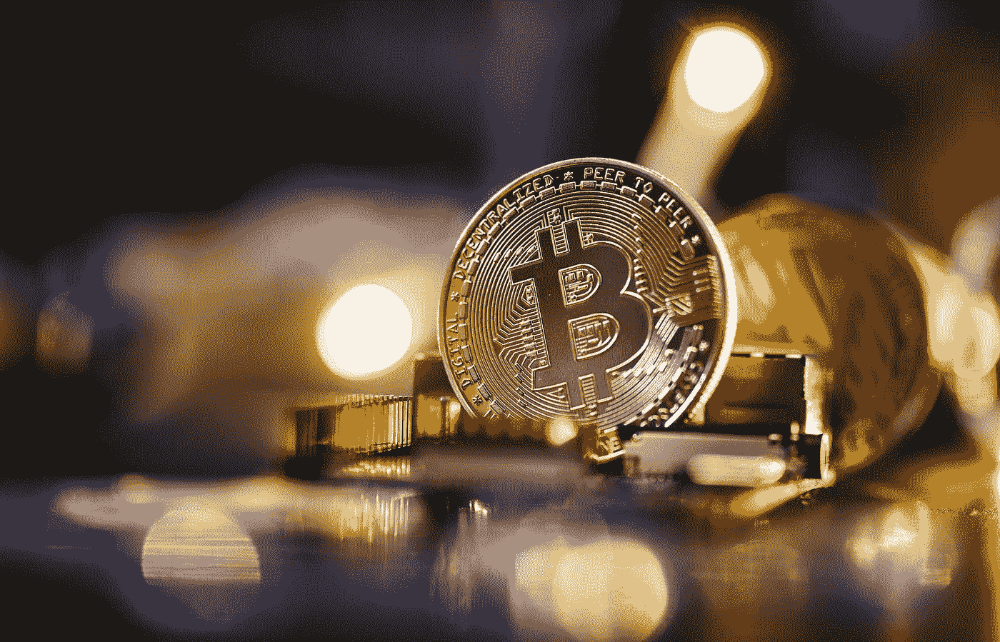

# 比特币是良药，密码是毒药吗？

> 原文：<https://medium.com/coinmonks/is-bitcoin-the-medicine-and-crypto-the-poison-d025d1b61e42?source=collection_archive---------5----------------------->

Photo by [Michael Förtsch](https://unsplash.com/@michael_f?utm_source=medium&utm_medium=referral) on [Unsplash](https://unsplash.com?utm_source=medium&utm_medium=referral)

有充分的理由将比特币与加密市场的其他部分区分开来。然而，比特币不仅是加密沼泽的一部分，也是它的起源——比特币制造者不应该为此感到羞耻，而是应该为此感到自豪，因为这是可靠货币的价格。

比特币目前在许多屋顶上呼啸而过，它不是加密的:有比特币，然后还有其他的…