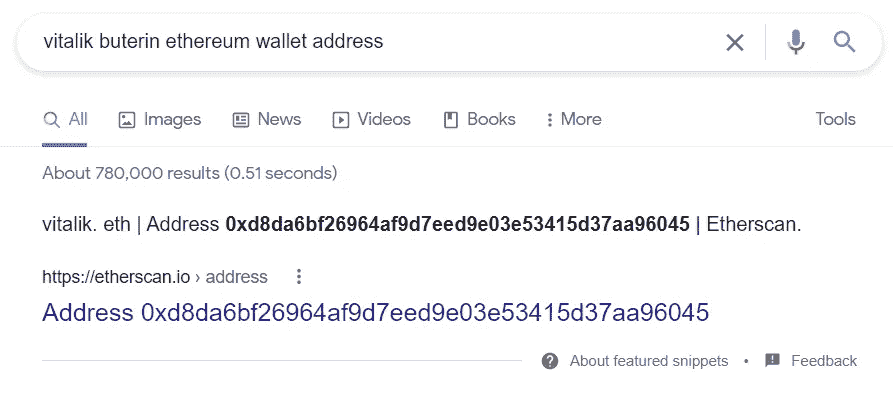
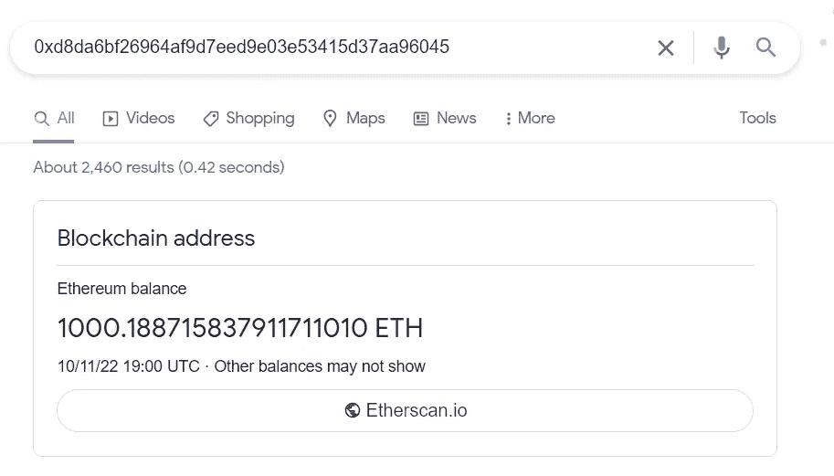

# 区块链变得比以往更加透明了吗？

> 原文：<https://medium.com/coinmonks/is-blockchain-becoming-more-transparent-than-ever-1262d138eb72?source=collection_archive---------24----------------------->

## 区块链|以太坊|加密货币

## 以太坊网络扫描快速指南

Photo by [GuerrillaBuzz Crypto PR](https://unsplash.com/@theshubhamdhage?utm_source=medium&utm_medium=referral) on [Unsplash](https://unsplash.com?utm_source=medium&utm_medium=referral)

因为这是我第一篇专门讨论区块链的文章，所以让我们先简单介绍一下绝对基础知识。

# 区块链到底是什么？

让我们不要重新发明轮子，让我们看看普华永道对此有什么看法:

> 区块链是点对点网络中所有交易的分散分类账。使用这种技术，参与者可以确认交易，而不需要中央结算机构。潜在的应用可能包括资金转移、结算交易、投票和许多其他问题。(《理解比特币、加密货币和区块链》，2022 年)

# 区块链是数据库吗，反之亦然？

这个问题很好，再让专家来回答这个问题:

> 区块链的最终目标是存储信息，这使它成为一个数据库。区块链与其他数据库类型的区别仅在于它们存储数据的方式。
> 
> 虽然区块链可以被认为是一个数据库，但数据库通常不是区块链。数据库通常不使用带符号的块来存储数据。(区块链数据库:综合指南，2022 年)

# 我们应该理解的特征

区块链的产生使它具有很多优势，比如:

*   去中心化，
*   不变性，
*   **透明度**
*   安全性

在数字世界创造了“不信任”的概念。(荣格，2019 年)

但是让我们纯粹关注**的透明度。**

# 消除偏见

> 区块链以一种金融系统未曾有过的方式让数据公开/透明。(荣格，2019 年)

所有区块链的交易都可以通过[以太扫描](https://etherscan.io/)在线追踪。这样的特征在传统金融体系中是从来没有的。所有的网络参与者都可以随时跟踪网络上正在进行的交易。他们还可以看到矿工的奖励，块的数量等等。这有什么帮助？

它可以阻止黑客从我们这里提取新窃取的资金，如果报告得足够快，交易所可以阻止从某些地址提取资金( [**已经有黑客返还被盗资金**](https://www.bbc.co.uk/news/business-58180692) (加密货币盗窃黑客返还 2.6 亿美元资金，2022))。

透明度也可以用在 NFT 技术中。(是的，这不仅仅是有趣的推测性 JPEG)——我很快就会写一篇关于它的文章。

# 现在发生了什么变化？

将以太坊地址粘贴到 google.com，我们可以立即看到它的平衡，让人们更容易跟踪某些钱包，并降低了许多人努力克服的技术障碍。

**以维塔利克的地址为例:**

**粘贴到谷歌，我们可以立即看到余额:**

下面有一个到 Etherscan.io 的[链接，允许我们浏览交易列表](https://etherscan.io/address/0xd8da6bf26964af9d7eed9e03e53415d37aa96045)

**向全球采用又迈进了一小步，干得好，谷歌！**

# **参考文献**

2022.*理解比特币、加密货币和区块链*。[在线]可在:<https://www . PwC . com/us/en/industries/financial-services/fin tech/bit coin-区块链-crypto currency . html>【2022 年 10 月 10 日访问】。

BBC 新闻。2022.*加密货币盗窃黑客返还 2.6 亿美元资金*。[在线]可在:<https://www.bbc.co.uk/news/business-58180692>【2022 年 10 月 11 日访问】。

Jung，2019 年。*透明区块链如何帮助网络安全社区 IBM 供应链和区块链博客*。[在线] IBM 供应链和区块链博客。可查阅:<https://www . IBM . com/blogs/区块链/2019/04/how-transparency-through-区块链-helps-the-the-cyber security-community/>【2022 年 10 月 11 日访问】。

MongoDB。2022.*区块链数据库:综合指南*。[在线]可在:<https://www.mongodb.com/databases/blockchain-database>[2022 年 10 月 11 日访问]。