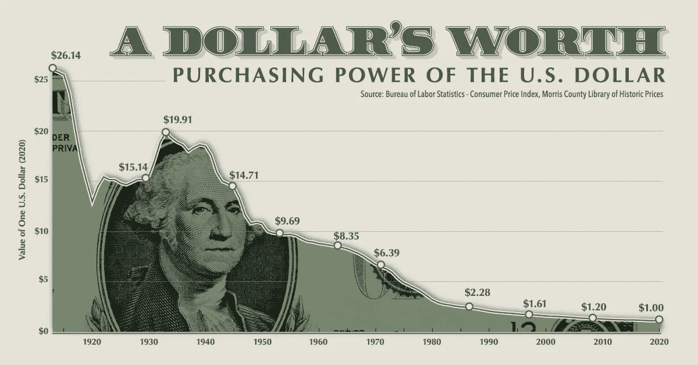
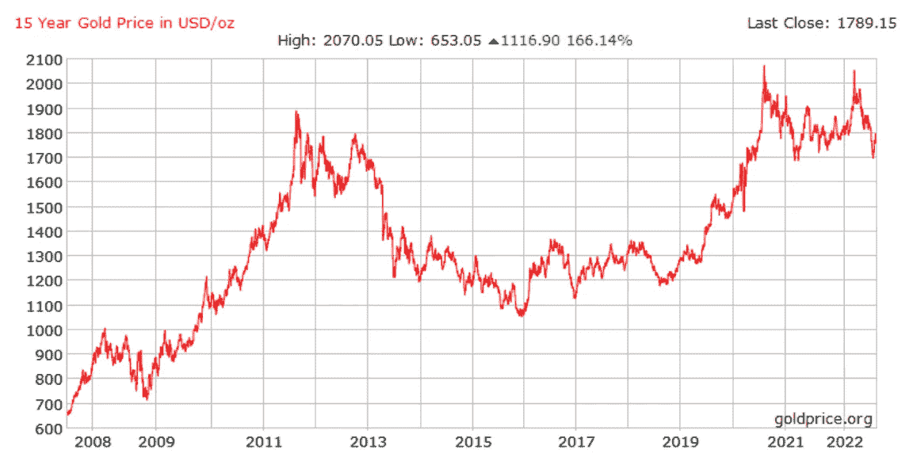
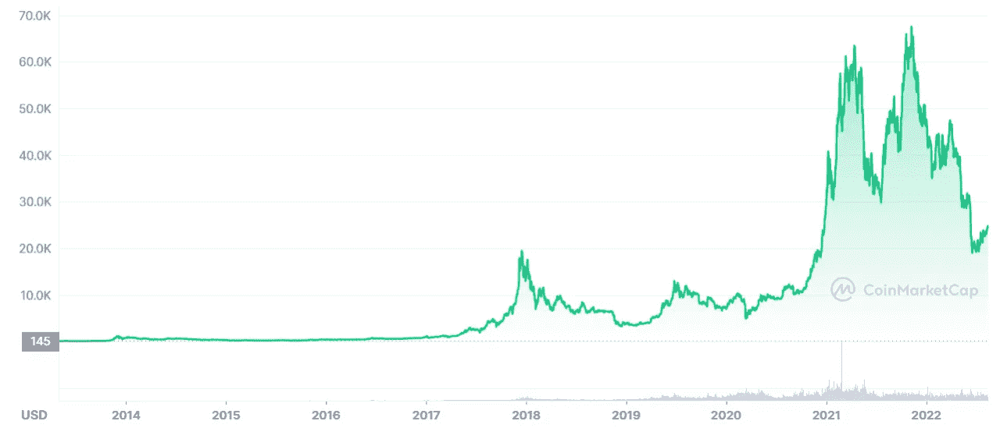

# BTC 是通胀对冲工具吗？7 篇学术论文怎么说。

> 原文：<https://medium.com/coinmonks/is-btc-an-inflation-hedge-what-7-academic-papers-say-20b6310cd1f7?source=collection_archive---------6----------------------->

是的。不。也许吧。

Purchasing Power of the US Dollar 1913–2020, Source: visualcapitalist.com

全球许多国家正在经历几十年来最高的通货膨胀。人们在寻找出路。比特币能防止法定货币失去购买力吗？这对 BTC 的投资者意味着什么？

我感兴趣的是学术来源对此有何评论。在我的研究过程中，我偶然发现了 7 篇发表于 2021 年和 2022 年的论文。

下面是简短的版本。

## **调查结果:7 篇学术论文中有 4 篇称比特币是一种通胀对冲工具**

*   研究显示结果喜忧参半。7 篇研究论文中有 4 篇说比特币可以用来对冲通货膨胀。[1] [2] [3] [4]
*   一篇论文称，研究结果并不确定，因为比特币在审查期间仅在相对较短的时间内提供了有效的通胀保护。[5]
*   两项研究得出结论，比特币不能用作远期通胀预期的对冲。[6] [7]
*   比特币无法抵御通胀的主要原因是，近年来，它对宏观市场的满意度有所上升。一篇论文称，这可能是因为包括对冲基金在内的专业和机构交易者的参与增加了。[6]
*   一些论文指出，在疫情开始时，BTC 作为对冲通胀的工具表现良好，但在 2021 年失去了优势。[4] [5] [7]

## **批评:**参考时间和观察期太短

*   广大机构投资者是在 2017 年之后才开始关注比特币的。大规模采用的时间相应较短，这使得很难对 BTC 是否代表通胀保护做出可靠的声明。
*   其中两项将 BTC 视为通胀对冲工具的研究的观察期相对较短，分别为 3 年和 2 年。
*   我覆盖了最近的研究，这意味着我只研究了 2021 年和 2022 年发表的论文。然而，在 2022 年第二季度，由于各种原因，全球许多国家经历了高通胀，而比特币价格保持相对较低。这个有趣的时间段不包括在研究中。
*   比特币有多年的周期。疫情发生的时间与比特币价格上涨的周期相吻合。为了获得更好的理解，未来需要更多的研究。
*   有些研究结果只适用于某些国家，不能推广到全世界。

## 结论——对于那些可以等待的人来说，比特币是一个很好的通胀对冲工具

好吧，那么我们能从中得出什么结论呢？老实说，没什么新鲜的。

根据所考察的时期，比特币有时被视为更好的对冲工具，有时被视为更差的对冲工具。在一些研究中，不可避免地要与黄金进行比较。

Gold price in USD from 2008 to 2022\. Source: [https://goldprice.org/spot-gold.html](https://goldprice.org/spot-gold.html)

几十年来，黄金一直是对冲通胀和不确定时期的传统投资。正如上图所示，这并非没有充分的理由。

自 2009 年以来，美元失去了 28%的购买力，欧元失去了 22%。相比之下，同期以美元和欧元计价的黄金价格上涨了一倍多。

尽管波动性很大，但这一表现很容易被比特币盖过。虽然 BTC 价格偶尔下跌是痛苦的，但从中长期来看，这种下跌将远远超过价格的发展。所以，在我看来，拥有比特币是抵御通货膨胀的好方法。

你只需要能够等待足够长的时间。

## **参考文献**

[1] S. Choi 和 J. Shin，“比特币:通胀对冲但不是安全港”，*金融研究快报*，第 46 卷，2022 年 5 月，土井:【https://doi.org/10.1016/j.frl.2021.102379.】T4

[2] P. Phochanachan，N. Pirabun，S. Leurcharusmee，W. Yamaka，“比特币和传统金融资产在稳定和动荡的市场中是否起到了通胀对冲的作用？高加密货币采用国家的证据”，*公理*，第 11 卷，第 7 期，第 7 条，2022 年 7 月，doi: 10.3390/axioms11070339。

[3] B. M. Blau，T. G. Griffith，和 R. J. Whitby，“通货膨胀和比特币:一个描述性的时间序列分析”，*《经济学快报》*，第 203 卷，第 109848 页，2021 年 6 月，doi:10.1016/j . econ let . 2021 . 109848 . 2021 . 2021 . 109841 . 109848 . 21

[4] C. Wijaya 和 M. Ulpah，“比特币、以太币和黄金在新冠肺炎疫情之前和期间作为对冲和避险资产在印度尼西亚股票市场上的作用分析”，*《印度尼西亚资本市场评论*，第 14 卷，第 1 期，2022 年 1 月，doi: 10.21002/icmr.v14i1.1140

[5] D. Roberto Curciarello，《标题:比特币对冲通胀风险了吗？多变量时间序列分析。”访问时间:2022 年 8 月 12 日。【在线】。可用:[https://gupea.ub.gu.se/handle/2077/72396](https://gupea.ub.gu.se/handle/2077/72396)

[6] S. A. Basher 和 P. Sadorsky，“用随机森林预测比特币价格方向:利率、通胀和市场波动有多重要？，"*机器学习与应用*，第 9 卷，第 100355 页，2022 年 9 月，doi: 10.1016/j.mlwa.2022.100355。

[7] T. Conlon，S. Corbet 和 R. J. McGee，“通货膨胀和加密货币的再探讨:时间尺度分析”，*《经济学快报》*，第 206 卷，第 109996 页，2021 年 9 月，doi:10.1016/j . econ let . 2021.10999999。2021 年 9 月。

> 交易新手？试试[加密交易机器人](/coinmonks/crypto-trading-bot-c2ffce8acb2a)或者[复制交易](/coinmonks/top-10-crypto-copy-trading-platforms-for-beginners-d0c37c7d698c)