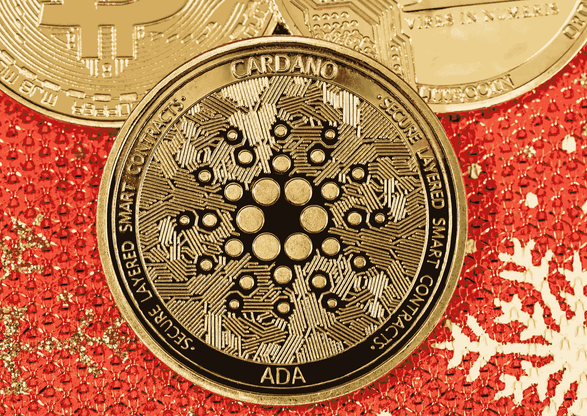

# 2022 年买卡尔达诺(ADA)划算吗？

> 原文：<https://medium.com/coinmonks/is-cardano-ada-a-good-buy-in-2022-93012d1a04d8?source=collection_archive---------17----------------------->

Source photo Unsplash.com

就价值而言，我们认为卡达诺是 2022 年最值得购买的一分钱硬币。它的六个月价格区间为 0.4 美元至 1.6 美元，目前是第七大最有价值的加密货币。

它也是智能合约最大、最安全的平台。然而，这些并不是现在花 5 美元购买 crypto 的唯一原因。我们将它包括在内，因为我们认为它有很大的潜力，并相信它的价值…