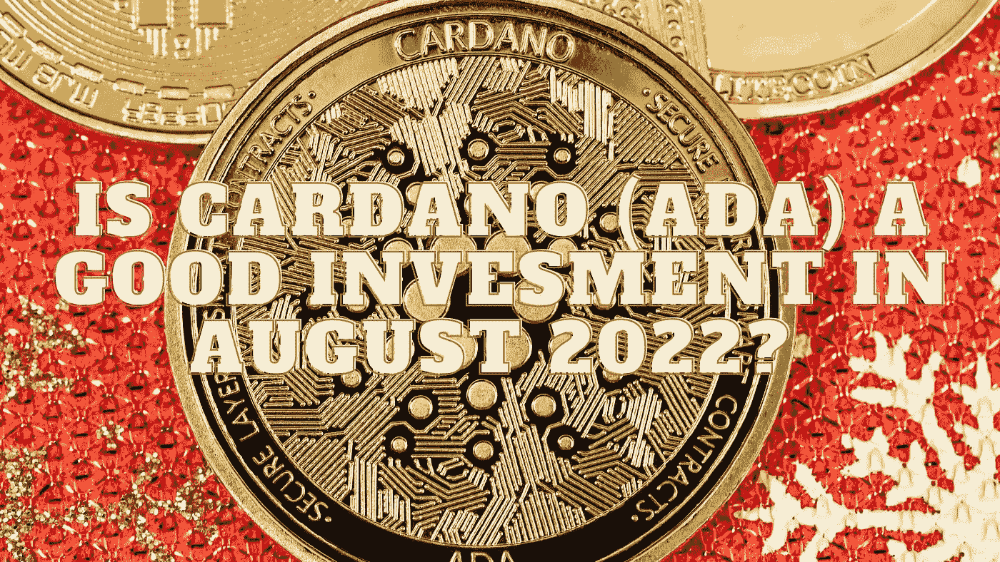

# 2022 年 8 月卡尔达诺(ADA)是个好投资吗？

> 原文：<https://medium.com/coinmonks/is-cardano-ada-a-good-invesment-in-august-2022-af8972bb3de2?source=collection_archive---------25----------------------->

Source photo Unsplash.com

投资者对 Cardano 感兴趣有各种原因，包括其在 dApps、网络改进、战略联盟和其他相关举措方面的潜力。作为当今最便宜的替代硬币之一，ADA 目前 0.51 美元的价格使其成为那些寻找一分钱加密货币的人的首选。