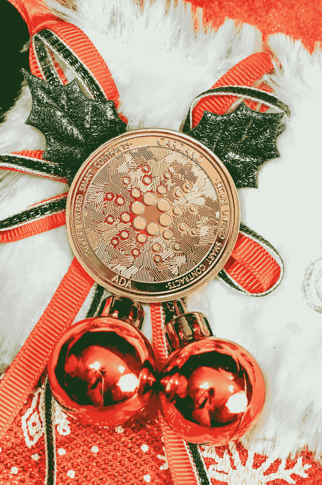

# 2022 年 12 月买卡尔达诺(ADA)划算吗？

> 原文：<https://medium.com/coinmonks/is-cardano-ada-a-good-investment-e736939fd8a2?source=collection_archive---------23----------------------->

Source photo [Free Btc Image on Unsplash](https://unsplash.com/photos/rTzVFtl3FCI)

九月有一些值得注意的分裂，包括以太坊的合并。卡尔达诺的硬叉子名为 Vasil，现在是世界上第八大最有价值的加密货币。与以太坊类似，卡尔达诺决定对其区块链进行彻底改造，这是基于技术和战略两方面的考虑；在这种情况下，吞吐量和效率的提高使得交易成本大大降低。