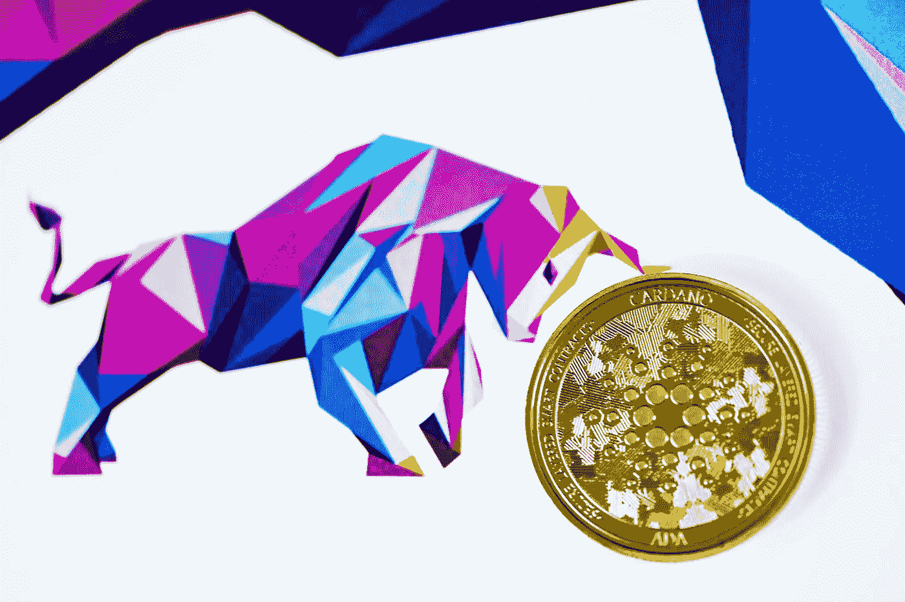

# 卡尔达诺(ADA)是一个好的长期投资吗？

> 原文：<https://medium.com/coinmonks/is-cardano-ada-a-good-investment-for-long-term-e303f206969d?source=collection_archive---------20----------------------->

Source photo Unsplash.com

Cardano (ADA)是第三代区块链，对公众开放，也作为分散应用的开发平台。第一代和第二代数字资产的例子被用来加强第三代加密货币的限制。

Cardano 整合了多年来的各种改进，如安全性、可持续性…