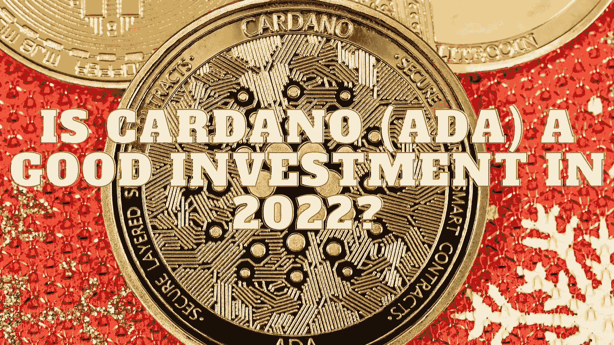

# 2022 年卡尔达诺(ADA)投资好吗？

> 原文：<https://medium.com/coinmonks/is-cardano-ada-a-good-investment-in-2022-8b4ecd22ab6b?source=collection_archive---------7----------------------->

Source photo Unsplash.com

市值超过 150 亿美元，最大的智能合约网络和最危险的以太坊竞争对手之一仍在折价出售。

然而，这背后有一个很好的原因。卡尔达诺的“同行评议”设计是罪魁祸首。Cardano 网络上的所有程序和协议都必须经过同行审查，才能添加到系统中。…的结果