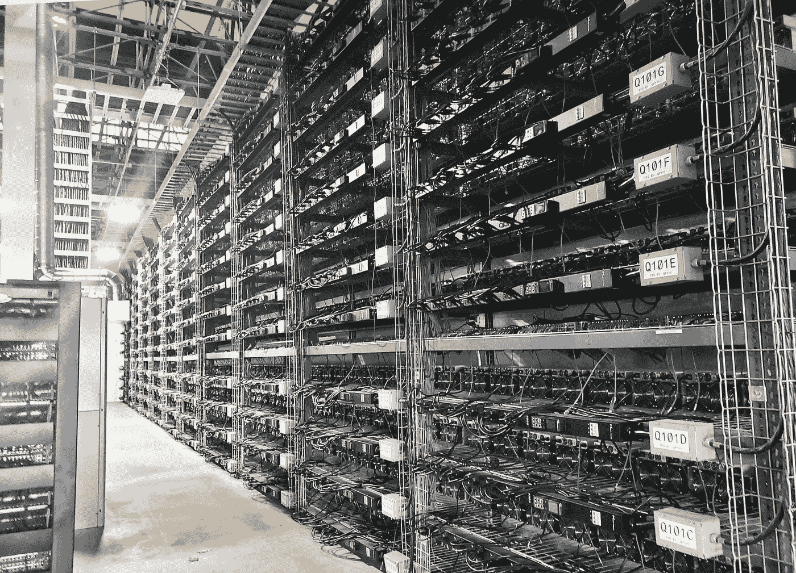

# Core Scientific 只是比特币采矿全面破产浪潮的先兆吗？

> 原文：<https://medium.com/coinmonks/is-core-scientific-just-the-harbinger-of-a-full-scale-bankruptcy-wave-in-bitcoin-mining-fbc7eacf271b?source=collection_archive---------10----------------------->

Image credit — Core Scientific

美国最大的矿业公司 Core Scientific 停止向债权人付款。该公司已经抛售了比特币储备，其股价下跌了约 90%，采矿本身仍然非常无利可图。Core Scientific 只是比特币挖矿全面破产浪潮的先兆吗？