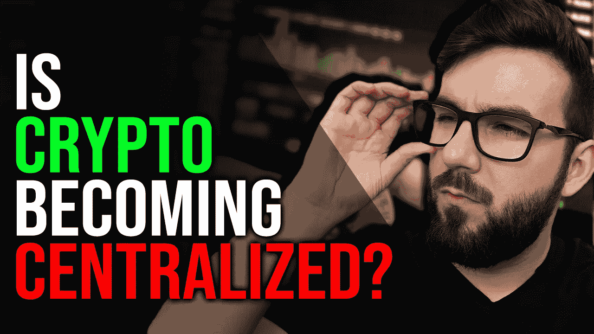

# 加密正在集中化吗？

> 原文：<https://medium.com/coinmonks/is-crypto-becoming-centralized-de72ffad1a1b?source=collection_archive---------37----------------------->

集中化总是一个问题，但是如果它意味着大规模采用，你如何在 crypto 中阻止它？我们唯一的工具就是教育。让我们来谈谈密码产业被集中化的许多方式，以及取而代之的是什么。

这是我的第 544 集/文章。我在这个内容上投入了大量的工作，所以如果你觉得它有价值，请喜欢，分享，评论和订阅！

让我们涵盖最近和 2022 年发生的所有重要加密新闻，以更好地了解加密行业集中化的加速发展。

FTX+VISA——VISA 与 FTX 合作推出预付费信用卡。

o[https://www . CNBC . com/2022/10/07/visa-partners-with-ftx-in-a-bet-the-shoppers-want-to-spend-cryptocurrences-in-a-a-bear-market . html](https://www.cnbc.com/2022/10/07/visa-partners-with-ftx-in-a-bet-that-shoppers-still-want-to-spend-cryptocurrencies-in-a-bear-market.html)

万事达卡+币安——万事达卡和币安也是预付费信用卡的合作伙伴。

o[https://www . Forbes . com/sites/billybambrough/2022/08/25/the-future-is-here-visa-master card-and-币安-is-a-just-making-bit coin-ether eum-xrp-Solana-cardano-and-tether-payments-a-reality-justice-price-crash/？sh=3f504e461ae0](https://www.forbes.com/sites/billybambrough/2022/08/25/the-future-is-here-visa-mastercard-and-binance-are-suddenly-making-bitcoin-ethereum-xrp-solana-cardano-and-tether-payments-a-reality-despite-price-crash/?sh=3f504e461ae0)

万事达卡+银行——万事达卡最近与银行合作，通过 Paxos 帮助提供直接加密交易，Pax OS 还管理 Paypal，这让我认为这将非常严格。

o[https://www . CNBC . com/2022/10/17/master card-will-help-banks-offer-cryptocurrency-trading . html](https://www.cnbc.com/2022/10/17/mastercard-will-help-banks-offer-cryptocurrency-trading.html)

韩国的区块链 id——区块链 id 是未来，但目前看来，它们主要用于向你征收更多的税。

o[https://www . Bloomberg . com/news/articles/2022-10-16/south-Korea-aims-to-boost-economy-with-digital-id-on-区块链？leadSource=uverify%20wall](https://www.bloomberg.com/news/articles/2022-10-16/south-korea-aims-to-boost-economy-with-digital-id-on-blockchain?leadSource=uverify%20wall)

谷歌接受 Crypto——这是一个信号，表明更大的权威机构开始接受 Crypto，并推动比特币基地和 USDC 等其他集中化的参与者。

o[https://www . Google Cloud press corner . com/2022-10-11-Google-Cloud-and-比特币基地-Launch-New-Strategic-Partnership-to-Drive-web 3-Innovation](https://www.googlecloudpresscorner.com/2022-10-11-Google-Cloud-and-Coinbase-Launch-New-Strategic-Partnership-to-Drive-Web3-Innovation)

https://dune.com/phabc/usdc-banned-addresses——这是 USDC 的禁令名单。你知道吗，每次交易前简单地检查这 88 个地址实际上使的使用成本比戴高 40%？！

[https://cryptoslate . com/usdc-black list-cost-users-an-extra-360 万-每月/](https://cryptoslate.com/usdc-blacklist-cost-users-an-extra-3-6-million-per-month/)

Metamask 银行转账——这是一种创新，但它通过将银行连接到您的私人钱包来换取便利。

o[https://consensys . net/blog/meta mask/meta mask-integrated-with-sardine-to-bring-instant-bank-to-crypto-option-for-u-s-users/](https://consensys.net/blog/metamask/metamask-integrates-with-sardine-to-bring-instant-bank-to-crypto-option-for-u-s-users/)

Twitter 和 Instagram 上的 NFTs 你现在可以在 Instagram 上使用收藏品，你可以连接到你的钱包，在 Twitter 上显示 NFT 的个人资料照片。NFT 的大规模采用已经出现，但是在我看来，如果没有实用性，NFT 本身并没有那么好。相反，这更像是以太坊和密码的胜利，因为他们找到了更多的采用方式。–

o[https://about . insta gram . com/blog/announcements/insta gram-digital-collectibles](https://about.instagram.com/blog/announcements/instagram-digital-collectibles)

o[https://www . CNN . com/2022/01/20/tech/Twitter-NFT-profile-picture/index . html](https://www.cnn.com/2022/01/20/tech/twitter-nft-profile-picture/index.html)

我相信这可能在短期内对加密货币有利，但从长期来看，这将导致更多人误入歧途，他们选择方便而不是安全和真正的所有权，这是放弃了很多。我们现在的工作是教育人们为什么你需要做额外的交易密码的工作，在那里你可以提取和存储在一个钱包里，你只有访问和拥有它。

不要把你的密码留在交易所和平台上。避免获得加密签证或连接到您的银行并为一切提供 KYC 的诱惑。甚至仅仅把你的社交账户和你的钱包联系起来以获得 NFT 的影响力也是另一种巧妙实现“KYC 精简版”的简单方法。很快你将不得不避免通过银行购买的诱惑。

你认为这也是一个大问题吗？KYC 和我想象的一样糟吗？从长远来看，这对加密是好是坏？请在下面的评论中告诉我您对此的看法，不要忘记订阅！

***免责声明:此非财务建议，仅供娱乐。您所看到、听到或读到的都是我个人的观点，任何陈述都是基于我的观点，不应被误解为事实。我的加密文件夹可能是模拟的，也可能不是模拟的***

👥支持我&在其他地方跟随我👥

👉[http://www.scottcbusiness.com](http://www.scottcbusiness.com)

在我的电报中提问:[https://t.me/cryptoandthings](https://t.me/cryptoandthings)

你可以在[https://cointr.ee/scottcbusiness](https://cointr.ee/scottcbusiness)找到我所有的密码货币地址

您可以在这里找到我的所有推荐链接:[https://linktr.ee/scottcbusiness](https://linktr.ee/scottcbusiness)

> 交易新手？试试[密码交易机器人](/coinmonks/crypto-trading-bot-c2ffce8acb2a)或者[拷贝交易](/coinmonks/top-10-crypto-copy-trading-platforms-for-beginners-d0c37c7d698c)