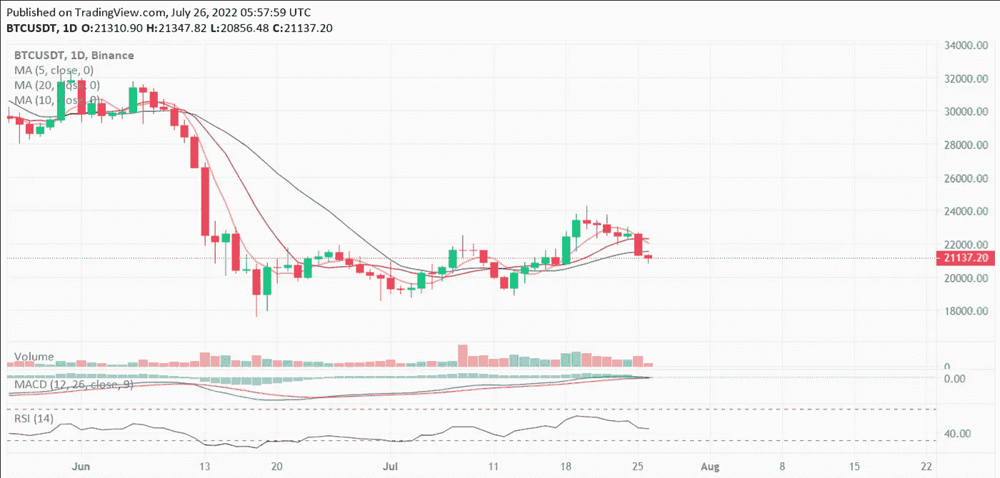
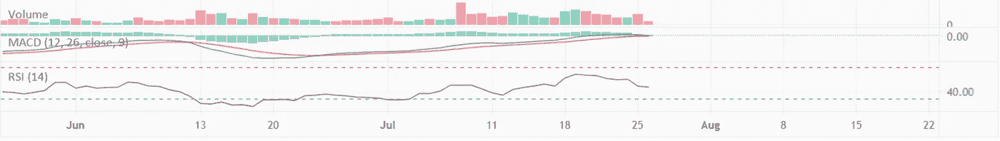

# 加密货币在这里是底部吗？截至 2022 年 7 月 26 日的比特币技术分析

> 原文：<https://medium.com/coinmonks/is-cryptocurrency-bottom-here-technical-analysis-of-bitcoin-as-of-26-july-2022-1856ae9f8c10?source=collection_archive---------31----------------------->

BTC/USDT 1-day chart

现在是 7 月 26 日，对于加密市场来说，市场似乎处于熊市趋势和横盘。

在过去的两周内， [crypto](/coinmonks/simple-way-to-understand-cryptocurrency-by-day-to-day-examples-9f3bb62f7c9c) 市场见证了比特币和替代币价格的小幅上涨，分别达到 24000 美元和 1600 美元，在负面消息的持续轰炸后，为市场复苏带来了希望。

然而，随着 7 月底的临近，美国联邦储备委员会通过加息收紧货币政策，本周价格下跌的空间更大。

美国联邦储备委员会将于 7 月 26 日星期三召开 FOMC 会议，当前的市场状况和全球范围内的高通胀导致整体市场出现预期的负面压力。

这导致了期货市场的抛售，在撰写本文时，比特币目前的交易价格为 21，130 美元。

MACD and RSI indicators of Bitcoin

市场指标 MACD 和 RSI 主要表明中性定价和死亡交叉形态，描述了未来几天更多的短期抛售。

由于市场在当前水平已经枯竭，卖方或空头已经没有太多的空间来进一步拉低价格。对于买家来说，目前长期购买可以获得最大的折扣，以 2 万美元或 1.8 万美元的价格购买比特币是一个合乎逻辑的决定。

按市值购买前 5 名的硬币，如比特币、以太坊、币安币和索拉纳，是长期投资者的首选。

> “谢谢你读我的文章。鼓掌，分享并关注我的[个人资料(点击此处)](/@barateprajwal25)了解更多更新和内容。”
> 
> 交易新手？试试[密码交易机器人](/coinmonks/crypto-trading-bot-c2ffce8acb2a)或[复制交易](/coinmonks/top-10-crypto-copy-trading-platforms-for-beginners-d0c37c7d698c)