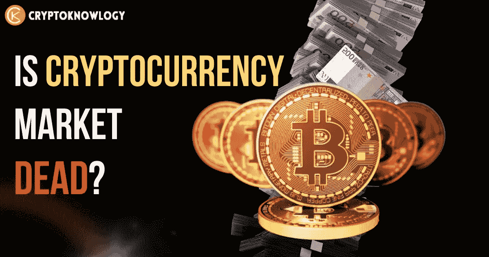
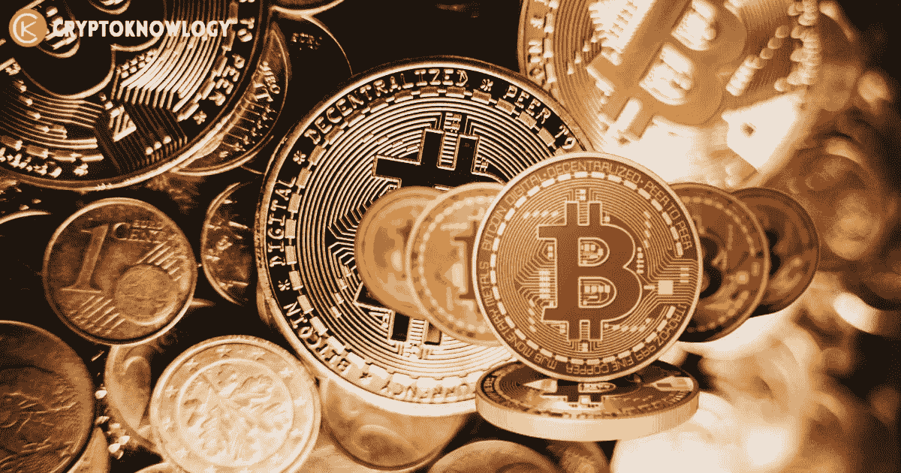
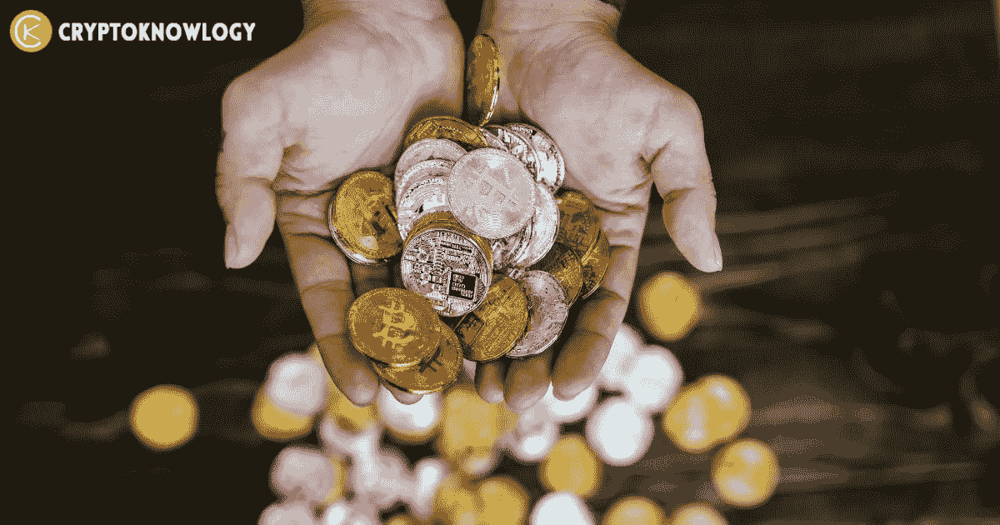
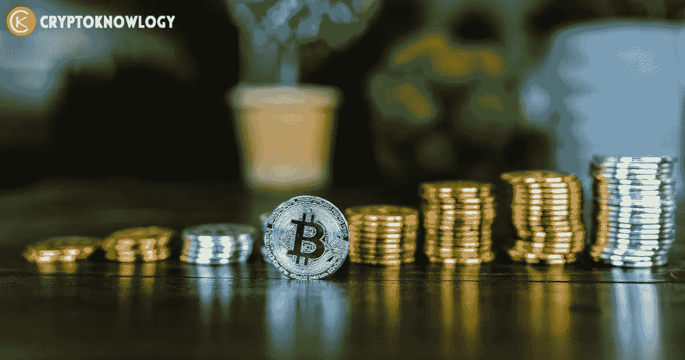

# 加密货币市场死了吗？

> 原文：<https://medium.com/coinmonks/is-cryptocurrency-market-dead-a8089d1284c4?source=collection_archive---------16----------------------->

在最近的抛售中，1 万亿美元的市值从[加密货币](https://cryptoknowlogy.com/)市场消失，这给了投资者毁灭性的打击。

主要的加密货币，包括像[比特币](https://cryptoknowlogy.com/what-is-bitcoin-and-how-does-it-work/)和[以太坊](https://cryptoknowlogy.com/what-is-ethereum/)这样的巨头，遭受了如此严重的损失，以至于它们的价值从峰值下跌了一半，而次要的[替代币](https://cryptoknowlogy.com/what-are-altcoins/)遭受的损失更大。

crypto 崩溃的主要原因似乎是投资者在日益加剧的通货膨胀恐惧和加密货币贷款公司 Celsius 暂停提款的情况下突然抛售。投资者对高风险资产的持续回避也对股票市场产生了影响。

最大、最知名的加密货币**比特币**跌破 2 万美元大关，而从**以太坊**开始，几乎所有的**替代币**都遭受了损失。

在专家看来，加密货币价格的急剧下降表明投资者的风险偏好正在减弱。他们显然害怕风险投资

# 加密货币市场死了吗？

一切都取决于你怎么问这个问题“**加密货币市场死了吗？**“你是一个**投资者**寻求一枚没有现实应用的投机硬币的 10 倍回报吗？你是不是在购买一件艺术品 **NFT** 的时候，希望某位名人会从同一系列中购买自己的作品？如果是这样，“死亡”调查很可能会有一个肯定的回答。

**市场崩溃**正在导致加密货币投降，类似 2021 年的事情再次发生的可能性不是很大。简而言之，这家企业就像瓶子里的闪电。疫情创造了极其有利的宏观经济条件，价格已经在上涨，比以往任何时候都多的投资者活跃在市场上，而且——最重要的是——没有规则。

现在几乎所有国家都监管加密货币，尤其是 T2 和美国。特别是在崩盘之后，**美国证券交易委员会**正在严厉打击项目。即使是该领域最前沿的企业，未来也可能会受到调查和法律问题的阻碍。因此，没有多少空间让更具投机性的游戏出现，并像以前一样销声匿迹。

加密货币投资并没有完全消失。然而，对于只专注于投机性投资和赚取巨额利润的个人来说，这无疑是非常不利的。继互联网泡沫、房地产泡沫和最近的这次泡沫之后，又一次投机性资产泡沫被最近的崩溃所破灭。自然，网络股和房地产都没有完全消失。然而，他们一点也不像他们最被炒作的版本。 **Crypto** 也不会。

对于要出售的资产，必须有一个卖方不想要这个东西，因为它有风险和缺点。买家必须认为风险大于潜在优势，才能购买。所有资本市场的核心是。只是加密货币现在似乎吸引了很多媒体的关注。所有这些噪音可能会令人困惑；回到你的基本原则，并根据你的具体情况评估这是否是一个明智的投资。

# 尽管市场崩溃，项目仍保持创新:

随着投资者向下滚动[最佳加密货币](https://cryptoknowlogy.com/top-5-crypto-picks-for-2022/)的列表，他们会看到每个项目都有一个很高的目标，一个从未明确包括价格增长的目标。与以太坊类似的第 1 层计划包括:卡尔达诺(ADA-USD)、索拉纳(SOL-USD)和 T21(DOT-USD)。**系绳**(USDT-美元) [**币安美元**](https://www.binance.com/en/busd)(BUSD-美元)，美元币(USDC-美元)是**无法增长的稳定币**。这个清单还在继续。

那么，在这次崩溃之后，crypto 死了吗？不，不是从**创新**的角度。

由于这些企业最终专注于更广阔的愿景，他们不会受到市场不稳定的影响。当从股票转向加密货币时，投资者有时会陷入一个陷阱，认为硬币制造商与传统企业一样关注股价和股东。这不是真的。事实上，项目经常限制在官方渠道讨论价格投机。

自从**密码崩溃**，开发者们继续**创新**。投资者继续观察几个重大的改进和推出。 **Cardano** 将很快推出自己的硬分叉，而**以太坊**经历了有史以来最大的升级“ [**合并**](https://cryptoknowlogy.com/ethereum-merge-explained/) ”。此外，**Ripple**(XRP-美元)和银行正在密切合作，实施新的全球银行通信标准。

# 加密:为交易而非收益而制作

在 2008 年创造了比特币的匿名程序员(中本聪)可能没有想到它有一天会达到加密货币牛市的高度。BTC 的价格远远超过了每枚 67，000 美元，并且“只买不卖”的格言“T21”开始流行。目前，比特币巨擘总共拥有约 46%的比特币供应量。

但比特币从来没有打算这样。BTC 的价格预计会略有上涨，尽管最初只是认为这将来自其现实世界应用的扩展。BTC 最初是作为无银行账户人群的交易手段而创建的。有了比特币，消费者可以在不受中央金融机构监管的情况下进行交易。

是的，除了**比特币**之外，还有更多类似这样的加密货币。尽管它是作为一个笑话而被创造出来的，但它的作用是一样的。Monero (XMR-USD)和 Zcash (ZEC-USD)等隐私币也是如此，目的是让这些交易完全匿名。

去年经历了自身价格复活的第二大加密货币**以太坊** (ETH-USD)心中有着不同的目标。然而，瑞士联邦理工学院也不完全专注于利润。当 Vitalik Buterin 和其他七位以太坊联合创始人开始这个项目时，他们的目标是用集成编程语言创建一个区块链。与当前的万维网相反，这导致了一个由**去中心化应用(dapps)** 组成的生态系统的诞生，它可能是不可改变的，并且表现得更好。

# 结论:

市场分析师认为，当基本面稳定或改善时，下跌的市场是机会而不是威胁。

自去年以来，加密货币市场下跌了不同程度，有大有小，但它总是会复苏。

许多市场分析师拒绝接受加密货币市场已经死亡的说法，认为它不会从目前的水平下降。

*最后，如果你喜欢我们在* [***所做的事情，请在你自己的对加密货币感兴趣的奇妙人类社区中给我们大声喊出来。***](https://cryptoknowlogy.com/)

> 交易新手？尝试[加密交易机器人](/coinmonks/crypto-trading-bot-c2ffce8acb2a)或[复制交易](/coinmonks/top-10-crypto-copy-trading-platforms-for-beginners-d0c37c7d698c)