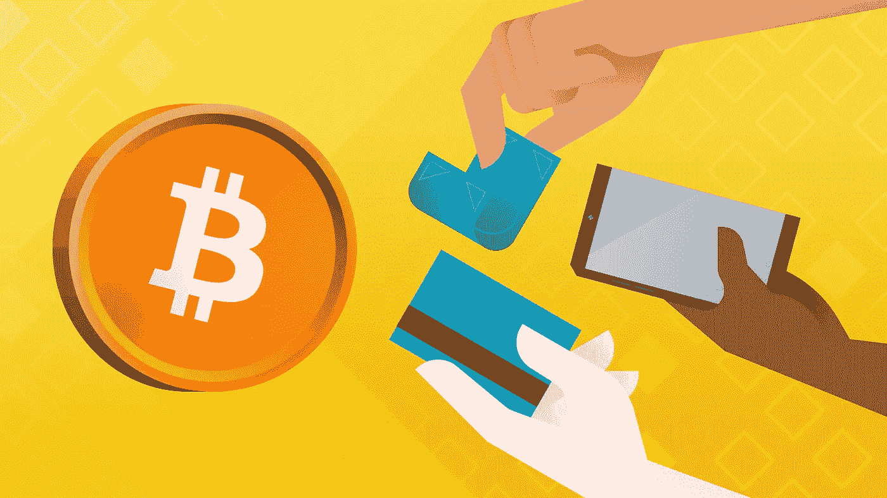

# 加密货币还值得买吗？

> 原文：<https://medium.com/coinmonks/is-cryptocurrency-still-worth-buying-8ee945f95bbf?source=collection_archive---------45----------------------->

随着当前加密货币市场的崩溃，你可能会怀疑是否会问这样的问题，**“我还应该买比特币吗”？“现在可以购买 crypto 吗？”“到年底比特币的价格会是多少？”**

嗯，这些问题是正常的，你不是唯一有这种想法的人。在这篇文章中，我们将为你解释一些事情，让你对事情有一个更清晰的了解，并且能够下定决心去做什么。

在撰写本文时，世界领先的加密货币比特币的交易价格为 19647 美元。持续的加密下跌损害了许多投资者的兴趣。

正如在[本帖](https://36crypto.com/market-news/crypto-lenders-currently-experiencing-difficulties/)中看到的，最近发生的各种事件，如 [Voyager Digital(领先的加密货币借贷平台)申请第 11 章](https://36crypto.com/market-news/cryptocurrency-broker-voyager-files-for-bankruptcy-protection/)，Vauld(顶级加密货币交易平台)暂停退出，最重要的是，LUNA crypto 的崩溃和其他一些类似的事件在加密领域给投资者留下了很多疑问。

# 投资加密货币还安全吗？

ClearTax 创始人兼首席执行官 Archit Gupta 谈到了比特币的价格。领先的加密货币比特币的价格在 2021 年 11 月首次升至 68，000 美元的历史最高水平。此后不久，它开始下跌，市值缩水一半，跌至 3.5 万美元，此后继续下跌。

现在，它徘徊在 19，000 到 20，000 美元之间。这清楚地表明了加密市场的波动程度。鉴于目前的事件和投资者从市场的大规模退出，硬币的需求和供应受到严重影响，这使得风险更大。

现在，印度政府制定了一项新的税收规则，宣布必须从₹10,000.的所有加密交易中抽取 1%的 TDS 古普塔进一步说:

> *“这些税收规则将增加监管和合规负担。税收规则进一步增加了挑战，因为它们可能会锁定恢复加密市场所需的流动性。”*

他还补充说，人们在没有适当知识的情况下投资加密货币，主要是受影响力的影响，这些法规将有助于保护投资者的资金。

另一位专家 TradeSmart 的首席执行官 Vikas Singhania 也表示，除了 TDS 之外，GST 收费也弊大于利，增加了加密货币交易的风险。

辛哈尼亚还补充道；

> 从 7 月 1 日开始实施的加密货币 1%的 TDS 对该资产类别的交易是一个阻碍。尽管这可能不会影响投资量，但该行业的交易量肯定会受到冲击。这只是一个例子，说明它将如何影响交易者——如果一个交易者在一个月内进行 10 笔交易，他将不得不从这些交易中累计赚取至少 10 %,仅仅是为了收回 TDS 成本。”

他继续说；*“除此之外，经纪费和商品及服务税增加了加密货币交易的风险。无论剩下多少剩余利润，现在都将受到资本利得和其他费用的影响，使得投资者更难从加密货币中获利。”*

与此同时，比特币仍在 19000 美元交易，下跌约 4.36%。据[彭博](https://www.bloomberg.com/news/articles/2022-07-10/bitcoin-faces-another-50-drop-wall-street-says-mliv-pulse)报道，参与 MLIV pulse 调查的 950 名投资者中，超过 60%的人认为，比特币目前的价值更有可能减半，跌至 1 万美元左右，而不是升至 3 万美元。

这与另外 40%持相反观点的人的想法不同。自 2021 年 11 月比特币升至 68000 美元以来，其价值已下跌一半，自 2020 年 9 月以来也没有低至 10000 美元。

> 交易新手？尝试[加密交易机器人](/coinmonks/crypto-trading-bot-c2ffce8acb2a)或[复制交易](/coinmonks/top-10-crypto-copy-trading-platforms-for-beginners-d0c37c7d698c)

# 结论

购买或投资加密货币应始终由您自行决定。经常检查历史，并与现状进行比较，找出规律和相似之处。通过这种方式，你可以自己做研究，看看你是否对某个硬币还有希望。如果你发现了希望，你应该投资，如果没有，你应该远离。

最初发布于 [36crypto](https://36crypto.com/cryptocurrency/is-cryptocurrency-still-worth-buying/)