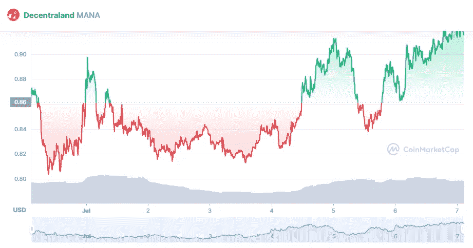

# 分散地(MANA)在 7 月是个好买卖吗？

> 原文：<https://medium.com/coinmonks/is-decentraland-mana-a-good-buy-in-july-58b4eb4959a9?source=collection_archive---------33----------------------->

Source photo [Decentraland price today, MANA to USD live, marketcap and chart | CoinMarketCap](https://coinmarketcap.com/currencies/decentraland/)

寻找最伟大的 NFT 硬币购买在“元宇宙？”分权是一个很好的选择。一款基于区块链的游戏正在开发中，玩家可以创建虚拟角色并购买地产。这些小块土地可以和其他用户一起转让和货币化，这是他们的 NFT 系统的一个迷人之处。这使得分散地成为一些最受欢迎的 NFT 游戏的中心。