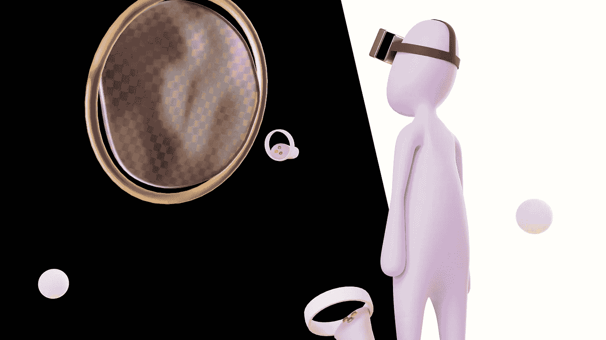

# 分散地(法力)是个好投资吗？

> 原文：<https://medium.com/coinmonks/is-decentraland-mana-a-good-investment-97cb140aeb1f?source=collection_archive---------19----------------------->

Source photo [Free Crypto Image on Unsplash](https://unsplash.com/photos/Hbpqkm2psNA)

分散土地是一个开源的元宇宙平台，由 Esteban Ordano 和 Ari Meilich 在 2017 年创建。它促进了共享虚拟环境中用户之间的交流和探索。加密货币的用户可以访问元宇宙，这是一个充满可玩游戏、可下载内容和虚拟房地产的虚拟 3D 世界。