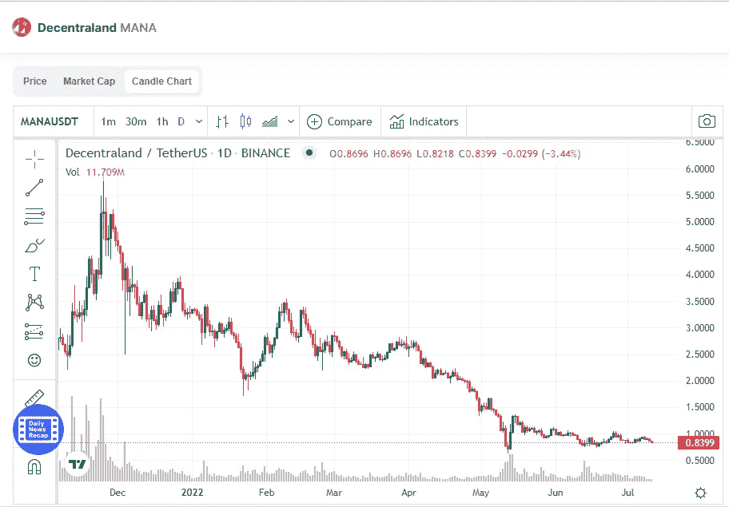

# 分散地(法力)是个好投资吗？

> 原文：<https://medium.com/coinmonks/is-decentraland-mana-a-good-investment-9954d5d2c714?source=collection_archive---------40----------------------->

Source photo [Decentraland price today, MANA to USD live, marketcap and chart | CoinMarketCap](https://coinmarketcap.com/currencies/decentraland/)

就元宇宙项目而言，分权是第一位的。这可能解释了为什么如此多的大型外链企业争相染指这个虚拟世界中最抢手的房地产。摩根大通、可口可乐、三星和 Forever 21 都是被提及的公司。

元宇宙的用户基础和支持者群体也在增加。例如，分散土地…