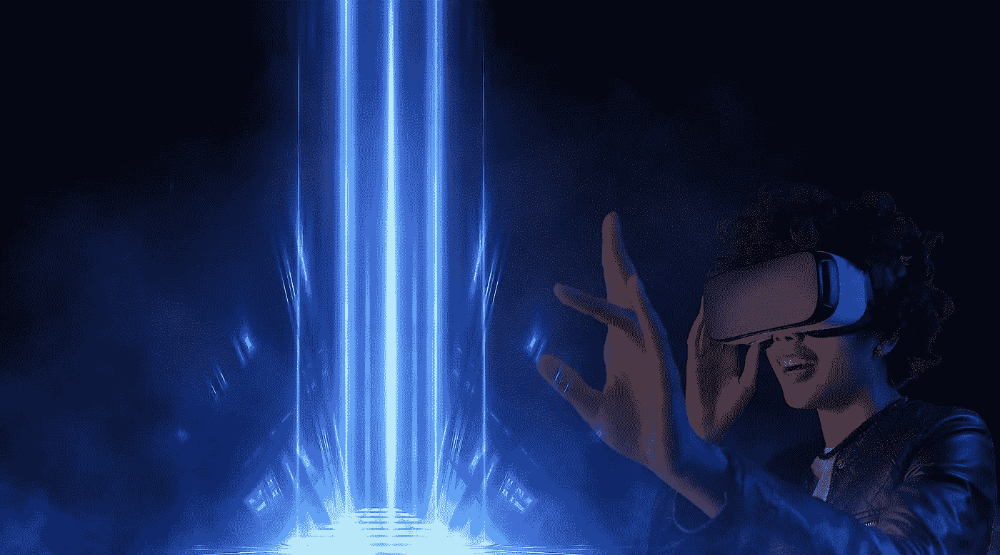

# 2023 年分散地(MANA)投资好吗？

> 原文：<https://medium.com/coinmonks/is-decentraland-mana-a-good-investment-in-2023-156a96ef256c?source=collection_archive---------27----------------------->

Source photo [Woman Headset Virtual — Free photo on Pixabay](https://pixabay.com/photos/woman-headset-virtual-reality-vr-6882918/)

分散土地是元宇宙的一种加密货币，允许其用户探索无限的交互式虚拟环境。与竞争对手的虚拟现实(VR)系统不同，分散的土地并不要求使用任何专门的硬件来体验其模拟环境。相反，其革命性的分散设计使任何拥有电脑或手机的人都有可能…