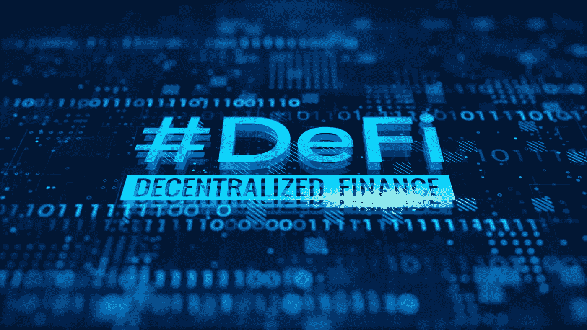

# DeFi 难学吗？

> 原文：<https://medium.com/coinmonks/is-defi-hard-to-learn-daac79f8866?source=collection_archive---------28----------------------->

~dwulf

DeFi

DeFi 不难学。因为大多数用户根本不需要理解 ROI 和 APYs。银行过去为我们做所有的工作。DeFi 总是给人以“复杂”和“难学”的印象，但事实是它远没有传统金融概念难懂。事实上，我认为这要简单得多。

然而，我们从来没有真正需要了解 CeFi 或传统金融是如何工作的，因为这一直是银行和金融机构的工作，与用户的责任完全分开。这就是为什么旧世界的金融家和受监管的中央银行能够欺骗这么多难以支付贷款的人，比如臭名昭著的学生贷款和新车贷款。

但是，因为没有任何集中的权力来处理完成 DeFi 交易所需的流程，所以我们需要自己做每件事，这意味着我们需要了解完成所述交易所需的每一个细节，而不会搞砸。

以太坊社区充分理解这一点非常重要，因为许多人(尤其是新手)非常害怕 DeFi，最终求助于并依赖于集中融资，这总体上伤害了 DeFi 空间。

## 更好地展示给新手用户

DeFi 开始变得越来越用户友好，许多 dApps 如 AAVE 和曲线改善用户界面和 UX。在 Polkadot 领域，许多外观更好、功能更强的钱包，比如 Talisman，正越来越受欢迎。

## 让开发者更容易

它也变得对开发者友好，我认为这有多方面的原因。zkEVMs 将会改变开发者的游戏规则，昨天发布的一个多边形就是证明。开发人员现在可以使用他们的 zkEVM 来迁移契约，并简单地复制粘贴他们的代码。事实上，它的开源也给了它更多的改进空间。

不仅仅是他们，其他 L2 如 Loopring、Zksync 和 Scroll 也在致力于推出 zkEVMs，这意味着这些 L2 的共同努力将为开发人员提供更好的构建工具和技术，所有这些都直接影响用户体验。

我希望随着开发人员的工作变得越来越简单，普通用户将开始看到 DeFi 空间的不同之处，用户体验得到提高。

我怀疑，即使是相当数量的使用 DeFi 的人仍然没有完全理解它是如何工作的，如果我们想成为主流，这肯定会是一个问题。

## 一个易于使用的美人计

这些银行和金融机构变得受欢迎并最终成为社会和经济不可或缺的一部分的原因是因为它们提供了易用性，我认为 DeFi 开发者应该从中吸取教训，尽最大努力以某种方式模仿这一点，尽管我知道这是一项极其困难的工作。

> 这只是懒惰——和人们不保管他们的密码的原因一样。

然而，如果你真的陷入了 DeFi(例如像我一样的高 APR 池翻转)，它确实会变得复杂，但不是从技术角度来看。平衡结合期、非永久性损失和 APR/价格下降有点棘手，需要一些时间来适应，但一旦你“得到它”，就会非常有利可图。尽管相对较快地理解了纸面上的概念，但我花了一年多的时间才真正理解这些池实际上是如何发挥作用以及如何盈利的。

## DeFi 协议是做什么的？

随着 DeFi 协议变得越来越多，理解这些项目试图解决的不同类别的问题是有益的。

**借贷**
专注于借贷的 DeFi 加密货币可能允许用户通过软件获得贷款，不再需要可信的第三方。
这些项目由代码而不是书面合同驱动，可能会自动执行贷款所需的维护保证金和利率。除其他外，如果余额低于规定的抵押比率，这允许自动清算。
尽管每项贷款协议都有不同的细微差别，但它们都以相似的方式运作。如果协议按预期运行，用户可以很容易地借用加密货币，持有者可以从他们的资产中获得回报。

**分散式交易所**
分散式交易所(dex)可以允许用户在不需要中介的情况下交换加密资产，从而允许加密货币的真正点对点交易。
该协议的用户通常能够即时转换加密货币，而无需访问订单簿。相反，转换率可以内置于网络中。DEX 的另一个主要好处是用户资金不被集中方持有。相反，它们存放在个人钱包里，增加了 dex 使用者的隐私。

**衍生品**
衍生品市场是买卖双方根据资产的预期未来价值交换合约的地方。这些资产可以是任何东西，从加密货币到未来事件结果，再到现实世界的股票和债券。

# 结论

坚持下去，DeFi 机制是可以学习和理解的。使用 DeFi 系统你不必是一个“程序员”,但是如果你是，你将能够有效地使用 DeFi 系统并获利。

自动化和最佳配置将保持良好的分数。

> 交易新手？尝试[加密交易机器人](/coinmonks/crypto-trading-bot-c2ffce8acb2a)或[复制交易](/coinmonks/top-10-crypto-copy-trading-platforms-for-beginners-d0c37c7d698c)