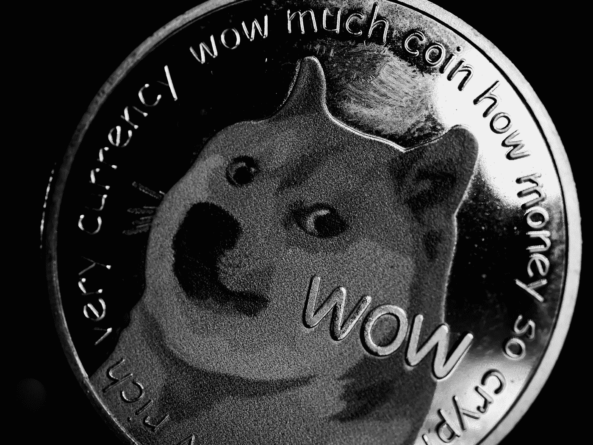

# 2022 年 12 月 Dogecoin (DOGE)是否是一个好的买入点？

> 原文：<https://medium.com/coinmonks/is-dogecoin-doge-a-good-investment-ee2c0085f5bb?source=collection_archive---------26----------------------->

Source photo [Grayscale Photo of a Dogecoin · Free Stock Photo (pexels.com)](https://www.pexels.com/photo/grayscale-photo-of-a-dogecoin-7767501/)

虽然 memecoins 乍一看似乎很轻松，但它们实际上是对虚拟货币价值所依赖的基本原则的辛辣讽刺:最终，加密货币的价值是由其用户的共识决定的。如果一个令牌的用户基础是热情和积极参与，该令牌将继续有价值。Dogecoin 是有史以来第一个 memecoin