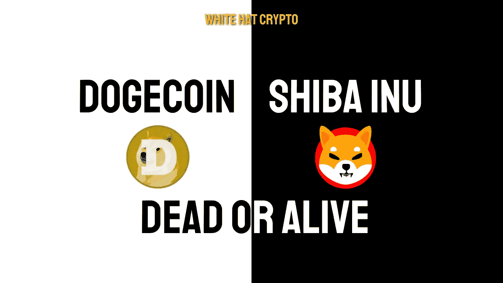

# Dogecoin &柴犬真的死了吗？

> 原文：<https://medium.com/coinmonks/is-dogecoin-shiba-inu-really-dead-1ebe535619f4?source=collection_archive---------2----------------------->

密码行业正在发生很多事情，但我们还没有听到流行的迷因币、Dogecoin 和 Shiba Inu。他们已经完成了吗？

迷因硬币无疑是 2021 年最令人兴奋和最受瞩目的硬币。那些有着“去月球”的直接目的的人这些硬币引起了公众的注意，因为它们是“快速致富”计划的同义词。

老实说，许多人确实从房价的大幅上涨中获利，但大多数人只是抱着致富的期望投入资金。从推特到特斯拉，他们无处不在，有一点很清楚:他们吸引了所有的注意力。

然后是隐秘的冬天！

不仅这些迷因货币会遇到障碍，每种加密货币都会遇到障碍。而那些拥有真正团队的企业正在成长，并再次收复失地。

然而，最近一段时间，我们并没有听到这些迷因货币的消息。所以，在这篇博客里，我将专门讨论 **Dogecoin** 和**柴犬**！

# Dogecoin:

实话实说吧。埃隆·马斯克的推文对加密市场或 Dogecoin 不像以前那么乐观了。早些时候，这位亿万富翁在推特上说 Dogecoin 具有货币潜力。当时的价格大约是 0.08 美元**。**

**在 4 月份的 12 条推文中，Robinhood 首席执行官 Vlad Tenev 表示，Dogecoin 可能会成为未来的货币，只要它克服了其可扩展性和速度方面的某些基本缺陷。**

**自从罗宾汉交易所增加了 Dogecoin 和 Vlad Tenev 贴出帖子以来，Dogecoin 的价格从 **$0.14** 下跌了 50%以上。**

**在长达 12 个月的熊市中，DOGE 追溯了每一个乐观的新闻发展和 Elon Musk 的推文。下跌始于 2021 年 5 月，5 月 8 日道指创下 0.74 美元的历史新高。**

**Dogecoin 起初似乎没有死，因为它在去年的大部分时间里都在均线 8 找到了支撑，直到 12 月份下跌到均线 21 才收盘。它在 2022 年 1 月反弹到该均线，当时它被否认，然后在 4 月再次反弹。这是技术方面。**

**现在，我们来谈谈 dogecoin 这个项目。简单来说，周围没什么事情。例如，在 Twitter 上，他们可以直接与观众交流，除了模因分享、赞助帖子和转发之外，几乎没有什么事情发生！**

# **柴犬:**

**让我们从头开始。**

**柴犬今日价格为 0.000013 美元，24 小时交易量为 380，369，353 美元。柴犬指数在过去 24 小时内上涨了 2.26%。目前 CoinMarketCap 排名第 15，实时市值为 6，942，367，761 美元。它的发行量为 549，063，278，876，302 SHIB 硬币和最大面值。供应不可用。**

**许多专家认为柴犬将在 2023 年底前消失。出售的硬币数量有限，流通的代币有一千万亿枚。**

**许多专家，如马修·亨利和史文朋科技大学的专家，担心柴犬会灭绝，因为它的货币已经没有用了。**

**根据这些专家的说法，所有没有功能的基于迷因的货币都将为具有真正效用的代币铺平道路。**

**此外，随着市值达到 69 亿美元，令牌将需要超越流行的加密项目，如 Avalanche、Polygon、Polkadot 和 Solana，才能进入前 10 名。**

# **结论:**

**加密货币领域没有什么是确定的。随着熊市和牛市的循环，我们已经看到主要货币跌至接近零，然后再次上升。所以，这些项目都没有最终目的地，但是两者的理想点是保持活跃。为了生存，他们必须证明他们是有价值的，有效的，而不仅仅是一个迷因硬币！**

**这篇文章中提供的内容不是赞助的，据我所知是正确的。这篇文章不是金融建议，我们不对针对这篇文章采取的任何行动负责！**

**请随时查看我们的社交平台，了解每日加密更新，或通过以下渠道联系我们:**

**[YouTube](https://www.youtube.com/channel/UCjfinzatswbVaRd89zn5kJQ/featured)**

**[推特](https://twitter.com/whitehatcrypto)**

**[Instagram](https://instagram.com/white.hatcrypto?igshid=YmMyMTA2M2Y=)**

**[Gmail](http://cryptowhitehat@gmail.com/)**

**信息来源:硬币市场资本和更多！**

> **交易新手？尝试[加密交易机器人](/coinmonks/crypto-trading-bot-c2ffce8acb2a)或[复制交易](/coinmonks/top-10-crypto-copy-trading-platforms-for-beginners-d0c37c7d698c)**