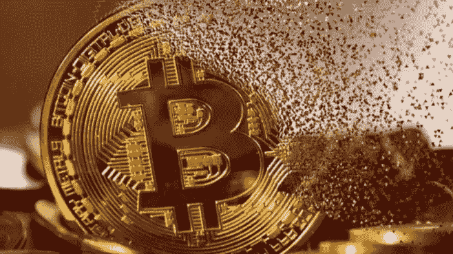

# 用比特币赚被动收入是不是要死了？

> 原文：<https://medium.com/coinmonks/is-earning-a-passive-income-with-bitcoin-dying-6f39ed8e4298?source=collection_archive---------21----------------------->

过去的几个月里，密码市场混乱不堪。卢娜和 UST 脱钩并最终接近于零，是给整个行业带来冲击波的最初事件。这也是导致整个市场多米诺骨牌效应下降的原因。很快我们就会听到 Celsius 破产的消息，然后是 3AC，接下来是 BlockFi、Voyager、Vauld 和 the list…