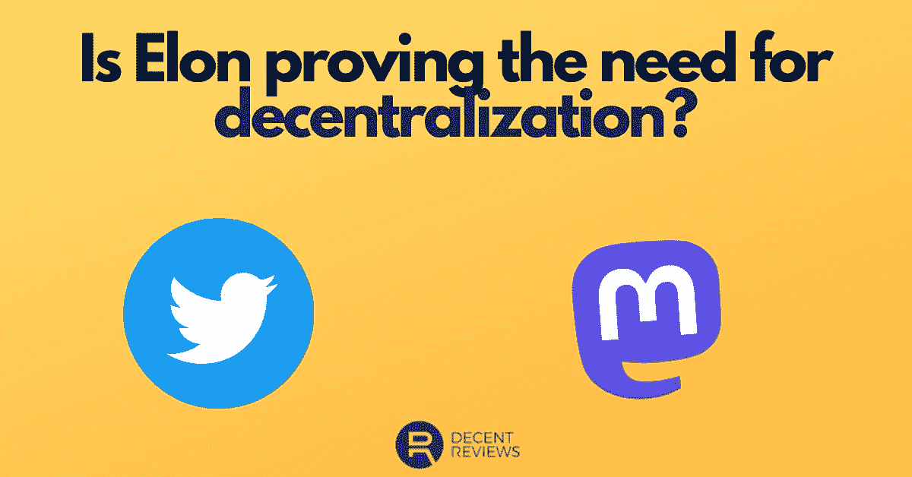

# 埃隆证明了权力下放吗？— DecentReviews 博客

> 原文：<https://medium.com/coinmonks/is-elon-proving-the-case-for-decentralization-decentreviews-blog-72cdc36ae55a?source=collection_archive---------46----------------------->

感觉好像自从埃隆接管 Twitter 以来，就有源源不断的消息传来，人们分析、批评、称赞和/或斥责他的每一个举动。

我在这里不是为了支持或反对马斯克先生正在实施的政策。

那是一篇完全不同的文章，需要有人进行更深入的分析…